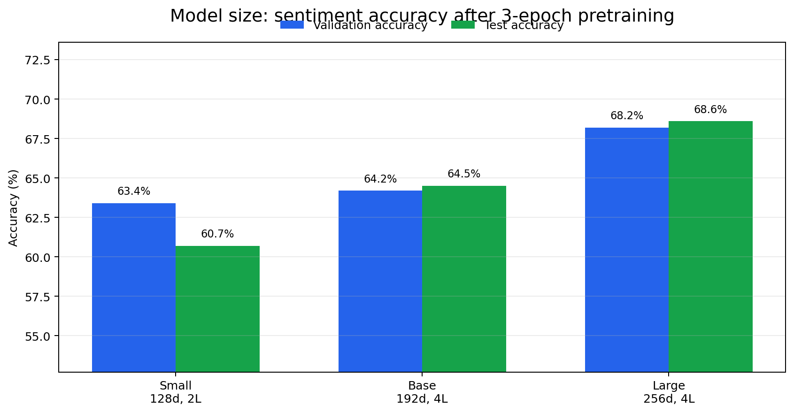
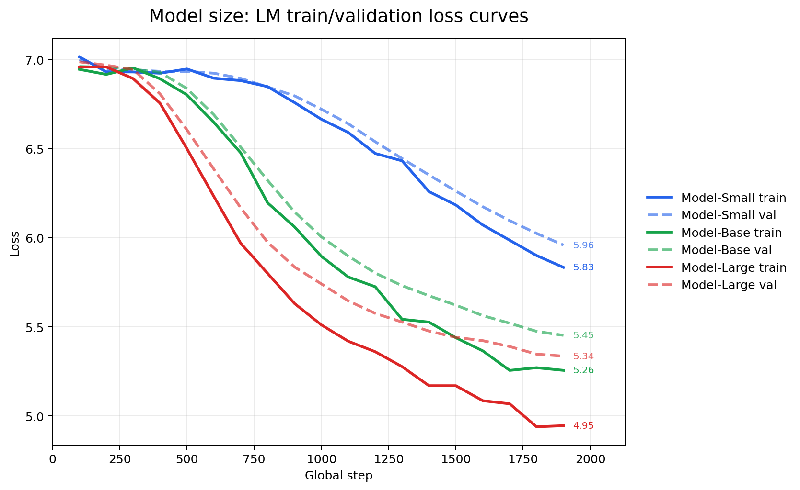
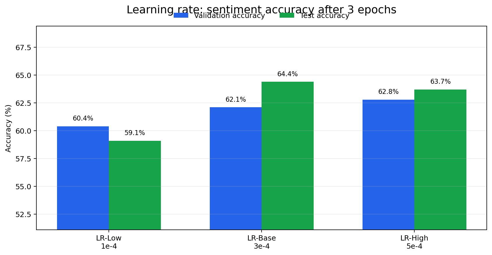
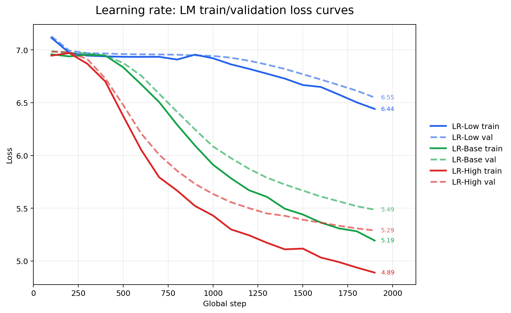
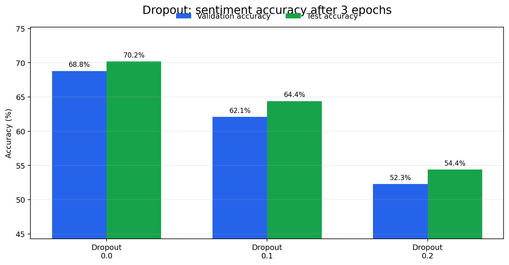
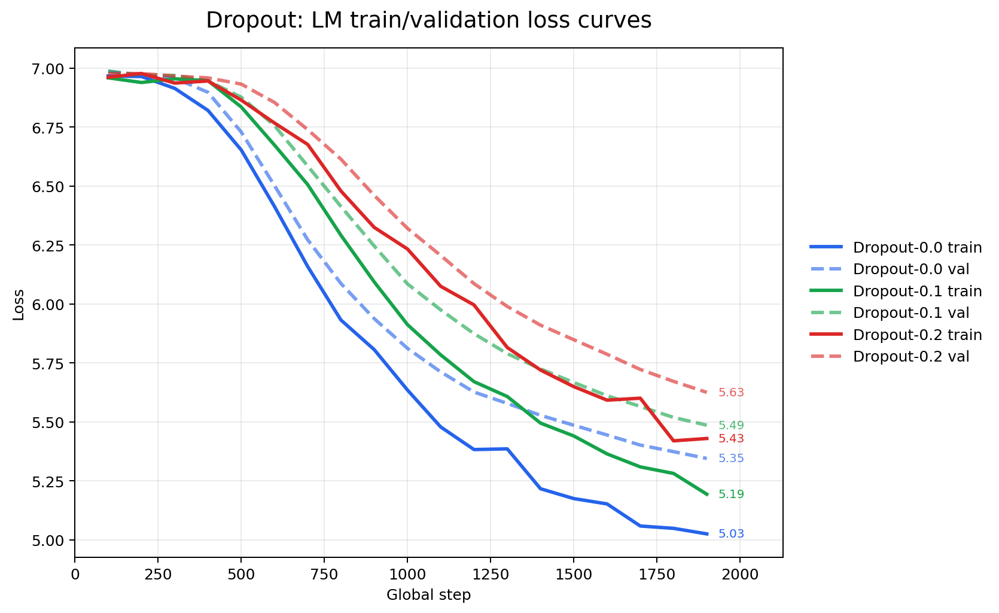
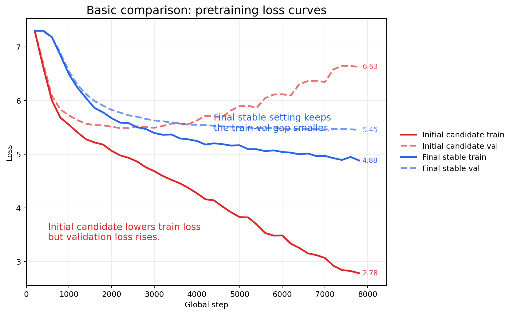

# mini GPT 구현 과제 보고서

## 제출 정보

| 항목 | 내용 |
| --- | --- |
| 3팀 | (김동현) |
| 3팀 | (정찬빈) |
| 3팀 | (주호석) |

---

## 0. 보고서 요약

이 프로젝트의 목표는 PyTorch만 사용해서 mini GPT를 직접 구현하고, NSMC 영화 리뷰 데이터로 사전 학습과 감성 분류 미세 조정을 수행하는 것이다.


> Light 설정에서 `model_size`, `learning rate`, `dropout`을 바꿔 보았을 때, 어떤 조합이 감성 분류 성능까지 가장 안정적으로 이어지는가?

실험은 먼저 빠른 비교가 가능한 Light 설정에서 진행했다.

| 단계 | 설정 | 목적 |
| --- | --- | --- |
| Smoke | `corpus[:5000]`, `vocab_size=300`, `context_length=32` | BPE와 한 배치 학습 확인 |
| Light | `corpus[:500000]`, `vocab_size=2000`, `context_length=64` | 여러 하이퍼파라미터 후보를 빠르게 비교 |
| Basic | `corpus[:1500000]`, `vocab_size=3000`, `context_length=128` | Light에서 고른 조합을 더 큰 설정에 적용 |

Basic 확장에서는 먼저 Light 실험에서 validation accuracy가 높았던 공격적인 조합을 1차 후보로 적용했다. 이때 1차 후보는 `emb_dim=256`, `drop_rate=0.0`, `lr=5e-4`였다.

하지만 Basic 사전 학습 결과 1차 후보는 train loss는 크게 낮췄지만 validation loss가 높아지고 train-validation gap이 커졌다. 이는 모델이 학습 corpus에는 강하게 맞춰졌지만 검증 corpus에는 잘 일반화되지 않는 과적합 신호로 해석했다.

따라서 최종 Basic 설정은 모델 용량과 update 폭을 줄이고 dropout을 다시 적용한 안정 조합으로 조정했다.

| 선택 항목 | 최종 값 |
| --- | --- |
| `emb_dim` | 192 |
| `n_layers` | 4 |
| `n_heads` | 4 |
| `drop_rate` | 0.1 |
| `lr` | 3e-4 |

왜 이 기준 조합을 사용했는지의 핵심은 단순히 loss 하나만 낮았기 때문이 아니다. 사전 학습 loss가 낮아지는 것과 실제 downstream task인 감성 분류 validation accuracy가 함께 안정적으로 나오는 조합을 우선했다.

---

## 1. 구현 현황

| 단계 | 구현 내용 | 구현 파일 | 
| --- | --- | --- |
| 1 | UTF-8 byte-level BPE tokenizer | `src/bpe.py` 
| 2 | GPTDataset, create_dataloader, InputEmbedding | `src/dataset.py`, `src/embeddings.py` | (미입력) |
| 3 | MultiHeadAttention, causal mask | `src/attention.py` | (미입력) |
| 4 | LayerNorm, GELU, FeedForward, TransformerBlock, GPTModel, generate_text_simple | `src/model.py` | (미입력) |
| 5 | loss 계산, checkpoint, generate, train_model | `src/train.py` | (미입력) |
| 6 | NSMC 감성 분류 Dataset과 classifier | `src/finetune.py` | (미입력) |

---

## 2. 테스트 통과 현황

로컬 프로젝트의 `.venv` 환경에서 전체 테스트를 실행했다.

| 실행 명령 | 결과 | 비고 |
| --- | --- | --- |
| `./.venv/bin/python -m pytest tests/ -q` | `34 passed, 1 warning` | `plot_losses`의 non-interactive canvas warning 1개 |

- plot_losses() 함수가 마지막에 plt.show()로 그래프 창을 띄우려고 하는데, pytest 실행 환경은 GUI 창을 띄우는 대화형 환경이 아니라서 그래프를 화면에 보여줄 수 없다는 경고

---

## 3. 데이터

| 항목 | 내용 |
| --- | --- |
| 원본 데이터 | NSMC |
| 원본 경로 | `data/ratings_train.txt`, `data/ratings_test.txt` |
| 사전 학습 데이터 | `data/nsmc_lm_train.txt`, `data/nsmc_lm_val.txt` |
| 미세 조정 데이터 | `data/nsmc_sentiment_train.jsonl`, `data/nsmc_sentiment_val.jsonl`, `data/nsmc_sentiment_test.jsonl` |
| 전처리 방식 | 빈 리뷰 제거, 공백 정리, train/validation 분리 |
| 사전 학습 train 크기 | 1,379,486자 |
| 사전 학습 validation 크기 | 120,560자 |
| 감성 분류 train 개수 | 137,996개 |
| 감성 분류 validation 개수 | 11,999개 |
| 감성 분류 test 개수 | 49,997개 |

실험 규모는 `EXPERIMENT_PRESET`으로 나누었다. Light는 빠른 비교를 위해 일부 데이터만 사용했고, Basic은 가능한 전체 데이터를 사용했다.

| 설정 | 사전 학습 corpus | 감성 분류 train | 감성 분류 validation | 감성 분류 test | 목적 |
| --- | ---: | ---: | ---: | ---: | --- |
| Light | 앞 500,000자 | 앞 5,000개 | 앞 1,000개 | 앞 1,000개 | 여러 하이퍼파라미터 후보를 빠르게 비교 |
| Basic | 전체 train corpus | 전체 137,996개 | 전체 11,999개 | 전체 49,997개 | Light에서 고른 설정을 더 큰 데이터로 검증 |

---

## 4. BPE

### 4.1 Light/Basic 설정

<table>
  <thead>
    <tr>
      <th>항목</th>
      <th>Light</th>
      <th>Basic</th>
    </tr>
  </thead>
  <tbody>
    <tr>
      <td>corpus chars</td>
      <td align="right">500,000</td>
      <td align="right">1,500,000</td>
    </tr>
    <tr>
      <td>vocab_size</td>
      <td align="right">2,000</td>
      <td align="right">3,000</td>
    </tr>
    <tr>
      <td>context_length</td>
      <td align="right">64</td>
      <td align="right">128</td>
    </tr>
    <tr>
      <td>vocabulary 저장 경로</td>
      <td><code>data/vocab_light_2000.json</code></td>
      <td><code>data/vocab_basic_3000.json</code></td>
    </tr>
    <tr>
      <td>어휘 학습 시간</td>
      <td>미기록(JSON 미포함)</td>
      <td>미기록(JSON 미포함)</td>
    </tr>
    <tr>
      <td>인코딩/디코딩 복원</td>
      <td colspan="2"><code>decode(encode("이 영화는 좋았다! English 123", add_bos_eos=True), skip_special=True) == "이 영화는 좋았다! English 123"</code></td>
    </tr>
  </tbody>
</table>


### 4.2 구현 방식

| 항목 | 내용 |
| --- | --- |
| 구현 파일 | `src/bpe.py` |
| BPE 방식 | UTF-8 byte-level BPE |
| 특수 토큰 ID | `<pad>=0`, `<unk>=1`, `<bos>=2`, `<eos>=3` |
| byte token ID 범위 | 4~259 |
| vocab_size | (3000) |
| 학습 corpus 크기 | (`corpus[:1_500_000]`) |
| 어휘 학습 시간 | () |
| vocabulary 저장 경로 | `data/vocab_light_2000.json` | `data/vocab_basic_3000.json` |
| 인코딩/디코딩 복원 예시 | (예: `decode(encode("이 영화는 좋았다")) == 원문`)|


BPE는 UTF-8 byte-level 방식으로 구현했다. 한국어는 한 글자가 UTF-8에서 여러 byte로 표현되기 때문에, 글자 단위나 공백 단위로 먼저 자르면 처음 보는 어미와 조사에서 `<unk>`가 많이 생길 수 있다. byte-level BPE를 쓰면 모든 한글, 영어, 숫자, 문장부호를 최소한 byte 단위로 표현할 수 있고, 자주 붙는 byte sequence만 merge하면서 vocabulary를 확장할 수 있다.

특수 토큰 ID는 고정했다.

| 토큰 | ID |
| --- | ---: |
| `<pad>` | 0 |
| `<unk>` | 1 |
| `<bos>` | 2 |
| `<eos>` | 3 |
| byte token | 4~259 |
| BPE merge token | 260 이상 |

---

## 5. 모델 구조



### 5.1 공통 구조

| 항목 | 내용 |
| --- | --- |
| 구현 파일 | `src/model.py` |
| 전체 구조 | InputEmbedding -> N x TransformerBlock -> LayerNorm -> LM head |
| vocab_size | 3,000 |
| context_length | 128 |
| emb_dim | 192 |
| n_heads | 4 |
| n_layers | 4 |
| drop_rate | 0.1 |
| qkv_bias | False |
| 총 파라미터 수 | 2,954,112개 |

---

이 구조를 선택한 이유는 GPT가 autoregressive language model이기 때문이다. 현재 위치의 토큰은 미래 토큰을 보면 안 되므로 attention에 causal mask를 적용했다. 또한 깊은 block을 통과하면서 gradient가 불안정해지는 것을 줄이기 위해 shortcut connection과 LayerNorm을 사용했다.


---

## 6. 실험 설계와 가설

##### Light 모델을 통해 최적의 하이퍼 파라미터를 구하기 위한 테스트 과정을 진행 

| 단계 | 설정 | 목적 |
| --- | --- | --- |
| Smoke | `corpus[:5000]`, `vocab_size=300`, `context_length=32` | BPE와 한 배치 학습 확인 |
| Light | `corpus[:500000]`, `vocab_size=2000`, `context_length=64` | 여러 하이퍼파라미터 후보를 빠르게 비교 |
| Basic | `corpus[:1500000]`, `vocab_size=3000`, `context_length=128` | Light에서 고른 조합을 더 큰 설정에 적용 |

### 6.1 공통 Light 설정

| 항목 | 값 |
| --- | ---: |
| corpus_chars | 500,000 |
| vocab_size |  2,000 |
| context_length | 64 |
| batch_size | 8 |
| n_heads | 4 |
| num_epochs | 3 |
| eval_freq | 200 |
| eval_iter | 20 |
| start_context | `이 영화` |

#### 6.1.1 최종 안정 설정 (Basic)

| 구분 | 항목 | 값 |
| --- | --- | --- |
| 모델 | vocab_size | 3,000 |
| 모델 | context_length | 128 |
| 모델 | emb_dim | 192 |
| 모델 | n_heads | 4 |
| 모델 | n_layers | 4 |
| 모델 | drop_rate | 0.1 |
| 학습 | batch_size | 8 |
| 학습 | num_epochs | 10 |
| 학습 | eval_freq, eval_iter | 200, 20 |
| 최적화 | lr | 3e-4 |

이 값은 처음부터 고정한 값이 아니라, `emb_dim=256`, `drop_rate=0.0`, `lr=5e-4` 1차 후보에서 과적합 신호를 확인한 뒤 조정한 최종 안정 설정이다.

실험은 한 번에 모든 값을 바꾸지 않고, 가능한 한 하나의 축만 바꾸는 방식으로 설계했다. 이렇게 해야 어떤 변화가 결과에 영향을 주었는지 설명할 수 있기 때문이다.

아래 6.2~6.4의 검증 그래프는 첨부 JSON 파일을 기준으로 다시 계산했다. 막대그래프는 최종 sentiment validation/test accuracy를 비교하고, 선그래프는 3 epoch 동안의 LM train/validation loss 변화를 비교한다. 각 가설 해석에서는 `diagrams/report_graphs/15_split_graph_data_summary_3epoch.json`의 값을 우선한다.

### 6.2 Model size 가설

가설:

> 모델이 너무 작으면 한국어 리뷰의 표현과 문맥을 충분히 담지 못해 모델을 키우면 평가율이 높아질까?

결과:

> 3 epoch 기준으로 맞추면 `Model-Large`가 sentiment validation/test accuracy 모두 가장 높았다. 따라서 "큰 모델은 Light 데이터와 짧은 epoch 안에서 충분히 학습되지 않을 수 있다"는 1 epoch 결과의 해석은 맞지만, 3 epoch로 학습 시간을 맞추면 모델 크기를 키우는 것이 성능 향상에 도움이 되었다.

왜 이런 가설을 세웠는가:

- `emb_dim`은 각 토큰을 표현하는 벡터의 크기다. 값이 작으면 표현 공간이 좁아 복잡한 문맥을 담기 어렵다.
- `n_layers`는 문맥을 반복적으로 조합하는 TransformerBlock의 개수다. layer가 적으면 깊은 패턴을 학습하기 어렵다.
- 하지만 모델이 커지면 파라미터 수가 늘어나고, 같은 데이터와 같은 학습 시간에서는 충분히 수렴하지 못할 수 있다.

검증 그래프:





첨부 JSON 기준 결과는 다음과 같다.

| 모델 | 설정 | epoch | LM val loss | sentiment val acc | sentiment test acc |
| --- | --- | ---: | ---: | ---: | ---: |
| Model-Small | `emb_dim=128`, `n_layers=2` | 3 | 5.959 | 0.634 | 0.607 |
| Model-Base | `emb_dim=192`, `n_layers=4` | 3 | 5.453 | 0.642 | 0.645 |
| Model-Large | `emb_dim=256`, `n_layers=4` | 3 | **5.336** | **0.682** | **0.686** |

해석:

- 3 epoch 기준에서는 **모델 크기를 키울수록 sentiment accuracy가 상승했다.** 따라서 "모델이 너무 작으면 표현력이 부족할 수 있다"는 가설은 지지된다.
- 선그래프에서도 `Model-Large`의 LM validation loss가 가장 낮아졌다. 즉 더 큰 모델이 다음 토큰 예측에서도 더 낮은 검증 손실을 보였다.
- 다만 이 결론은 3 epoch 기준이다. 1 epoch만 학습한 Large 결과에서는 성능이 낮았으므로, 큰 모델은 학습 시간을 충분히 확보해야 한다.

### 6.3 Learning rate 가설

가설:

> learning rate가 낮으면 안정적이지만 loss가 천천히 줄고, 높으면 빠르게 움직이지만 validation 성능이 불안정해질 수 있다. Light 설정에서는 중간값인 `3e-4`가 가장 안정적일 것이다.

왜 이런 가설을 세웠는가:

- `lr=1e-4`는 update 폭이 작아서 제한된 epoch 안에 충분히 학습하지 못할 수 있다.
- `lr=5e-4`는 빠르게 내려갈 수 있지만, 작은 mini GPT에서는 update가 커져 일반화가 흔들릴 수 있다.
- `lr=3e-4`는 두 경우의 중간값으로, 수렴 속도와 안정성의 균형을 기대할 수 있다.

검증 그래프:





첨부 JSON 기준 결과는 다음과 같다.

| 설정 | lr | LM val loss | sentiment val acc | sentiment test acc |
| --- | ---: | ---: | ---: | ---: |
| LR-Low | `1e-4` | 6.549 | 0.604 | 0.591 |
| LR-Base | `3e-4` | 5.486 | 0.621 | **0.644** |
| LR-High | `5e-4` | **5.290** | **0.628** | 0.637 |

해석:

- `lr=1e-4`는 LM val loss와 sentiment accuracy가 모두 낮아, 제한된 epoch 안에서는 학습 속도가 부족하다는 가설을 지지한다.
- `lr=5e-4`는 LM val loss와 validation accuracy가 가장 좋았지만, test accuracy는 `3e-4`보다 약간 낮았다.
- 따라서 **`3e-4`가 가장 안정적일 것이라는 가설은 부분적으로만 맞다.** test accuracy 기준으로는 `3e-4`가 가장 높지만, validation 기준으로는 `5e-4`도 나쁘지 않았다. 한 번의 실험만으로 `3e-4`가 절대 최선이라고 단정하기는 어렵다.

### 6.4 Dropout 가설

가설:

> dropout이 없으면 학습 데이터에 너무 맞춰질 수 있고, dropout이 너무 크면 작은 모델/작은 데이터에서 학습 신호가 약해질 수 있다. 따라서 `drop_rate=0.1`이 균형점일 것이다.

왜 이런 가설을 세웠는가:

- dropout은 일부 hidden unit을 무작위로 끄면서 특정 feature에 과하게 의존하는 것을 줄인다.
- 하지만 모델이 작거나 데이터가 제한적이면 dropout이 너무 클 때 필요한 정보까지 자주 사라져 underfitting이 날 수 있다.
- 그래서 `0.0`, `0.1`, `0.2` 중에서는 `0.1`을 기본 후보로 두고 비교했다.

검증 그래프:





첨부 JSON 기준 결과는 다음과 같다.

| 설정 | drop_rate | sentiment train acc | sentiment val acc | sentiment test acc | train-val acc gap |
| --- | ---: | ---: | ---: | ---: | ---: |
| Dropout-0.0 | 0.0 | 0.8116 | **0.688** | **0.702** | +12.4%p |
| Dropout-0.1 | 0.1 | 0.5736 | 0.621 | 0.644 | -4.7%p |
| Dropout-0.2 | 0.2 | 0.5610 | 0.523 | 0.544 | +3.8%p |


해석:

- **`drop_rate=0.1`이 가장 균형점일 것이라는 가설은 첨부 JSON 기준으로는 틀렸다.** 가장 높은 validation/test accuracy는 dropout을 끈 `0.0`에서 나왔다.
- 다만 `Dropout-0.0`은 train accuracy가 validation accuracy보다 12.4%p 높아, 학습 데이터에 더 강하게 맞춰진 overfitting 가능성이 있다.
- `Dropout-0.2`는 validation/test accuracy가 크게 낮아졌으므로, dropout이 너무 크면 학습 신호가 약해져 underfitting이 날 수 있다는 부분은 지지된다.

---

## 7. Light 실험 결과

### 7.1 전체 결과 표

아래 표는 첨부 JSON의 마지막 평가 기록을 기준으로 다시 계산했다. `Model-Base`, `LR-Base`, `Dropout-0.1`은 같은 base 구조 계열이지만, 각 비교 축의 기준 실행이므로 반복해서 표기했다.

| 실험명 | 비교 축 | emb_dim | n_layers | drop_rate | lr | epoch | LM train loss | LM val loss | sentiment val loss | sentiment val acc | sentiment test acc | 요약 해석 |
| --- | --- | ---: | ---: | ---: | ---: | ---: | ---: | ---: | ---: | ---: | ---: | --- |
| Model-Small | model_size | 128 | 2 | 0.1 | 3e-4 | 3 | 5.8341 | 5.9592 | 0.6467 | 0.634 | 0.607 | 작은 구조라 빠르지만 3 epoch 기준 acc는 가장 낮음 |
| Model-Base | model_size | 192 | 4 | 0.1 | 3e-4 | 3 | 5.2563 | 5.4527 | **0.6251** | 0.642 | 0.645 | 기존 기본 구조, Small보다 높지만 Large보다 낮음 |
| Model-Large | model_size | 256 | 4 | 0.1 | 3e-4 | 3 | 4.9458 | 5.3360 | 0.7333 | 0.682 | 0.686 | model_size 축에서 val/test acc 최고 |
| LR-Low | learning_rate | 192 | 4 | 0.1 | 1e-4 | 3 | 6.4412 | 6.5491 | 0.6662 | 0.604 | 0.591 | update 폭이 작아 제한된 epoch에서 학습 부족 |
| LR-Base | learning_rate | 192 | 4 | 0.1 | 3e-4 | 3 | 5.1939 | 5.4864 | 0.6434 | 0.621 | 0.644 | LR 비교의 기준점, test acc는 LR 축에서 가장 높음 |
| LR-High | learning_rate | 192 | 4 | 0.1 | 5e-4 | 3 | **4.8904** | **5.2898** | 0.6335 | 0.628 | 0.637 | LM loss와 val acc는 가장 좋지만 test acc는 Base보다 낮음 |
| **Dropout-0.0** | dropout | 192 | 4 | 0.0 | 3e-4 | 3 | 5.0257 | 5.3455 | 0.6581 | **0.688** | **0.702** | 전체 val/test acc 최고, train-val gap이 커 과적합 주의 |
| Dropout-0.1 | dropout | 192 | 4 | 0.1 | 3e-4 | 3 | 5.1939 | 5.4864 | 0.6434 | 0.621 | 0.644 | dropout 비교 기준점, 정확도는 0.0보다 낮음 |
| Dropout-0.2 | dropout | 192 | 4 | 0.2 | 3e-4 | 3 | 5.4300 | 5.6255 | 0.7260 | 0.523 | 0.544 | dropout이 커져 underfitting 경향 |


위 그래프에서는 전체 후보 중 `Dropout-0.0`이 sentiment validation accuracy `0.688`, test accuracy `0.702`로 가장 높았다. model size 축만 보면 `Model-Large`가 validation accuracy `0.682`, test accuracy `0.686`으로 가장 높았다. 다만 `Dropout-0.0`은 train accuracy와 validation accuracy의 차이가 커 과적합 가능성이 있으므로, Light 단계의 목적은 단순 최고값 하나를 확정하는 것이 아니라 Basic 실험으로 가져갈 후보와 리스크를 함께 좁히는 것이었다.


손실 관점에서도 언어 모델 검증 손실과 감성 분류 검증 손실을 함께 확인해야 한다. 다음 토큰 예측 손실이 낮아지는 것만으로 하위 작업의 성능이 좋아진다고 확정할 수 없기 때문이다.


| 단계 | 설정 | 목적 |
| --- | --- | --- |
| Light | `corpus[:500000]`, `vocab_size=2000`, `context_length=64` | 여러 하이퍼파라미터 후보를 빠르게 비교 |
| Basic | `corpus[:1500000]`, `vocab_size=3000`, `context_length=128` | Light에서 고른 조합을 더 큰 설정에 적용 |


표를 해석할 때는 `Model-Base` 계열 설정을 기준점으로 두었다.

- 먼저 model size 실험에서 `Model-Small`, `Model-Base`, `Model-Large`를 비교해 기본 모델 크기를 정했다.
- 이후 `Model-Base`의 구조를 유지한 상태에서 `LR-Low`, `LR-Base`, `LR-High`를 비교해 learning rate가 학습 안정성에 주는 영향을 확인했다.
- dropout 실험은 `Dropout-0.0`, `Dropout-0.1`, `Dropout-0.2`를 비교해 정규화가 sentiment validation accuracy에 주는 영향을 확인했다.

즉 이 표의 목적은 모든 값을 한 번에 바꾸는 것이 아니라, `Model-Base`를 중심으로 한 축씩 바꿔 어떤 하이퍼파라미터가 성능에 영향을 주는지 확인하는 것이다.

--- 

## 8. Basic 설정 적용 결과

Light 실험에서 validation accuracy가 높았던 값을 그대로 따르면 1차 후보는 `emb_dim=256`, `drop_rate=0.0`, `lr=5e-4`였다. 이 조합은 모델 용량이 크고, dropout이 없으며, learning rate도 높기 때문에 더 빠른 학습을 기대할 수 있었다.

하지만 Basic 설정으로 확장했을 때는 train loss만 빠르게 낮아지고 validation loss가 높아졌다. 따라서 최종 설정은 `emb_dim=192`, `drop_rate=0.1`, `lr=3e-4`로 조정했다.

| 항목 | 1차 후보 | 최종 안정 설정 |
| --- | ---: | ---: |
| corpus_chars | 1,500,000 | 1,500,000 |
| vocab_size | 3,000 | 3,000 |
| context_length | 128 | 128 |
| batch_size | 8 | 8 |
| emb_dim | 256 | 192 |
| n_heads | 4 | 4 |
| n_layers | 4 | 4 |
| drop_rate | 0.0 | 0.1 |
| lr | 5e-4 | 3e-4 |
| num_epochs | 10 | 10 |



위 선그래프에서 1차 후보는 train loss가 `2.7819`까지 낮아졌지만 validation loss는 `6.6285`까지 올라갔다. 반면 최종 안정 설정은 train loss는 `4.8838`로 더 높지만 validation loss가 `5.4538`로 낮고, train-validation gap도 훨씬 작다.


감성 분류에서도 최종 안정 설정이 더 높았다.

| 설정 | sentiment val loss | sentiment val acc | sentiment test loss | sentiment test acc |
| --- | ---: | ---: | ---: | ---: |
| 1차 후보: `256`, `drop_rate=0.0`, `lr=5e-4` | 0.4706 | 0.7801 | 0.4767 | 0.7752 |
| 최종 안정 설정: `192`, `drop_rate=0.1`, `lr=3e-4` | 0.4260 | 0.8080 | 0.4337 | 0.8047 |

따라서 Basic 실험의 결론은 "Light에서 가장 높았던 값을 그대로 확정한다"가 아니다. Light 결과는 1차 후보를 고르는 데 사용했고, Basic에서는 더 긴 학습과 더 큰 데이터에서 나타나는 과적합 신호를 확인한 뒤 안정적인 최종 설정으로 조정했다.

---
## 9. 미세 조정

감성 분류는 NSMC 리뷰를 부정 `0`, 긍정 `1`로 분류하는 task다. 구현에서는 GPT의 `lm_head`를 그대로 사용하지 않고, GPT backbone의 마지막 유효 token hidden state를 문장 대표 벡터로 사용한 뒤 Linear classifier를 붙였다.

왜 마지막 유효 token을 사용했는가:

- GPT는 causal model이므로 뒤쪽 token일수록 앞 문맥을 더 많이 본다.
- padding token은 실제 문장이 아니므로 대표 벡터로 쓰면 안 된다.
- 따라서 `<pad>`가 아닌 마지막 token 위치를 찾아 그 hidden state를 classifier에 넣었다.

Basic 확장에서는 sentiment validation accuracy를 핵심 기준으로 삼았기 때문에, 미세 조정 결과를 하이퍼파라미터 선택의 주요 지표로 사용했다.

| Light 단계 기준 후보 | train loss | train acc | val loss | val acc | test loss | test acc |
| --- | ---: | ---: | ---: | ---: | ---: | ---: |
| Model-Base | 0.7023 | 0.554 | 0.6251 | 0.642 | 0.6199 | 0.645 |

추가로 프로젝트 내부 `results/sentiment_light.json`에는 같은 Base 계열 설정의 별도 실행 결과가 저장되어 있었다.

| 결과 파일 | val loss | val acc | test loss | test acc | 비고 |
| --- | ---: | ---: | ---: | ---: | --- |
| `results/sentiment_light.json` | 0.6505 | 0.638 | 0.6235 | 0.657 | 첫 번째 기록 기준 |
| `results/sentiment_light.json` | 0.6445 | 0.634 | 0.6447 | 0.618 | 마지막 3 epoch 기록 기준 |

Basic fine-tuning 결과는 1차 후보와 최종 안정 설정의 마지막 평가 기록을 기준으로 비교했다.

| 설정 | train loss | train acc | val loss | val acc | test loss | test acc |
| --- | ---: | ---: | ---: | ---: | ---: | ---: |
| 1차 후보: `256`, `drop_rate=0.0`, `lr=5e-4` | 0.5247 | 0.7356 | 0.4706 | 0.7801 | 0.4767 | 0.7752 |
| 최종 안정 설정: `192`, `drop_rate=0.1`, `lr=3e-4` | 0.5003 | 0.7517 | 0.4260 | 0.8080 | 0.4337 | 0.8047 |

Light 마지막 재실행에서 test accuracy가 `0.618`에 머문 것은 epoch와 데이터 규모가 부족해 backbone이 충분히 수렴하지 못했을 가능성을 보여준다. Basic에서는 사전 학습 epoch를 `10`으로 늘려 더 많은 update를 수행했다. 다만 `emb_dim=256`, `drop_rate=0.0`, `lr=5e-4` 1차 후보는 pretraining train loss만 과하게 낮아지고 validation loss가 높아졌으므로, 최종적으로 `emb_dim=192`, `drop_rate=0.1`, `lr=3e-4` 안정 설정을 채택했다. 이 설정에서 sentiment test accuracy가 `0.8047`까지 올라갔다.

---


## 10. 디버깅 및 실험 해석 주의점

### 10.1 생성 샘플 decode 오류

Basic 사전 학습 중 다음과 같은 흐름까지는 정상적으로 진행되었다.

```text
Epoch 1, step 200
Epoch 1, step 400
Epoch 1, step 600
Epoch 2, step 800
```

오류는 학습 자체가 아니라 `generate_and_print_sample()`이 생성 샘플을 문자열로 바꾸는 decode 단계에서 발생했다.


문제 원인은 UTF-8 byte-level BPE의 특성과 관련이 있다. 원래 데이터에서 tokenizer가 만든 token sequence는 UTF-8 byte 배열로 정상 복원된다. 하지만 학습 초반 GPT는 아직 byte 규칙을 제대로 학습하지 못했기 때문에, 생성된 token을 byte로 펼쳤을 때 UTF-8 문법상 불가능한 byte sequence가 나올 수 있다.

실행 흐름은 다음과 같다.

```text
model.generate()
-> generated token IDs 생성
-> tokenizer.decode(generated_ids)
-> merge token을 원래 byte로 확장
-> bytes.decode("utf-8")
-> invalid byte sequence 때문에 UnicodeDecodeError 발생
```

따라서 이 오류는 다음을 의미하지 않는다.

- vocab load 실패가 아니다.
- train/validation loss 계산 실패가 아니다.
- optimizer 학습 실패가 아니다.
- 모델이 학습을 못 한다는 뜻도 아니다.

실제 문제는 "생성 샘플을 출력하려고 decode하는 순간" 발생했다. 그래서 해결 방향은 학습 루프를 바꾸는 것이 아니라, 생성 샘플 저장 경로에서 decode를 안전하게 만드는 것이다.

```python
try:
    generated_text = tokenizer.decode(generated_ids[0].tolist())
except UnicodeDecodeError:
    generated_text = "<decode failed: generated invalid UTF-8 byte sequence>"
```

더 좋은 방식은 tokenizer의 `decode()`가 `errors="replace"` 옵션을 받게 하고, 학습 중 sample 출력에서는 다음처럼 호출하는 것이다.

```python
generated_text = tokenizer.decode(
    generated_ids[0].tolist(),
    errors="replace",
)
```

이렇게 하면 학습 초반에 생성 샘플 일부가 `�`로 깨져 보일 수는 있지만, loss 평가와 결과 JSON 저장은 계속된다. 발표에서는 이 오류를 "학습 실패"가 아니라 "생성 샘플 로깅 단계의 UTF-8 복원 문제"로 설명하는 것이 정확하다.

### 10.2 `corpus_chars`를 무조건 키워도 의미가 없는 이유

`corpus_chars`는 "학습에 사용할 문자열을 앞에서 몇 글자까지 자를 것인가"를 정하는 값이다. 따라서 원본 학습 텍스트보다 큰 값을 넣어도 실제 데이터가 자동으로 늘어나지는 않는다.

현재 프로젝트의 LM 텍스트 길이는 다음과 같다.

| 파일 | 문자 수 | UTF-8 byte 수 |
| --- | ---: | ---: |
| `data/nsmc_lm_train.txt` | 1,379,486 | 3,335,336 |
| `data/nsmc_lm_val.txt` | 120,560 | 291,753 |

예를 들어 현재 데이터만 사용한다면 `corpus[:5_000_000]`을 넣어도 실제로는 train 텍스트의 전체 길이인 약 138만 자까지만 사용된다. 즉 이 경우는 "500만 자 학습"이 아니라 "가지고 있는 전체 train corpus 학습"이다.

이 점이 중요한 이유는 실험 해석 때문이다. `corpus_chars=1_500_000`과 `corpus_chars=5_000_000`을 비교한다고 말해도, 실제 데이터가 1,379,486자라면 두 실험은 거의 같은 데이터를 보는 실험이 된다. 더 큰 corpus 실험을 하려면 추가 리뷰 데이터를 붙이거나, 별도 말뭉치를 추가해야 한다. train/validation/test를 섞으면 글자 수는 늘릴 수 있지만 평가 데이터가 학습에 들어가는 leakage가 생기므로, 성능 평가 목적에서는 사용하지 않는 것이 맞다.


---


## 11. 최종 안정 설정을 선택한 근거: `emb_dim=192` vs `emb_dim=256`

추가로 Basic 설정에서 모델의 표현 차원을 `192`에서 `256`으로 키운 결과도 비교했다.


이 그래프에서 `emb_dim=256`은 train loss를 더 빠르게 낮춘다. 하지만 validation loss는 `emb_dim=192`와 거의 비슷하게 정체된다. 즉 모델 용량을 키운 효과가 학습 데이터에는 강하게 나타났지만, 검증 데이터 일반화로 충분히 이어지지는 않았다.


`val loss - train loss` gap은 일반화 차이를 보는 보조 지표다. `emb_dim=256`의 gap이 더 크다는 것은 train corpus에는 더 잘 맞았지만 validation corpus에는 그만큼 좋아지지 않았다는 뜻이다.

| 항목 | `emb_dim=192` | `emb_dim=256` |
| --- | ---: | ---: |
| 파라미터 수 | 2.95M | 4.73M |
| pretrain 마지막 train loss | 4.8838 | 4.4891 |
| pretrain 마지막 val loss | 5.4538 | 5.4473 |
| pretrain train-val gap | 0.5700 | 0.9582 |
| sentiment val acc | 80.80% | 78.22% |
| sentiment test acc | 80.47% | 78.05% |
| sentiment val loss | 0.4260 | 0.4541 |
| sentiment test loss | 0.4337 | 0.4607 |

이 결과는 꽤 자연스럽다. `emb_dim=256`은 더 큰 모델이므로 train loss는 더 잘 낮췄다. 하지만 validation loss 개선은 거의 없었고, train-val gap은 `0.9582`까지 커졌다. 즉 더 큰 모델이 훈련 데이터는 더 잘 맞췄지만, 일반화 성능은 충분히 좋아지지 않았다.

왜 이런 결과가 나왔는가:

- `emb_dim=256`은 파라미터 수가 약 60% 이상 커졌지만, corpus, dropout, learning rate, epoch 설정은 그대로였다.
- 큰 모델은 같은 데이터에서 더 쉽게 train corpus를 외울 수 있으므로 train loss는 낮아진다.
- 그러나 validation loss가 거의 줄지 않고 gap이 커졌다면 일반화가 좋아진 것이 아니라 과적합 신호로 볼 수 있다.
- pretraining loss가 낮다고 sentiment accuracy가 반드시 올라가지는 않는다. pretraining은 다음 토큰 예측이고, sentiment는 문장 감정 분류이기 때문이다.
- fine-tuning에서 backbone 전체를 같은 learning rate로 업데이트하면, 큰 모델일수록 사전 학습된 표현이 더 크게 흔들릴 수 있다.

따라서 이번 결과의 결론은 "`emb_dim=256`이 절대 나쁘다"가 아니다. 더 정확한 결론은 다음과 같다.

> 모델 용량을 키우면 train loss는 더 내려갈 수 있지만, 그 용량을 일반화 성능으로 바꾸려면 learning rate, dropout, early stopping, best checkpoint 선택도 함께 조정해야 한다.

이번 보고서에서는 `emb_dim=256`을 추가로 튜닝해 살리는 방향보다, 이미 더 안정적인 결과를 보인 `emb_dim=192`, `drop_rate=0.1`, `lr=3e-4` 조합을 최종 설정으로 채택했다.

이 선택의 의미는 다음과 같다.

| 항목 | 1차 후보 | 최종 안정 설정 |
| --- | --- | --- |
| 모델 용량 | `emb_dim=256`으로 큼 | `emb_dim=192`로 줄임 |
| 정규화 | `drop_rate=0.0`으로 없음 | `drop_rate=0.1`로 적용 |
| update 폭 | `lr=5e-4`로 큼 | `lr=3e-4`로 낮춤 |
| 기대 효과 | train loss를 빠르게 낮춤 | validation loss와 downstream accuracy 안정화 |

즉 최종 선택은 최고 train 성능을 노린 설정이 아니라, validation loss와 sentiment validation/test accuracy를 함께 고려한 일반화 중심 설정이다.
