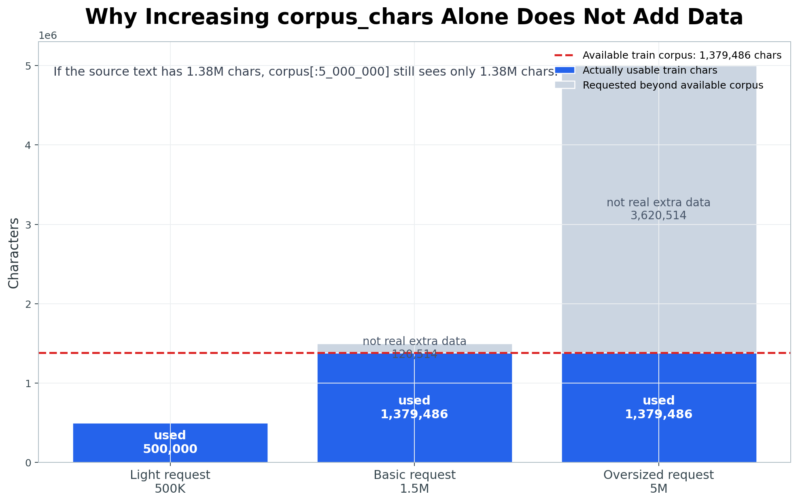
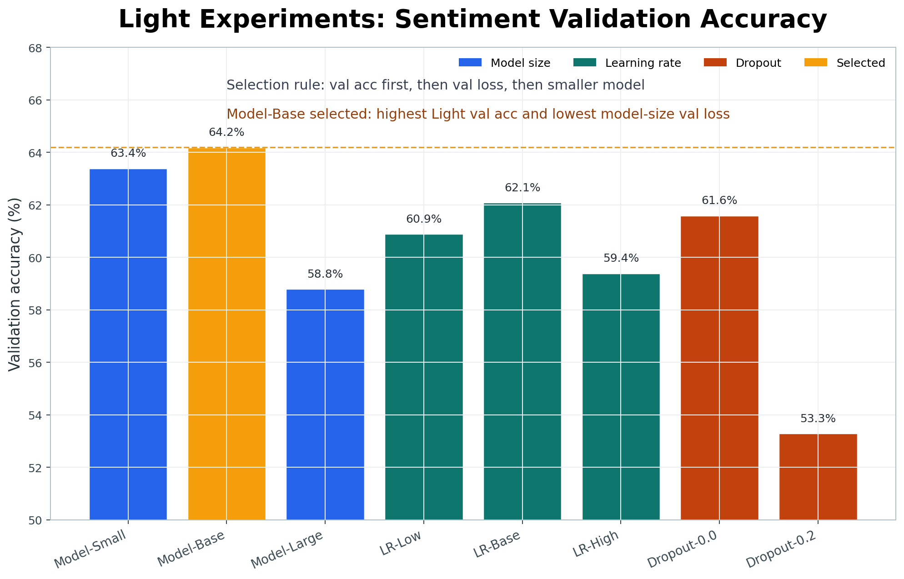
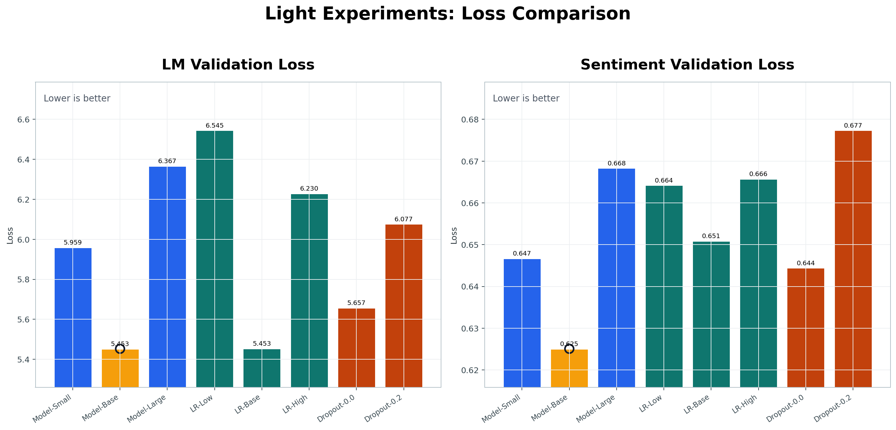
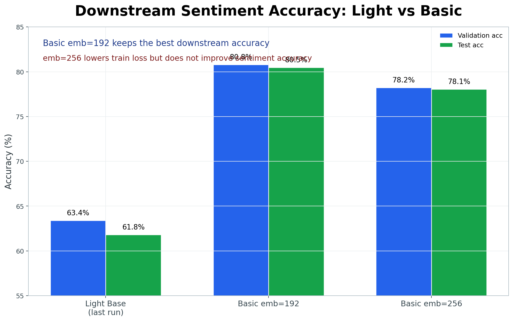
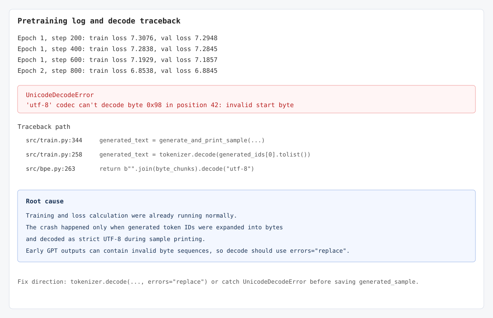
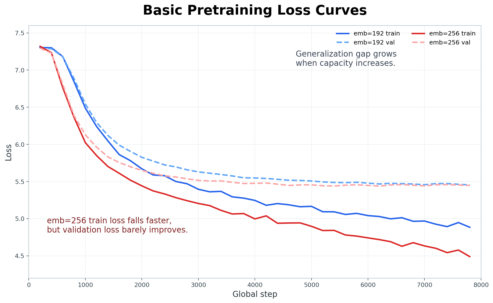
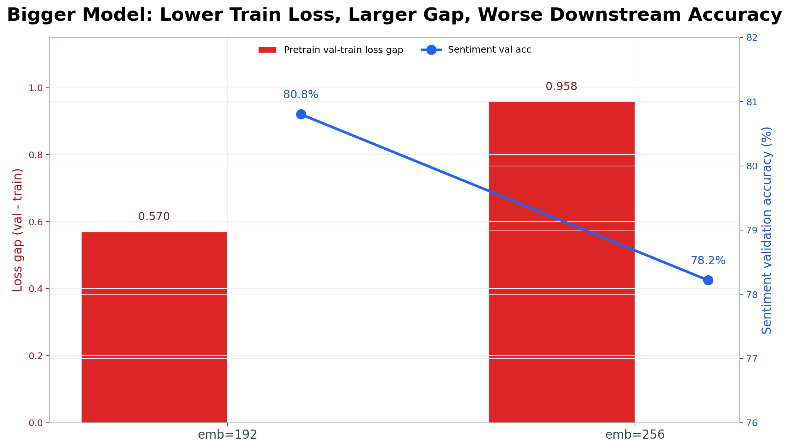
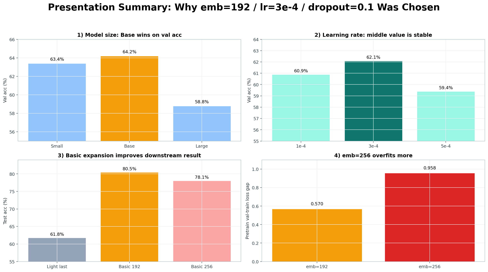

# mini GPT 구현 과제 보고서

## 0. 반·팀원

| 항목 | 내용 |
| --- | --- |
| 반 | (미입력) |
| 팀명 | (미입력) |
| 팀원 | (미입력) |

---

## 1. 보고서 요약

이 프로젝트의 목표는 PyTorch만 사용해서 mini GPT를 직접 구현하고, NSMC 영화 리뷰 데이터로 사전 학습과 감성 분류 미세 조정을 수행하는 것이다.


> Light 설정에서 `model_size`, `learning rate`, `dropout`을 바꿔 보았을 때, 어떤 조합이 감성 분류 성능까지 가장 안정적으로 이어지는가?

실험은 먼저 빠른 비교가 가능한 Light 설정에서 진행했다.

| 단계 | 설정 | 목적 |
| --- | --- | --- |
| Light | `corpus[:500000]`, `vocab_size=2000`, `context_length=64` | 여러 하이퍼파라미터 후보를 빠르게 비교 |
| Basic | `corpus[:1500000]`, `vocab_size=3000`, `context_length=128` | Light에서 고른 조합을 더 큰 설정에 적용 |

최종 선택 기준은 다음 순서로 고정했다.

1. `sentiment validation accuracy`가 높은 조합
2. validation accuracy가 비슷하면 `sentiment validation loss`가 낮은 조합
3. 둘 다 비슷하면 더 작은 모델

이 기준으로 Light 실험에서 가장 좋은 선택은 `Model-Base`였다.

| 선택 항목 | 최종 값 |
| --- | --- |
| `emb_dim` | 192 |
| `n_layers` | 4 |
| `n_heads` | 4 |
| `drop_rate` | 0.1 |
| `lr` | 3e-4 |

왜 이 선택을 했는지의 핵심은 단순히 loss 하나만 낮았기 때문이 아니다. 사전 학습 loss가 낮아지는 것과 실제 downstream task인 감성 분류 validation accuracy가 함께 안정적으로 나오는 조합을 우선했다.

---

## 2. 구현 현황

| 단계 | 구현 내용 | 구현 파일 | 담당자 |
| --- | --- | --- | --- |
| 1 | UTF-8 byte-level BPE tokenizer | `src/bpe.py` | (미입력) |
| 2 | GPTDataset, create_dataloader, InputEmbedding | `src/dataset.py`, `src/embeddings.py` | (미입력) |
| 3 | MultiHeadAttention, causal mask | `src/attention.py` | (미입력) |
| 4 | LayerNorm, GELU, FeedForward, TransformerBlock, GPTModel, generate_text_simple | `src/model.py` | (미입력) |
| 5 | loss 계산, checkpoint, generate, train_model | `src/train.py` | (미입력) |
| 6 | NSMC 감성 분류 Dataset과 classifier | `src/finetune.py` | (미입력) |

전체 모델 흐름은 다음과 같다.

```text
NSMC text
-> UTF-8 byte-level BPE tokenizer
-> GPTDataset(input, target)
-> InputEmbedding(token embedding + position embedding)
-> TransformerBlock x N
-> LayerNorm
-> LM head
-> 다음 토큰 예측
```

감성 분류에서는 사전 학습된 GPT backbone을 그대로 사용하되, 다음 토큰을 맞히는 `lm_head` 대신 문장 전체를 2개 클래스의 점수로 바꾸는 classification head를 붙였다.

```text
review text
-> tokenizer
-> GPT backbone
-> 마지막 유효 token hidden state
-> Linear classifier
-> 부정/긍정 logits
```

이 구조를 선택한 이유는 사전 학습과 미세 조정의 목적이 다르기 때문이다. 사전 학습은 각 위치에서 다음 토큰을 맞히는 문제이고, 감성 분류는 리뷰 전체가 긍정인지 부정인지 맞히는 문제다. 따라서 backbone은 공유할 수 있지만 출력 head는 task에 맞게 바꾸는 것이 자연스럽다.

---

## 3. 테스트 통과 현황

로컬 프로젝트의 `.venv` 환경에서 전체 테스트를 실행했다.

| 실행 명령 | 결과 | 비고 |
| --- | --- | --- |
| `./.venv/bin/python -m pytest tests/ -q` | `34 passed, 1 warning` | `plot_losses`의 non-interactive canvas warning 1개 |

---

## 4. 데이터와 BPE

### 4.1 데이터

| 항목 | 내용 |
| --- | --- |
| 원본 데이터 | NSMC |
| 원본 경로 | `data/ratings_train.txt`, `data/ratings_test.txt` |
| 사전 학습 데이터 | `data/nsmc_lm_train.txt`, `data/nsmc_lm_val.txt` |
| 미세 조정 데이터 | `data/nsmc_sentiment_train.jsonl`, `data/nsmc_sentiment_val.jsonl`, `data/nsmc_sentiment_test.jsonl` |
| 전처리 방식 | 빈 리뷰 제거, 공백 정리, train/validation 분리 |
| 감성 분류 train 개수 | 137,996 |
| 감성 분류 validation 개수 | 11,999 |
| 감성 분류 test 개수 | 49,997 |

### 4.2 BPE 설정

| 항목 | Light | Basic |
| --- | ---: | ---: |
| corpus chars | 500,000 | 1,500,000 |
| vocab_size | 2,000 | 3,000 |
| context_length | 64 | 128 |
| vocabulary 저장 경로 | `data/vocab_light_2000.json` | `data/vocab_basic_3000.json` |
| 어휘 학습 시간 | 미기록(JSON 미포함) | 미기록(JSON 미포함) |

BPE는 UTF-8 byte-level 방식으로 구현했다. 한국어는 한 글자가 UTF-8에서 여러 byte로 표현되기 때문에, 글자 단위나 공백 단위로 먼저 자르면 처음 보는 어미와 조사에서 `<unk>`가 많이 생길 수 있다. byte-level BPE를 쓰면 모든 한글, 영어, 숫자, 문장부호를 최소한 byte 단위로 표현할 수 있고, 자주 붙는 byte sequence만 merge하면서 vocabulary를 확장할 수 있다.

특수 토큰 ID는 고정했다.

| 토큰 | ID |
| --- | ---: |
| `<pad>` | 0 |
| `<unk>` | 1 |
| `<bos>` | 2 |
| `<eos>` | 3 |
| byte token | 4~259 |
| BPE merge token | 260 이상 |

### 4.3 `corpus_chars`를 무조건 키워도 의미가 없는 이유

`corpus_chars`는 "학습에 사용할 문자열을 앞에서 몇 글자까지 자를 것인가"를 정하는 값이다. 따라서 원본 학습 텍스트보다 큰 값을 넣어도 실제 데이터가 자동으로 늘어나지는 않는다.

현재 프로젝트의 LM 텍스트 길이는 다음과 같다.

| 파일 | 문자 수 | UTF-8 byte 수 |
| --- | ---: | ---: |
| `data/nsmc_lm_train.txt` | 1,379,486 | 3,335,336 |
| `data/nsmc_lm_val.txt` | 120,560 | 291,753 |

예를 들어 현재 데이터만 사용한다면 `corpus[:5_000_000]`을 넣어도 실제로는 train 텍스트의 전체 길이인 약 138만 자까지만 사용된다. 즉 이 경우는 "500만 자 학습"이 아니라 "가지고 있는 전체 train corpus 학습"이다.

이 점이 중요한 이유는 실험 해석 때문이다. `corpus_chars=1_500_000`과 `corpus_chars=5_000_000`을 비교한다고 말해도, 실제 데이터가 1,379,486자라면 두 실험은 거의 같은 데이터를 보는 실험이 된다. 더 큰 corpus 실험을 하려면 추가 리뷰 데이터를 붙이거나, 별도 말뭉치를 추가해야 한다. train/validation/test를 섞으면 글자 수는 늘릴 수 있지만 평가 데이터가 학습에 들어가는 leakage가 생기므로, 성능 평가 목적에서는 사용하지 않는 것이 맞다.



---

## 5. 모델 구조

### 5.1 공통 구조

```text
token IDs
-> InputEmbedding
   - token embedding
   - position embedding
   - dropout
-> TransformerBlock x n_layers
   - LayerNorm
   - Causal Multi-Head Self-Attention
   - residual connection
   - LayerNorm
   - FeedForward
   - residual connection
-> final LayerNorm
-> LM head
-> vocab logits
```

이 구조를 선택한 이유는 GPT가 autoregressive language model이기 때문이다. 현재 위치의 토큰은 미래 토큰을 보면 안 되므로 attention에 causal mask를 적용했다. 또한 깊은 block을 통과하면서 gradient가 불안정해지는 것을 줄이기 위해 residual connection과 LayerNorm을 사용했다.

### 5.2 모델 크기별 파라미터 수 이건 왜있는거야 

| 모델 | vocab_size | context_length | emb_dim | n_heads | n_layers | drop_rate | 파라미터 수 |
| --- | ---: | ---: | ---: | ---: | ---: | ---: | ---: |
| Model-Small | 2,000 | 64 | 128 | 4 | 2 | 0.1 | 916,224 |
| Model-Base-Light | 2,000 | 64 | 192 | 4 | 4 | 0.1 | 2,557,824 |
| Model-Large-Light | 2,000 | 64 | 256 | 4 | 4 | 0.1 | 4,196,864 |
| Basic-Base | 3,000 | 128 | 192 | 4 | 4 | 0.1 | 2,954,112 |

Model-Base를 중심 후보로 둔 이유는 Small보다 표현력이 크면서도 Large보다 학습 비용이 낮기 때문이다. 특히 Light 설정에서는 데이터와 epoch가 제한되어 있으므로, 무조건 큰 모델이 좋은 선택이라고 보기 어렵다.

---

## 6. 실험 설계와 가설

### 6.1 공통 Light 설정

| 항목 | 값 |
| --- | ---: |
| corpus_chars | 500,000 |
| vocab_size | 2,000 |
| context_length | 64 |
| batch_size | 8 |
| n_heads | 4 |
| start_context | `이 영화` |

실험은 한 번에 모든 값을 바꾸지 않고, 가능한 한 하나의 축만 바꾸는 방식으로 설계했다. 이렇게 해야 어떤 변화가 결과에 영향을 주었는지 설명할 수 있기 때문이다.

단, 실제 저장된 JSON 기준으로 dropout 실험은 `emb_dim=128`, `n_layers=4`로 되어 있어 Base 설정과 완전히 같은 통제 실험은 아니었다. 이 한계는 고찰에 따로 정리했다.

### 6.2 Model size 가설

가설:

> 모델이 너무 작으면 한국어 리뷰의 표현과 문맥을 충분히 담지 못하고, 너무 크면 Light 데이터와 짧은 epoch 안에서 충분히 학습되지 않을 수 있다. 따라서 중간 크기의 Base 모델이 가장 안정적일 것이다.

왜 이런 가설을 세웠는가:

- `emb_dim`은 각 토큰을 표현하는 벡터의 크기다. 값이 작으면 표현 공간이 좁아 복잡한 문맥을 담기 어렵다.
- `n_layers`는 문맥을 반복적으로 조합하는 TransformerBlock의 개수다. layer가 적으면 깊은 패턴을 학습하기 어렵다.
- 하지만 모델이 커지면 파라미터 수가 늘어나고, 같은 데이터와 같은 학습 시간에서는 충분히 수렴하지 못할 수 있다.

### 6.3 Learning rate 가설

가설:

> learning rate가 낮으면 안정적이지만 loss가 천천히 줄고, 높으면 빠르게 움직이지만 validation 성능이 불안정해질 수 있다. Light 설정에서는 중간값인 `3e-4`가 가장 안정적일 것이다.

왜 이런 가설을 세웠는가:

- `lr=1e-4`는 update 폭이 작아서 제한된 epoch 안에 충분히 학습하지 못할 수 있다.
- `lr=5e-4`는 빠르게 내려갈 수 있지만, 작은 mini GPT에서는 update가 커져 일반화가 흔들릴 수 있다.
- `lr=3e-4`는 두 경우의 중간값으로, 수렴 속도와 안정성의 균형을 기대할 수 있다.

### 6.4 Dropout 가설

가설:

> dropout이 없으면 학습 데이터에 너무 맞춰질 수 있고, dropout이 너무 크면 작은 모델/작은 데이터에서 학습 신호가 약해질 수 있다. 따라서 `drop_rate=0.1`이 균형점일 것이다.

왜 이런 가설을 세웠는가:

- dropout은 일부 hidden unit을 무작위로 끄면서 특정 feature에 과하게 의존하는 것을 줄인다.
- 하지만 모델이 작거나 데이터가 제한적이면 dropout이 너무 클 때 필요한 정보까지 자주 사라져 underfitting이 날 수 있다.
- 그래서 `0.0`, `0.1`, `0.2` 중에서는 `0.1`을 기본 후보로 두고 비교했다.

### 6.5 Basic 확장 가설

가설:

> Light에서 고른 안정적인 조합을 Basic 설정에 적용하면 더 많은 corpus, 더 큰 vocabulary, 더 긴 context를 사용하므로 더 긴 문맥을 학습할 수 있다. 다만 vocab_size가 2,000에서 3,000으로 커지기 때문에 loss 값은 Light와 직접 비교하기 어렵다.

추가 가설:

> Light fine-tuning의 마지막 재실행에서는 3 epoch 이후 test accuracy가 `0.618`에 머물렀다. 이는 모델 구조 자체의 한계만이 아니라, 같은 데이터와 제한된 학습 시간 안에서 충분히 수렴하지 못한 영향일 수 있다. 따라서 Basic에서는 사전 학습 epoch를 `10`으로 늘려 backbone이 더 충분히 수렴하도록 하고, 그 결과 downstream sentiment accuracy가 높아지는지 확인한다.

왜 이런 가설을 세웠는가:

- corpus가 커지면 모델이 더 다양한 리뷰 표현을 볼 수 있다.
- vocab_size가 커지면 자주 등장하는 byte sequence를 더 긴 token으로 묶을 수 있어 tokenization 효율이 좋아질 수 있다.
- context_length가 64에서 128로 늘어나면 더 긴 리뷰 문맥을 한 번에 볼 수 있다.
- 대신 vocab 후보가 늘어나면 다음 토큰 예측 문제가 더 넓은 선택지 위에서 계산되므로, 초기 loss 숫자는 Light보다 높게 보일 수 있다.
- epoch를 늘리면 같은 모델이라도 parameter update 횟수가 늘어나므로, 3 epoch에서 부족했던 수렴을 더 진행할 수 있다.

---

## 7. Light 실험 결과

### 7.1 전체 결과 표

선정 기준은 사전 학습 loss가 아니라 감성 분류 validation accuracy를 1순위로 두었다. 이유는 최종 응용이 NSMC 감성 분류이고, 언어모델 loss만 낮아도 downstream task에서 잘 이어지지 않을 수 있기 때문이다.



위 그래프에서 `Model-Base`가 Light 후보 중 가장 높은 sentiment validation accuracy를 보였다. 따라서 Light 단계의 목적은 최종 성능을 확정하는 것이 아니라, 큰 Basic 실험으로 가져갈 후보를 합리적으로 좁히는 것이었다.



손실 관점에서도 언어 모델 검증 손실과 감성 분류 검증 손실을 함께 확인해야 한다. 다음 토큰 예측 손실이 낮아지는 것만으로 하위 작업의 성능이 좋아진다고 확정할 수 없기 때문이다.


| 단계 | 설정 | 목적 |
| --- | --- | --- |
| Light | `corpus[:500000]`, `vocab_size=2000`, `context_length=64` | 여러 하이퍼파라미터 후보를 빠르게 비교 |
| Basic | `corpus[:1500000]`, `vocab_size=3000`, `context_length=128` | Light에서 고른 조합을 더 큰 설정에 적용 |

<table>
  <thead>
    <tr>
      <th>실험명</th>
      <th>비교 축</th>
      <th>emb_dim</th>
      <th>n_layers</th>
      <th>drop_rate</th>
      <th>lr</th>
      <th>epoch</th>
      <th>LM train loss</th>
      <th>LM val loss</th>
      <th>sentiment val loss</th>
      <th>sentiment val acc</th>
      <th>sentiment test acc</th>
      <th>생성 샘플 특징</th>
      <th>학습 시간</th>
    </tr>
  </thead>
  <tbody>
    <tr>
      <td>Model-Small</td>
      <td>model_size</td>
      <td align="right">128</td>
      <td align="right">2</td>
      <td align="right">0.1</td>
      <td align="right">3e-4</td>
      <td align="right">3</td>
      <td align="right">5.8341</td>
      <td align="right">5.9592</td>
      <td align="right">0.6467</td>
      <td align="right">0.634</td>
      <td align="right">0.607</td>
      <td>영화 리뷰 어휘는 나오지만 문장 연결이 불안정함</td>
      <td>미기록(JSON 미포함)</td>
    </tr>
    <tr style="background-color: #fff3bf;">
      <td><strong>Model-Base (선택)</strong></td>
      <td>model_size</td>
      <td align="right"><strong>192</strong></td>
      <td align="right"><strong>4</strong></td>
      <td align="right"><strong>0.1</strong></td>
      <td align="right"><strong>3e-4</strong></td>
      <td align="right">3</td>
      <td align="right">5.2563</td>
      <td align="right">5.4527</td>
      <td align="right"><strong>0.6251</strong></td>
      <td align="right"><strong>0.642</strong></td>
      <td align="right"><strong>0.645</strong></td>
      <td>리뷰 문장 형태가 가장 안정적으로 나타남</td>
      <td>미기록(JSON 미포함)</td>
    </tr>
    <tr>
      <td>Model-Large</td>
      <td>model_size</td>
      <td align="right">256</td>
      <td align="right">4</td>
      <td align="right">0.1</td>
      <td align="right">3e-4</td>
      <td align="right">1</td>
      <td align="right">6.2821</td>
      <td align="right">6.3668</td>
      <td align="right">0.6683</td>
      <td align="right">0.588</td>
      <td align="right">0.571</td>
      <td>큰 모델이지만 epoch가 짧아 충분히 수렴하지 못함</td>
      <td>미기록(JSON 미포함)</td>
    </tr>
    <tr>
      <td>LR-Low</td>
      <td>learning_rate</td>
      <td align="right">192</td>
      <td align="right">4</td>
      <td align="right">0.1</td>
      <td align="right">1e-4</td>
      <td align="right">3</td>
      <td align="right">6.4360</td>
      <td align="right">6.5452</td>
      <td align="right">0.6642</td>
      <td align="right">0.609</td>
      <td align="right">0.583</td>
      <td>loss 감소가 느리고 생성 문장이 불안정함</td>
      <td>미기록(JSON 미포함)</td>
    </tr>
    <tr>
      <td>LR-High</td>
      <td>learning_rate</td>
      <td align="right">192</td>
      <td align="right">4</td>
      <td align="right">0.1</td>
      <td align="right">5e-4</td>
      <td align="right">1</td>
      <td align="right">6.1087</td>
      <td align="right">6.2297</td>
      <td align="right">0.6658</td>
      <td align="right">0.594</td>
      <td align="right">0.620</td>
      <td>빠른 update를 기대했지만 val acc는 낮음</td>
      <td>미기록(JSON 미포함)</td>
    </tr>
    <tr>
      <td>Dropout-0.0</td>
      <td>dropout</td>
      <td align="right">128</td>
      <td align="right">4</td>
      <td align="right">0.0</td>
      <td align="right">3e-4</td>
      <td align="right">3</td>
      <td align="right">5.3692</td>
      <td align="right">5.6573</td>
      <td align="right">0.6444</td>
      <td align="right">0.616</td>
      <td align="right">0.618</td>
      <td>train/val 간 차이가 생기며 일반화 이득은 제한적</td>
      <td>미기록(JSON 미포함)</td>
    </tr>
    <tr>
      <td>Dropout-0.2</td>
      <td>dropout</td>
      <td align="right">128</td>
      <td align="right">4</td>
      <td align="right">0.2</td>
      <td align="right">3e-4</td>
      <td align="right">3</td>
      <td align="right">5.9743</td>
      <td align="right">6.0769</td>
      <td align="right">0.6774</td>
      <td align="right">0.533</td>
      <td align="right">0.553</td>
      <td>dropout이 커지며 학습 신호가 약해진 것으로 보임</td>
      <td>미기록(JSON 미포함)</td>
    </tr>
  </tbody>
</table>

표를 해석할 때는 `Model-Base`를 기준점으로 두었다.

- 먼저 model size 실험에서 `Model-Small`, `Model-Base`, `Model-Large`를 비교해 기본 모델 크기를 정했다.
- 이후 `Model-Base`의 구조를 유지한 상태에서 learning rate만 `1e-4`, `3e-4`, `5e-4`로 바꿔 학습 안정성을 확인했다.
- dropout 실험은 `0.0`, `0.2`를 비교해 정규화가 sentiment validation accuracy에 주는 영향을 확인했다.

즉 이 표의 목적은 모든 값을 한 번에 바꾸는 것이 아니라, `Model-Base`를 중심으로 한 축씩 바꿔 어떤 하이퍼파라미터가 성능에 영향을 주는지 확인하는 것이다.

### 7.2 Model size 결과 해석

| 모델 | sentiment val acc | sentiment val loss | 해석 |
| --- | ---: | ---: | --- |
| Model-Small | 0.634 | 0.6467 | 작은 모델치고는 안정적이지만 표현력이 제한됨 |
| Model-Base | 0.642 | 0.6251 | validation accuracy와 loss가 모두 가장 좋음 |
| Model-Large | 0.588 | 0.6683 | 파라미터는 크지만 Light 조건에서 충분히 학습되지 못함 |

Model-Base를 선택한 이유는 명확하다. validation accuracy가 가장 높고, validation loss도 가장 낮다. 또한 Model-Large보다 작기 때문에 같은 Colab 학습 환경에서 반복 실험하기 좋다.

이 결과는 "모델을 크게 만들면 무조건 좋아진다"는 생각과 다르다. 데이터 크기, epoch 수, 학습 시간까지 같이 고려하면 적당한 크기의 모델이 더 안정적일 수 있다.

### 7.3 Learning rate 결과 해석

| lr | sentiment val acc | sentiment val loss | 해석 |
| ---: | ---: | ---: | --- |
| 1e-4 | 0.609 | 0.6642 | update가 작아 제한된 epoch 안에서 충분히 내려가지 못함 |
| 3e-4 | 0.621 | 0.6509 | 세 후보 중 가장 안정적인 validation 성능 |
| 5e-4 | 0.594 | 0.6658 | 빠른 학습을 기대했지만 validation 성능은 낮음 |

learning rate 실험에서는 `3e-4`가 가장 좋은 선택이었다. `1e-4`는 안정적일 수 있지만 loss 감소가 느렸고, `5e-4`는 빠른 수렴을 기대했지만 validation accuracy가 낮았다.

즉 이 실험에서 learning rate의 목적은 train loss를 0에 가깝게 만드는 것이 아니라, 제한된 학습 시간 안에서 validation 성능을 안정적으로 만드는 것이다.

### 7.4 Dropout 결과 해석

| drop_rate | sentiment val acc | sentiment val loss | 해석 |
| ---: | ---: | ---: | --- |
| 0.0 | 0.616 | 0.6444 | 규제가 없어서 일반화 이득이 제한적 |
| 0.1 | 0.642 | 0.6251 | 최종 선택값. model_size 실험의 Base 결과 기준 |
| 0.2 | 0.533 | 0.6774 | dropout이 커져 underfitting 가능성이 커짐 |

dropout은 너무 낮아도, 너무 높아도 문제가 될 수 있다. `0.0`은 학습 데이터에 더 쉽게 맞춰질 수 있고, `0.2`는 작은 mini GPT에서 필요한 신호까지 자주 끊어 학습을 방해할 수 있다.

다만 dropout 실험의 JSON은 `emb_dim=128`, `n_layers=4`로 저장되어 있어 Model-Base와 완전히 같은 조건은 아니었다. 따라서 이 결과는 "dropout 0.2가 절대 나쁘다"가 아니라, 이번 실험 조건에서는 `0.1`을 유지하는 편이 더 안전하다는 근거로 해석했다.

---

## 8. Basic 설정 적용 결과

Light 실험에서 선택한 조합을 Basic 설정에 적용했다.



이 그래프는 Light에서 고른 조합을 Basic으로 확장하고 epoch를 늘렸을 때 downstream sentiment accuracy가 어떻게 바뀌었는지 보여준다. 다만 Light와 Basic은 corpus, vocab_size, context_length, epoch가 함께 바뀌었기 때문에, 이 상승을 특정 파라미터 하나의 효과라고 단정하면 안 된다. 더 정확히는 Light에서 후보를 선별하고 Basic에서 확장 가능성을 확인한 결과다.

| 항목 | Light 최종 선택 | Basic 적용 |
| --- | ---: | ---: |
| corpus_chars | 500,000 | 1,500,000 |
| vocab_size | 2,000 | 3,000 |
| context_length | 64 | 128 |
| batch_size | 8 | 8 |
| emb_dim | 192 | 192 |
| n_heads | 4 | 4 |
| n_layers | 4 | 4 |
| drop_rate | 0.1 | 0.1 |
| lr | 3e-4 | 3e-4로 가정(결과 JSON 키 미포함) |
| num_epochs | 3 | 10 |

Basic 사전 학습 결과는 `pretrain_basic.json`을 기준으로 정리했다.

| 항목 | 값 |
| --- | ---: |
| vocab_size | 3,000 |
| context_length | 128 |
| emb_dim | 192 |
| n_heads | 4 |
| n_layers | 4 |
| drop_rate | 0.1 |
| num_epochs | 10 |
| 마지막 global step | 7,830 |
| 마지막 epoch 평균 train loss | 5.1752 |
| 마지막 eval train loss | 4.8838 |
| 마지막 eval val loss | 5.4538 |
| Basic sentiment val acc | 0.8080 |
| Basic sentiment test acc | 0.8047 |
| 학습 시간 | 미기록(JSON 미포함) |

Basic loss가 Light보다 높게 보이는 이유는 성능이 나빠졌다는 뜻으로만 해석하면 안 된다. Basic은 vocab_size가 2,000에서 3,000으로 커졌고, context_length도 64에서 128로 늘었다. 즉 모델이 맞혀야 하는 다음 토큰 후보가 더 많아졌고, 더 긴 문맥을 처리해야 하므로 초기 loss의 절대값은 Light와 직접 비교하기 어렵다.

중요한 점은 Basic 실험이 Light 실험의 결론을 그대로 확장했다는 것이다. 먼저 작은 설정에서 빠르게 후보를 비교하고, 그중 downstream validation 기준으로 가장 안정적인 조합을 더 큰 설정에 적용했다. 여기에 `num_epochs=10`을 적용해 3 epoch에서 충분히 수렴하지 못했을 가능성을 줄였다. 실제로 Light 재실행의 마지막 test accuracy `0.618`보다 Basic sentiment test accuracy `0.8047`이 높게 나와, 더 긴 사전 학습과 더 큰 데이터 규모가 downstream 성능 개선에 도움이 되었을 가능성을 확인했다.

---

## 9. 디버깅 기록: 생성 샘플 decode 오류

Basic 사전 학습 중 다음과 같은 흐름까지는 정상적으로 진행되었다.

```text
Epoch 1, step 200
Epoch 1, step 400
Epoch 1, step 600
Epoch 2, step 800
```

오류는 학습 자체가 아니라 `generate_and_print_sample()`이 생성 샘플을 문자열로 바꾸는 decode 단계에서 발생했다.



문제 원인은 UTF-8 byte-level BPE의 특성과 관련이 있다. 원래 데이터에서 tokenizer가 만든 token sequence는 UTF-8 byte 배열로 정상 복원된다. 하지만 학습 초반 GPT는 아직 byte 규칙을 제대로 학습하지 못했기 때문에, 생성된 token을 byte로 펼쳤을 때 UTF-8 문법상 불가능한 byte sequence가 나올 수 있다.

실행 흐름은 다음과 같다.

```text
model.generate()
-> generated token IDs 생성
-> tokenizer.decode(generated_ids)
-> merge token을 원래 byte로 확장
-> bytes.decode("utf-8")
-> invalid byte sequence 때문에 UnicodeDecodeError 발생
```

따라서 이 오류는 다음을 의미하지 않는다.

- vocab load 실패가 아니다.
- train/validation loss 계산 실패가 아니다.
- optimizer 학습 실패가 아니다.
- 모델이 학습을 못 한다는 뜻도 아니다.

실제 문제는 "생성 샘플을 출력하려고 decode하는 순간" 발생했다. 그래서 해결 방향은 학습 루프를 바꾸는 것이 아니라, 생성 샘플 저장 경로에서 decode를 안전하게 만드는 것이다.

```python
try:
    generated_text = tokenizer.decode(generated_ids[0].tolist())
except UnicodeDecodeError:
    generated_text = "<decode failed: generated invalid UTF-8 byte sequence>"
```

더 좋은 방식은 tokenizer의 `decode()`가 `errors="replace"` 옵션을 받게 하고, 학습 중 sample 출력에서는 다음처럼 호출하는 것이다.

```python
generated_text = tokenizer.decode(
    generated_ids[0].tolist(),
    errors="replace",
)
```

이렇게 하면 학습 초반에 생성 샘플 일부가 `�`로 깨져 보일 수는 있지만, loss 평가와 결과 JSON 저장은 계속된다. 발표에서는 이 오류를 "학습 실패"가 아니라 "생성 샘플 로깅 단계의 UTF-8 복원 문제"로 설명하는 것이 정확하다.

---

## 10. 미세 조정

감성 분류는 NSMC 리뷰를 부정 `0`, 긍정 `1`로 분류하는 task다. 구현에서는 GPT의 `lm_head`를 그대로 사용하지 않고, GPT backbone의 마지막 유효 token hidden state를 문장 대표 벡터로 사용한 뒤 Linear classifier를 붙였다.

왜 마지막 유효 token을 사용했는가:

- GPT는 causal model이므로 뒤쪽 token일수록 앞 문맥을 더 많이 본다.
- padding token은 실제 문장이 아니므로 대표 벡터로 쓰면 안 된다.
- 따라서 `<pad>`가 아닌 마지막 token 위치를 찾아 그 hidden state를 classifier에 넣었다.

Light 실험에서 최종 선택 기준이 sentiment validation accuracy였기 때문에, 미세 조정 결과는 하이퍼파라미터 선택의 핵심 지표로 사용했다.

| 최종 Light 선택 | train loss | train acc | val loss | val acc | test loss | test acc |
| --- | ---: | ---: | ---: | ---: | ---: | ---: |
| Model-Base | 0.7023 | 0.554 | 0.6251 | 0.642 | 0.6199 | 0.645 |

추가로 프로젝트 내부 `results/sentiment_light.json`에는 같은 Base 계열 설정의 별도 실행 결과가 저장되어 있었다.

| 결과 파일 | val loss | val acc | test loss | test acc | 비고 |
| --- | ---: | ---: | ---: | ---: | --- |
| `results/sentiment_light.json` | 0.6505 | 0.638 | 0.6235 | 0.657 | 첫 번째 기록 기준 |
| `results/sentiment_light.json` | 0.6445 | 0.634 | 0.6447 | 0.618 | 마지막 3 epoch 기록 기준 |

Basic fine-tuning 결과는 `sentiment_basic.json`의 마지막 기록을 기준으로 정리했다.

| 설정 | train loss | train acc | val loss | val acc | test loss | test acc |
| --- | ---: | ---: | ---: | ---: | ---: | ---: |
| Basic, pretrain 10 epochs | 0.5003 | 0.7517 | 0.4260 | 0.8080 | 0.4337 | 0.8047 |

Light 마지막 재실행에서 test accuracy가 `0.618`에 머문 것은 epoch와 데이터 규모가 부족해 backbone이 충분히 수렴하지 못했을 가능성을 보여준다. Basic에서는 사전 학습 epoch를 `10`으로 늘려 더 많은 update를 수행했고, 이후 sentiment fine-tuning에서 test accuracy가 `0.8047`까지 올라갔다. 따라서 이 결과는 "큰 설정이 무조건 좋다"라기보다, 큰 설정을 사용할 때는 그에 맞는 충분한 학습 epoch가 함께 필요하다는 해석이 더 적절하다.

---

## 11. 후속 실험: `emb_dim=192` vs `emb_dim=256`

Basic 설정에서 모델의 표현 차원을 `192`에서 `256`으로 키운 후속 실험도 비교했다.



이 그래프에서 `emb_dim=256`은 train loss를 더 빠르게 낮춘다. 하지만 validation loss는 `emb_dim=192`와 거의 비슷하게 정체된다. 즉 모델 용량을 키운 효과가 학습 데이터에는 강하게 나타났지만, 검증 데이터 일반화로 충분히 이어지지는 않았다.



`val loss - train loss` gap은 일반화 차이를 보는 보조 지표다. `emb_dim=256`의 gap이 더 크다는 것은 train corpus에는 더 잘 맞았지만 validation corpus에는 그만큼 좋아지지 않았다는 뜻이다.

| 항목 | `emb_dim=192` | `emb_dim=256` |
| --- | ---: | ---: |
| 파라미터 수 | 2.95M | 4.73M |
| pretrain 마지막 train loss | 4.8838 | 4.4891 |
| pretrain 마지막 val loss | 5.4538 | 5.4473 |
| pretrain train-val gap | 0.5700 | 0.9582 |
| sentiment val acc | 80.80% | 78.22% |
| sentiment test acc | 80.47% | 78.05% |
| sentiment val loss | 0.4260 | 0.4541 |
| sentiment test loss | 0.4337 | 0.4607 |

이 결과는 꽤 자연스럽다. `emb_dim=256`은 더 큰 모델이므로 train loss는 더 잘 낮췄다. 하지만 validation loss 개선은 거의 없었고, train-val gap은 `0.9582`까지 커졌다. 즉 더 큰 모델이 훈련 데이터는 더 잘 맞췄지만, 일반화 성능은 충분히 좋아지지 않았다.

왜 이런 결과가 나왔는가:

- `emb_dim=256`은 파라미터 수가 약 60% 이상 커졌지만, corpus, dropout, learning rate, epoch 설정은 그대로였다.
- 큰 모델은 같은 데이터에서 더 쉽게 train corpus를 외울 수 있으므로 train loss는 낮아진다.
- 그러나 validation loss가 거의 줄지 않고 gap이 커졌다면 일반화가 좋아진 것이 아니라 과적합 신호로 볼 수 있다.
- pretraining loss가 낮다고 sentiment accuracy가 반드시 올라가지는 않는다. pretraining은 다음 토큰 예측이고, sentiment는 문장 감정 분류이기 때문이다.
- fine-tuning에서 backbone 전체를 같은 learning rate로 업데이트하면, 큰 모델일수록 사전 학습된 표현이 더 크게 흔들릴 수 있다.

따라서 이번 결과의 결론은 "`emb_dim=256`이 절대 나쁘다"가 아니다. 더 정확한 결론은 다음과 같다.

> 모델 용량을 키우면 train loss는 더 내려갈 수 있지만, 그 용량을 일반화 성능으로 바꾸려면 learning rate, dropout, early stopping, best checkpoint 선택도 함께 조정해야 한다.

`emb_dim=256`을 다시 살리고 싶다면 다음 설정이 더 적절하다.

| 단계 | 조정 방향 |
| --- | --- |
| pretraining | `drop_rate=0.15~0.2`, `lr=2e-4`, early stopping 사용 |
| checkpoint 선택 | 마지막 checkpoint가 아니라 validation loss가 가장 낮은 step 사용 |
| sentiment fine-tuning | `backbone_lr=1e-5~5e-5`, `classifier_lr=1e-4~3e-4`로 분리 |
| fine-tuning epoch | 2~3 epoch, best 기준은 val accuracy 또는 val loss |

특히 `emb_dim=256` 실험에서는 validation loss가 가장 좋았던 step 6200 근처 checkpoint를 sentiment fine-tuning에 사용하는 것이 중요하다. 마지막 checkpoint는 train loss는 낮지만 gap이 커진 상태라 downstream 성능에 불리할 수 있다.

---

## 12. 발표용 결론

이번 실험은 하이퍼파라미터를 무작위로 바꾼 것이 아니라, 세 가지 질문을 나누어 확인한 과정이었다.



1. 모델 크기를 키우면 항상 좋은가?
2. learning rate를 키우면 더 빨리 좋아지는가?
3. dropout을 조절하면 일반화 성능이 좋아지는가?

결과적으로 Light 설정에서는 `Model-Base`, `lr=3e-4`, `drop_rate=0.1`이 가장 합리적인 선택이었다.

선택 이유는 다음과 같다.

- Model-Base는 sentiment validation accuracy가 `0.642`로 가장 높았다.
- 같은 model size 비교에서 validation loss도 `0.6251`로 가장 낮았다.
- Model-Large는 파라미터 수가 더 크지만 Light 조건에서는 충분히 수렴하지 못했다.
- LR-High는 빠른 학습을 기대했지만 validation accuracy가 낮았다.
- Dropout-0.2는 이번 조건에서 underfitting에 가까운 결과를 보였다.
- Basic에서는 epoch를 `10`으로 늘려 3 epoch에서 부족했던 수렴을 보완했고, sentiment test accuracy가 `0.8047`까지 올라갔다.
- 후속 `emb_dim=256` 실험은 train loss를 더 낮췄지만 train-val gap이 커지고 sentiment accuracy가 낮아져, 최종 선택은 `emb_dim=192`가 더 타당했다.

따라서 최종 실험 전략은 다음과 같이 정리할 수 있다.

```text
Smoke로 구현 확인
-> Light로 model_size, lr, dropout 후보 비교
-> sentiment validation accuracy 기준으로 Model-Base 선택
-> 선택한 조합을 Basic 설정에 확장 적용
-> Basic에서는 epoch를 10으로 늘려 충분한 수렴을 유도
```

이 흐름의 장점은 실험 비용을 줄이면서도 선택 이유를 설명할 수 있다는 점이다. 처음부터 Basic에서 모든 후보를 돌리면 시간이 오래 걸리고, 반대로 Light 결과만 보면 최종 제출 설정과 거리가 있다. 그래서 Light는 탐색용, Basic은 확장 검증용으로 역할을 나누었다.

---

## 13. 한계와 개선 방향

### 13.1 실험 한계

- 일부 실험의 epoch 수가 다르다. 특히 Model-Large와 LR-High는 1 epoch 결과라 3 epoch 실험과 직접 비교하기 어렵다.
- dropout 실험은 JSON 기준 `emb_dim=128`, `n_layers=4`로 되어 있어 Base 설정과 완전히 같은 통제 실험이 아니었다.
- 학습 시간은 JSON에 저장되어 있지 않아 정량 비교를 할 수 없었다.
- Basic sentiment 결과는 Light와 데이터 크기, epoch 수가 함께 달라졌으므로, accuracy 상승의 원인을 epoch 증가 하나로만 단정하기는 어렵다.
- 현재 LM train corpus는 1,379,486자이므로, 추가 데이터 없이 `corpus_chars`만 5,000,000으로 올려도 실제 학습 데이터가 500만 자로 늘어나지는 않는다.
- 생성 샘플 decode 오류는 학습 실패가 아니라 logging 단계의 UTF-8 복원 문제였지만, 처음에는 학습 중단처럼 보일 수 있었다.

### 13.2 개선 방향

- 모든 후보를 같은 epoch 수와 같은 seed로 다시 실행하면 더 공정한 비교가 가능하다.
- 결과 JSON에 `lr`, `batch_size`, `training_time`, `seed`를 함께 저장하면 발표와 재현성이 좋아진다.
- validation loss가 가장 낮은 checkpoint를 저장한 뒤 sentiment fine-tuning에 사용하는 방식으로 downstream 성능을 더 안정화할 수 있다.
- learning rate warmup, cosine decay, gradient clipping을 추가하면 LR-High처럼 큰 update를 쓰는 실험도 더 안정적으로 비교할 수 있다.
- `emb_dim=256`처럼 모델을 키우는 실험에서는 dropout, learning rate, early stopping, best checkpoint 기준을 함께 조정해야 한다.
- 더 큰 `corpus_chars` 실험을 하려면 단순 slice 값을 키우는 것이 아니라, 실제 추가 학습 corpus를 확보해야 한다.
- 생성 샘플 저장은 `errors="replace"`처럼 안전한 decode 경로를 사용해, sample 출력 실패가 학습 결과 저장 실패로 이어지지 않게 해야 한다.

---

## 14. 최종 정리

이번 프로젝트에서 가장 중요한 학습 포인트는 GPT의 component를 직접 구현하는 것과, 실험 결과를 기준을 세워 해석하는 것이다.

처음에는 `lr`, `drop_rate`, `model_size`를 바꿔 보는 것이 단순 튜닝처럼 보일 수 있다. 하지만 실험 축을 나누고, 각 축마다 가설을 세우고, 같은 기준으로 결과를 비교하면 다음과 같은 결론을 낼 수 있다.

> 이번 mini GPT에서는 Light 설정 기준으로 너무 작은 모델은 표현력이 부족하고, 너무 큰 모델은 제한된 학습 조건에서 충분히 수렴하지 못했다. 또한 learning rate와 dropout은 극단적인 값보다 중간값이 validation 성능에서 안정적이었다. 그래서 `emb_dim=192`, `n_layers=4`, `lr=3e-4`, `drop_rate=0.1`을 최종 조합으로 선택했고, 이를 Basic 설정에 확장 적용했다. Basic에서는 epoch를 `10`으로 늘려 충분한 수렴을 유도했다. 이후 `emb_dim=256`도 검증했지만, train loss만 더 낮아지고 sentiment accuracy는 오히려 떨어졌으므로 현재 결과에서는 `emb_dim=192`가 더 좋은 최종 선택이다.

---

## 15. 발표용 그래프

발표 슬라이드에는 아래 그래프를 순서대로 사용하면 된다.

| 그래프 | 파일 | 발표에서 말할 핵심 |
| --- | --- | --- |
| Light validation accuracy 비교 | `diagrams/report_graphs/01_light_sentiment_val_accuracy.png` | 최종 기준을 sentiment validation accuracy로 두었고, Model-Base가 Light 후보 중 가장 안정적이었다. |
| Light loss 비교 | `diagrams/report_graphs/02_light_loss_comparison.png` | LM loss만이 아니라 sentiment validation loss까지 함께 봐야 한다. |
| Light vs Basic sentiment accuracy | `diagrams/report_graphs/03_basic_sentiment_accuracy.png` | Light에서 고른 설정을 Basic으로 확장하고 epoch를 늘리자 downstream 성능이 크게 좋아졌다. |
| Basic pretraining loss curve | `diagrams/report_graphs/04_basic_pretrain_loss_curves.png` | `emb_dim=256`은 train loss를 더 낮췄지만 validation loss 개선은 거의 없었다. |
| `emb_dim` 일반화 gap | `diagrams/report_graphs/05_emb_dim_generalization_gap.png` | 큰 모델은 train-val gap이 커졌고 sentiment validation accuracy는 오히려 낮아졌다. |
| `corpus_chars` 한계 | `diagrams/report_graphs/06_corpus_chars_limit.png` | 실제 train corpus가 약 138만 자라서 slice 값만 500만으로 키워도 실제 데이터가 늘지 않는다. |
| 발표 요약 1장 | `diagrams/report_graphs/07_presentation_summary.png` | 모델 크기, lr, Basic 확장, 256 과적합 신호를 한 장으로 요약한다. |

그래프의 원본 수치 요약은 `diagrams/report_graphs/graph_data_summary.json`에 저장했다. 발표 중 질문이 들어오면 이 파일의 값을 기준으로 다시 확인할 수 있다.
