# LLM 입문 정리

> 기반 자료: 업로드된 `llm.txt`의 LLM 구현 흐름을 바탕으로 재구성한 학습자료입니다.  
> 목표: 비유보다 정확한 정의와 처리 과정을 중심으로, LLM을 공부할 때 반드시 알아야 하는 개념을 빠짐없이 정리합니다. 이 버전은 이해를 돕기 위해 ASCII 아트와 Mermaid 구조도를 적극적으로 추가했습니다.

---

## 추가된 시각 자료 목록

- 전체 LLM 처리 파이프라인 Mermaid 구조도
- 다음 토큰 생성 반복 과정 ASCII 그림
- AI, 머신러닝, 딥러닝, LLM 관계도
- 토큰화, 어휘사전, BPE, 임베딩 lookup 그림
- 위치 임베딩과 슬라이딩 윈도 그림
- 셀프 어텐션, Q/K/V, 코잘 마스크, 멀티 헤드 어텐션 그림
- GPT 전체 구조도와 Transformer Block 내부 구조도
- 사전 훈련 루프, Cross Entropy, 디코딩 전략 그림
- 분류 미세 튜닝, 지시 미세 튜닝, LoRA 구조도
- PyTorch 학습 파이프라인, RAG, 훈련과 추론 차이 그림

---


## 0. 이 자료의 읽는 방법

### 시각 자료 사용 안내

이 버전은 글 설명만으로 이해하기 어려운 부분에 ASCII 아트와 Mermaid 구조도를 추가했습니다.
Mermaid를 지원하는 Markdown 뷰어에서는 구조도가 그림처럼 렌더링됩니다. 지원하지 않는 환경에서는 코드블록 형태로 보일 수 있습니다.

기존 구조도는 좌우로 길어질 수 있으므로, 이 버전에서는 전체 흐름을 **위에서 아래로 읽는 구조**로 바꿨습니다. Markdown 뷰어 폭이 좁아도 잘리지 않도록 노드 이름도 짧게 정리했습니다.

```text
전체 학습 지도

[원시 텍스트]
     │
     ▼
[토큰화]
     │
     ▼
[토큰 ID]
     │
     ▼
[토큰 임베딩]
     │
     ▼
[위치 임베딩 더하기]
     │
     ▼
[트랜스포머 블록 반복]
     │
     ▼
[로짓]
     │
     ▼
[다음 토큰 선택]
     │
     ▼
[출력 텍스트]
```

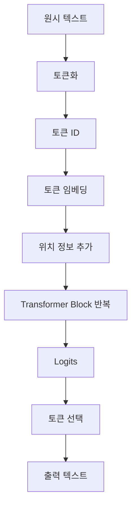

LLM을 이해하려면 단순히 “챗봇이 문장을 만든다”가 아니라, 다음 흐름을 정확히 이해해야 합니다.

```text
텍스트
→ 토큰화
→ 토큰 ID
→ 임베딩 벡터
→ 위치 정보 추가
→ 트랜스포머 블록 반복
→ 다음 토큰 확률 계산
→ 토큰 선택
→ 텍스트로 디코딩
```

이 자료는 위 흐름을 기준으로 구성되어 있습니다.

처음 읽을 때는 다음 순서로 보는 것이 좋습니다.

```text
1. 텍스트가 숫자로 바뀌는 과정
   토큰화 → 토큰 ID → 임베딩

2. 숫자 벡터가 문맥 정보를 얻는 과정
   위치 임베딩 → 셀프 어텐션 → 멀티 헤드 어텐션

3. GPT 모델이 다음 토큰을 고르는 과정
   Transformer Block → Logits → Softmax → Sampling

4. 모델이 좋아지는 과정
   Cross Entropy → Backpropagation → Optimizer → Fine-tuning
```

수식은 최소한으로 쓰되, 반드시 알아야 하는 수식은 포함했습니다. 특히 `shape`, `softmax`, `cross entropy`, `Q/K/V`, `causal mask`는 LLM 구현에서 계속 등장하므로 처음에는 천천히 읽는 편이 좋습니다.

## 1. LLM이란 무엇인가

### 1.1 LLM의 정의


#### 시각화: LLM의 가장 기본 동작

LLM은 완성 문장을 한 번에 뽑는 장치가 아니라, 다음 토큰 예측을 반복하는 모델입니다.

```text
초기 입력
"Every effort moves"
        │
        ▼
┌──────────────────────────────┐
│ LLM forward pass              │
│ 입력 문맥을 보고 다음 토큰 점수 계산 │
└──────────────────────────────┘
        │
        ▼
다음 토큰 후보 확률
┌───────────┬────────┐
│ 후보 토큰 │ 확률   │
├───────────┼────────┤
│ you       │ 0.42   │
│ forward   │ 0.18   │
│ slowly    │ 0.04   │
│ ...       │ ...    │
└───────────┴────────┘
        │
        ▼
선택된 토큰: "you"
        │
        ▼
새 입력
"Every effort moves you"
```

이 과정을 여러 번 반복하면 긴 문장이 됩니다.

```text
1회차: Every effort moves        -> you
2회차: Every effort moves you    -> forward
3회차: Every effort moves you forward -> .
```


LLM, 즉 Large Language Model은 대규모 텍스트 데이터로 훈련된 언어 모델입니다. 핵심 기능은 주어진 문맥을 바탕으로 다음에 올 토큰의 확률을 계산하는 것입니다.

LLM의 기본 작업은 다음과 같습니다.

```text
입력:  "Every effort moves"
모델 출력: 다음 토큰 후보들의 확률
예: "you" 0.42, "forward" 0.18, "slowly" 0.04, ...
```

LLM은 한 번에 완성된 문장을 통째로 생성하는 것이 아닙니다. 보통 한 토큰씩 생성합니다.

```text
1단계: Every effort moves → you
2단계: Every effort moves you → forward
3단계: Every effort moves you forward → .
```

따라서 LLM을 가장 정확하게 말하면 다음과 같습니다.

> LLM은 주어진 토큰 시퀀스에서 다음 토큰의 확률 분포를 예측하도록 훈련된 대규모 신경망입니다.

### 1.2 “언어를 이해한다”는 말의 정확한 의미

LLM이 “이해한다”고 말할 때, 이것은 사람이 의미를 의식적으로 이해한다는 뜻이 아닙니다. LLM은 대규모 데이터에서 토큰 사이의 패턴, 문맥, 문장 구조, 의미적 연관성을 통계적으로 학습합니다.

정확히는 다음과 같습니다.

- 문장 안에서 어떤 단어가 어떤 단어와 자주 함께 등장하는지 학습합니다.
- 문맥에 따라 같은 단어가 다른 역할을 할 수 있음을 학습합니다.
- 긴 문장 안에서 앞쪽 정보가 뒤쪽 예측에 영향을 줄 수 있음을 학습합니다.
- 결과적으로 사람이 보기에는 문맥을 이해한 것처럼 보이는 출력을 생성합니다.

반드시 기억해야 할 점은 다음입니다.

> LLM의 출력은 “지식 데이터베이스에서 정답을 꺼내는 것”이 아니라, “문맥에 따라 가장 그럴듯한 다음 토큰을 반복적으로 선택하는 것”입니다.

이 때문에 LLM은 그럴듯하지만 틀린 답을 만들 수 있습니다. 이를 흔히 환각, hallucination이라고 부릅니다.

---

## 2. AI, 머신러닝, 딥러닝, LLM의 관계


### 구조도: AI 안에서 LLM의 위치

```text
Artificial Intelligence, AI
│
├─ 규칙 기반 시스템
│  └─ 사람이 직접 if/else 규칙 작성
│
└─ Machine Learning
   │
   ├─ 전통적 머신러닝
   │  └─ 사람이 feature를 설계하는 경우가 많음
   │
   └─ Deep Learning
      │
      ├─ CNN, RNN 등
      │
      └─ Transformer 기반 LLM
         ├─ GPT 계열
         ├─ BERT 계열
         └─ 기타 언어 모델
```

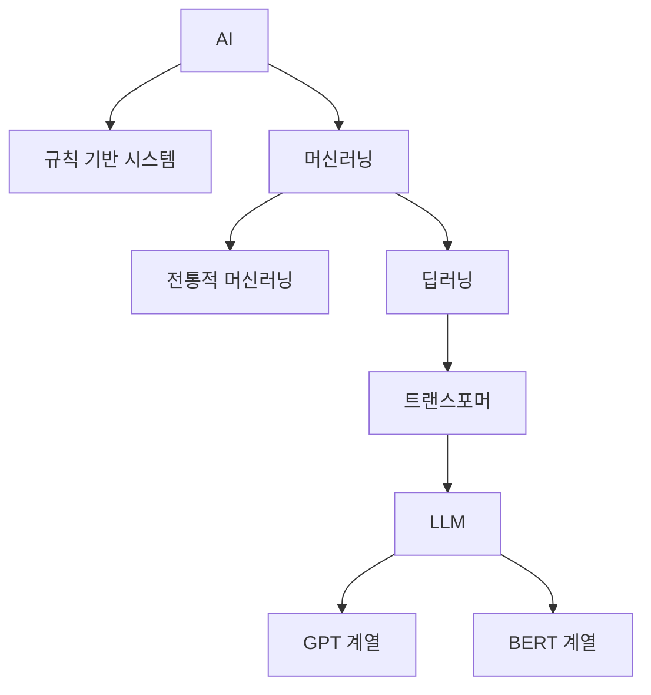


LLM은 AI 전체 중 하나의 분야입니다.

```text
AI
└─ 머신러닝
   └─ 딥러닝
      └─ 트랜스포머 기반 LLM
```

### 2.1 AI

AI는 사람이 지능이 필요하다고 보는 작업을 컴퓨터가 수행하도록 만드는 넓은 분야입니다. 예시는 다음과 같습니다.

- 언어 이해
- 이미지 인식
- 의사 결정
- 게임 플레이
- 계획 수립

### 2.2 머신러닝

머신러닝은 사람이 규칙을 전부 직접 작성하지 않고, 데이터로부터 규칙을 학습하게 하는 방법입니다.

예를 들어 스팸 필터를 만든다고 할 때, 사람이 다음과 같은 규칙을 직접 작성할 수 있습니다.

```text
"무료"가 들어가면 스팸일 가능성이 높다.
"당첨"이 들어가면 스팸일 가능성이 높다.
링크가 많으면 스팸일 가능성이 높다.
```

하지만 이런 규칙은 쉽게 깨집니다. 머신러닝에서는 스팸과 스팸 아님 예시를 많이 주고, 모델이 패턴을 학습하게 합니다.

### 2.3 딥러닝

딥러닝은 여러 층의 신경망을 사용해 데이터의 복잡한 패턴을 학습하는 머신러닝 방식입니다. LLM은 딥러닝 모델이며, 매우 많은 층과 파라미터를 사용합니다.

### 2.4 생성형 AI와 LLM

생성형 AI는 새로운 콘텐츠를 생성하는 AI입니다.

- 텍스트 생성
- 이미지 생성
- 코드 생성
- 음악 생성
- 요약 및 번역

LLM은 생성형 AI 중 텍스트를 중심으로 처리하는 모델입니다.

---

## 3. LLM에서 “대규모”가 의미하는 것


### 시각화: 파라미터와 데이터 크기

```text
LLM에서 "Large"가 의미하는 두 축

          ┌────────────────────┐
          │  1. 모델이 큼       │
          │  파라미터가 많음    │
          └────────────────────┘
                    │
                    ▼
        예: Linear 층 가중치 행렬

        W = [ 2048행 × 2048열 ]

        파라미터 수 = 2048 × 2048
                    = 4,194,304개


          ┌────────────────────┐
          │  2. 데이터가 큼     │
          │  토큰 수가 많음     │
          └────────────────────┘
                    │
                    ▼
        웹 문서 + 책 + 위키 + 논문 + 코드 + Q&A ...
```

파라미터는 모델이 학습 중 바꾸는 숫자입니다. 하이퍼파라미터는 사람이 정하는 설정값입니다.

```text
파라미터 예시        : 가중치 W, 편향 b, 임베딩 행렬 값
하이퍼파라미터 예시  : learning rate, batch size, layer 수, head 수
```


LLM에서 large는 두 가지 의미를 가집니다.

### 3.1 많은 파라미터

파라미터는 신경망 내부의 학습 가능한 숫자입니다. 보통 가중치라고도 부릅니다.

예를 들어 행렬 하나가 다음 크기라면:

```text
2048 × 2048
```

파라미터 개수는 다음과 같습니다.

```text
2048 × 2048 = 4,194,304개
```

LLM은 이런 파라미터를 수억 개에서 수천억 개 이상 가질 수 있습니다.

### 3.2 많은 훈련 데이터

LLM은 대규모 말뭉치로 훈련됩니다. 말뭉치는 텍스트 데이터 모음입니다.

예시는 다음과 같습니다.

- 웹 문서
- 책
- 위키백과
- 논문
- 코드
- 질의응답 데이터

데이터가 다양할수록 모델은 다양한 문체, 지식, 언어 패턴, 코드 패턴을 학습할 수 있습니다.

---

## 4. LLM 개발의 큰 흐름


### 구조도: LLM 개발 전체 흐름

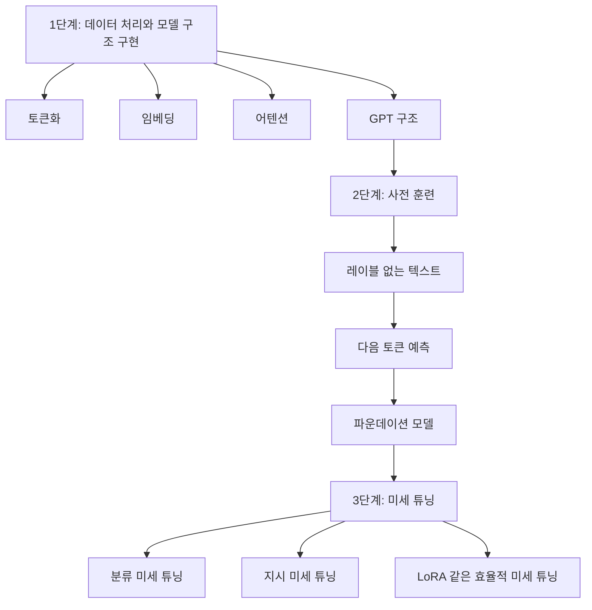

```text
사전 훈련 데이터 예시

문장: The model is trained to predict the next word

입력                            정답
──────────────────────────────  ───────
The                             model
The model                       is
The model is                    trained
The model is trained            to
The model is trained to         predict
```


LLM 개발은 크게 세 단계로 볼 수 있습니다.

```text
1단계: 모델 구조와 데이터 처리 구현
2단계: 레이블 없는 텍스트로 사전 훈련
3단계: 특정 목적에 맞게 미세 튜닝
```

### 4.1 사전 훈련

사전 훈련은 레이블이 없는 대규모 텍스트에서 다음 토큰 예측을 학습하는 단계입니다.

예를 들어 문장이 다음과 같다고 합시다.

```text
The model is trained to predict the next word
```

모델은 다음과 같은 문제를 반복해서 풉니다.

```text
The → model
The model → is
The model is → trained
The model is trained → to
```

이 방식은 사람이 직접 정답 레이블을 붙이지 않아도 됩니다. 텍스트 자체에서 정답을 만들 수 있기 때문입니다. 이를 자기 지도 학습이라고 합니다.

### 4.2 파운데이션 모델

사전 훈련이 끝난 모델을 파운데이션 모델 또는 베이스 모델이라고 부릅니다. 이 모델은 일반적인 텍스트 완성 능력을 갖습니다.

하지만 사전 훈련만 된 모델은 반드시 좋은 챗봇은 아닙니다. “요약해 줘”, “번역해 줘”, “다음 코드를 고쳐 줘” 같은 지시를 잘 따르도록 만들려면 추가 훈련이 필요합니다.

### 4.3 미세 튜닝

미세 튜닝은 이미 훈련된 모델을 특정 작업에 맞게 조금 더 훈련하는 과정입니다.

대표적인 미세 튜닝은 두 가지입니다.

| 종류 | 목적 | 데이터 형태 |
|---|---|---|
| 분류 미세 튜닝 | 입력을 정해진 클래스 중 하나로 분류 | 텍스트 + 클래스 레이블 |
| 지시 미세 튜닝 | 사용자의 지시를 따르는 응답 생성 | 지시 + 입력 + 정답 응답 |

예를 들어 스팸 분류는 분류 미세 튜닝입니다.

```text
입력: "You won $1000! Click here"
출력: spam
```

지시 미세 튜닝은 다음과 같습니다.

```text
지시: 다음 문장을 독일어로 번역하라.
입력: The dog is sleeping.
정답: Der Hund schläft.
```

---

## 5. 텍스트는 바로 모델에 들어갈 수 없다


### 시각화: 텍스트가 바로 모델에 들어갈 수 없는 이유

신경망은 문자열을 직접 계산하지 못합니다. 행렬 곱셈, 덧셈, 미분을 하려면 숫자 텐서가 필요합니다.

```text
사람이 보는 입력
"This is an example."

컴퓨터가 신경망에 넣기 위해 필요한 형태
[1212, 318, 281, 1672, 13]

그다음 실제 모델 내부 표현
[[ 0.12, -0.33, ...],
 [ 1.02,  0.04, ...],
 [ ...              ]]
```


신경망은 숫자 연산을 수행합니다. 하지만 텍스트는 문자열입니다. 따라서 텍스트를 숫자로 바꾸는 과정이 필요합니다.

전체 과정은 다음과 같습니다.

```text
원문 텍스트
→ 토큰
→ 토큰 ID
→ 임베딩 벡터
→ 위치 임베딩 추가
→ LLM 입력
```

---

## 6. 토큰화


#### ASCII 예시: 토큰화 전후

```text
입력 문장
"Hello, world. Is this a test?"

토큰화 결과
┌───────┬───┬───────┬───┬────┬──────┬───┬────┬───┐
│Hello  │ , │world  │ . │Is  │this  │a  │test│ ? │
└───────┴───┴───────┴───┴────┴──────┴───┴────┴───┘
```

토큰은 항상 단어 하나와 같지 않습니다.

```text
가능한 토큰 단위

단어       : "hello"
부분단어   : "un", "believ", "able"
문자       : "A", "k", "w"
구두점     : ",", ".", "?"
공백 포함  : "Ġhello" 같은 형태를 쓰는 토크나이저도 있음
```


### 6.1 토큰이란 무엇인가

토큰은 모델이 텍스트를 처리하는 기본 단위입니다.

토큰은 반드시 단어 하나와 같지는 않습니다. 다음이 모두 토큰이 될 수 있습니다.

- 단어
- 부분 단어
- 구두점
- 공백을 포함한 문자열 조각
- 특수 토큰

예를 들어:

```text
입력: This is an example.
토큰: ["This", "is", "an", "example", "."]
```

또는 BPE 같은 토크나이저에서는 단어가 더 작은 조각으로 나뉠 수 있습니다.

```text
unknownword → ["unknown", "word"] 또는 ["un", "known", "word"]
```

### 6.2 토큰화가 필요한 이유

LLM은 문자열 자체를 처리하지 않습니다. 각 토큰을 정수 ID로 바꾼 뒤, 정수 ID를 벡터로 바꿔 처리합니다.

```text
"This" → 4013
"is" → 2052
"an" → 1333
"example" → 8912
```

이런 정수 ID는 어휘사전의 인덱스입니다.

### 6.3 어휘사전


#### ASCII 예시: 어휘사전과 토큰 ID

```text
토큰화된 데이터
[The, quick, brown, fox, jumps, over, the, dog]

고유 토큰 정리
brown, dog, fox, jumps, over, quick, The, the

어휘사전 예시
┌────────┬─────────┐
│ 토큰   │ 토큰 ID │
├────────┼─────────┤
│ brown  │ 0       │
│ dog    │ 1       │
│ fox    │ 2       │
│ jumps  │ 3       │
│ over   │ 4       │
│ quick  │ 5       │
│ The    │ 6       │
│ the    │ 7       │
└────────┴─────────┘

문장 "The brown dog" → [6, 0, 1]
```

주의할 점은 토큰 ID 자체에는 의미적 거리가 없습니다. ID 1과 ID 2가 가깝다고 해서 뜻이 비슷하다는 의미는 아닙니다.


어휘사전은 토큰과 정수 ID의 매핑입니다.

```text
"apple" → 0
"banana" → 1
"cat" → 2
"." → 3
```

역방향 매핑도 필요합니다.

```text
0 → "apple"
1 → "banana"
2 → "cat"
3 → "."
```

이 역방향 매핑은 모델이 출력한 토큰 ID를 다시 텍스트로 바꿀 때 사용합니다.

### 6.4 특수 토큰

특수 토큰은 일반 단어가 아니라 모델 처리에 필요한 신호입니다.

| 토큰 | 의미 |
|---|---|
| `<unk>` | 어휘사전에 없는 알 수 없는 토큰 |
| `<endoftext>` | 문서나 텍스트의 끝 |
| `[BOS]` | 시퀀스 시작 |
| `[EOS]` | 시퀀스 끝 |
| `[PAD]` | 길이를 맞추기 위한 패딩 |

GPT 계열 모델에서는 `<endoftext>`가 문서 구분과 패딩 용도로 사용될 수 있습니다.

---

## 7. BPE, Byte Pair Encoding


### ASCII 예시: BPE 병합 과정

BPE는 자주 같이 나오는 문자 또는 부분단어 쌍을 반복해서 병합합니다.

```text
초기 상태
l o w e r
l o w e s t
n e w e r

자주 등장하는 쌍을 병합
l + o  -> lo
lo + w -> low

중간 상태
low e r
low e s t
n e w e r

다시 자주 등장하는 쌍을 병합
 e + r -> er
 e + s -> es

결과 예시
lower  -> low + er
lowest -> low + est
newer  -> n + e + w + er
```

핵심은 모르는 단어도 더 작은 단위로 쪼개서 처리할 수 있다는 점입니다.

```text
처음 보는 단어: Akwirw_ier
가능한 분해  : A + k + w + ir + w + _ + ier
```


### 7.1 BPE의 목적

BPE는 단어를 더 작은 부분 단어로 나눌 수 있는 토큰화 방법입니다. 핵심 목적은 어휘사전에 없는 단어도 처리하는 것입니다.

예를 들어 모델이 처음 보는 단어가 들어왔을 때 단어 전체를 모른다고 버리는 것이 아니라, 이미 아는 조각으로 분해합니다.

```text
someunknownPlace
→ some
→ unknown
→ Place
```

또는 더 작게 나눌 수도 있습니다.

```text
Akwirwier
→ A
→ kw
→ ir
→ w
→ ier
```

### 7.2 BPE가 중요한 이유

BPE를 쓰면 다음 장점이 있습니다.

1. 처음 보는 단어를 처리할 수 있습니다.
2. 단어 단위 어휘사전보다 효율적입니다.
3. 자주 등장하는 단어 조각은 하나의 토큰으로 묶어 처리할 수 있습니다.
4. 희귀 단어는 더 작은 조각으로 나눠 처리할 수 있습니다.

### 7.3 BPE의 기본 아이디어

BPE는 자주 함께 등장하는 문자나 문자 조각을 반복적으로 병합합니다.

간단한 과정은 다음과 같습니다.

```text
1. 처음에는 문자 단위로 시작
2. 가장 자주 붙어 나오는 쌍을 찾음
3. 그 쌍을 하나의 토큰으로 병합
4. 반복
```

예를 들어 `d`와 `e`가 자주 붙어 나온다면 `de`라는 부분 단어를 만들 수 있습니다. 이후 `de`가 들어간 단어는 더 효율적으로 토큰화됩니다.

---

## 8. 임베딩


### ASCII 예시: 임베딩 층은 행을 꺼내는 lookup입니다

```text
임베딩 행렬 E

토큰 ID   임베딩 벡터
0       [ 0.12, -0.40,  0.31, ...]
1       [-0.07,  0.88,  0.04, ...]
2       [ 1.21, -0.33, -0.55, ...]
3       [ 0.19,  0.02,  0.77, ...]

입력 토큰 ID: [2, 3, 1]

lookup 결과
2 -> [ 1.21, -0.33, -0.55, ...]
3 -> [ 0.19,  0.02,  0.77, ...]
1 -> [-0.07,  0.88,  0.04, ...]
```


### 8.1 임베딩의 정의

임베딩은 토큰 ID를 실수 벡터로 바꾸는 과정입니다.

```text
토큰 ID 345 → [0.12, -0.08, 1.43, ...]
```

신경망은 정수 ID 자체보다 벡터 표현을 사용해야 학습하기 좋습니다.

### 8.2 왜 정수 ID만으로는 부족한가

토큰 ID는 단순한 번호입니다.

```text
cat → 10
dog → 11
pizza → 12
```

번호가 가깝다고 의미가 비슷하다는 뜻은 아닙니다. 신경망이 이 번호를 그대로 사용하면 잘못된 순서 관계를 학습할 수 있습니다.

그래서 각 토큰을 학습 가능한 벡터로 바꿉니다.

### 8.3 임베딩 층

PyTorch에서는 임베딩 층을 다음처럼 생각할 수 있습니다.

```python
embedding_layer = torch.nn.Embedding(vocab_size, emb_dim)
```

이 층은 크기가 다음과 같은 행렬을 가집니다.

```text
[vocab_size, emb_dim]
```

예를 들어:

```text
vocab_size = 50257
emb_dim = 768
```

그러면 임베딩 행렬 크기는 다음과 같습니다.

```text
50257 × 768
```

토큰 ID는 이 행렬에서 특정 행을 고르는 인덱스 역할을 합니다.

```text
토큰 ID 345 → 임베딩 행렬의 345번째 행
```

### 8.4 임베딩은 훈련 중 바뀐다

임베딩 벡터는 고정된 값이 아닙니다. 모델 훈련 중 손실을 줄이는 방향으로 업데이트됩니다. 즉, 모델은 텍스트 예측에 유리한 방식으로 각 토큰의 벡터 표현을 학습합니다.

---

## 9. 위치 임베딩


### ASCII 예시: 토큰 임베딩 + 위치 임베딩

같은 토큰이라도 위치가 다르면 문장 안 역할이 달라질 수 있습니다. 그래서 위치 정보를 더합니다.

```text
토큰 ID 시퀀스
[fox, jumps, over, fox]

토큰 임베딩만 사용하면
fox 위치 0 -> E[fox]
fox 위치 3 -> E[fox]        두 벡터가 동일함

위치 임베딩을 더하면
위치 0의 fox -> E[fox] + P[0]
위치 3의 fox -> E[fox] + P[3]

따라서 모델은 같은 fox라도 위치 차이를 볼 수 있음
```

```text
입력 임베딩 계산

토큰 임베딩      T0      T1      T2      T3
위치 임베딩    + P0    + P1    + P2    + P3
──────────────────────────────────────────
모델 입력        X0      X1      X2      X3
```


### 9.1 위치 정보가 필요한 이유

셀프 어텐션은 입력 토큰들의 관계를 계산하지만, 기본적으로 토큰의 순서 정보를 직접 알지 못합니다.

다음 두 문장은 단어는 같지만 의미가 다릅니다.

```text
dog bites man
man bites dog
```

토큰만 있으면 두 문장의 구성 단어는 같습니다. 하지만 순서가 다르므로 의미가 달라집니다. 따라서 모델에는 위치 정보가 필요합니다.

### 9.2 절대 위치 임베딩

절대 위치 임베딩은 각 위치마다 별도의 벡터를 둡니다.

```text
위치 0 → position embedding 0
위치 1 → position embedding 1
위치 2 → position embedding 2
```

최종 입력 임베딩은 다음과 같이 만듭니다.

```text
입력 임베딩 = 토큰 임베딩 + 위치 임베딩
```

예를 들어:

```text
"Every"의 토큰 벡터 + 위치 0의 위치 벡터
"effort"의 토큰 벡터 + 위치 1의 위치 벡터
```

### 9.3 상대 위치 임베딩

상대 위치 임베딩은 “절대 몇 번째 토큰인가”보다 “두 토큰 사이의 거리가 얼마인가”에 집중합니다. 최근 모델들에는 다양한 위치 인코딩 방식이 사용되지만, GPT-2 계열 설명에서는 학습 가능한 절대 위치 임베딩을 이해하는 것이 우선입니다.

---


## 10. 슬라이딩 윈도와 입력-타깃 쌍

### ASCII 예시: 입력과 타깃은 한 칸 차이입니다

LLM은 다음 토큰 예측으로 훈련됩니다. 긴 텍스트 하나를 그대로 통째로 넣는 것이 아니라, 일정 길이의 조각을 계속 잘라서 학습 샘플을 만듭니다.

```text
토큰 시퀀스
[t0, t1, t2, t3, t4, t5, t6]

context_size = 4일 때

입력 x: [t0, t1, t2, t3]
타깃 y: [t1, t2, t3, t4]

모델이 해야 할 예측
────────────────────────
t0              -> t1
t0 t1           -> t2
t0 t1 t2        -> t3
t0 t1 t2 t3     -> t4
```

핵심은 **입력과 타깃이 거의 같지만, 타깃이 한 칸 오른쪽으로 밀려 있다**는 점입니다.

```text
입력 x : [오늘, 날씨, 는, 정말]
타깃 y : [날씨, 는, 정말, 좋다]

모델은 각 위치에서 다음 토큰을 맞힙니다.

입력 위치 0: "오늘"               -> "날씨"
입력 위치 1: "오늘 날씨"          -> "는"
입력 위치 2: "오늘 날씨 는"       -> "정말"
입력 위치 3: "오늘 날씨 는 정말"  -> "좋다"
```

### 10.1 왜 슬라이딩 윈도를 쓰는가

슬라이딩 윈도를 쓰는 이유는 단순히 데이터를 잘라내기 위해서가 아닙니다. LLM 훈련에 필요한 조건을 동시에 만족시키기 위해서입니다.

첫째, LLM은 한 번에 처리할 수 있는 토큰 수가 정해져 있습니다. 이를 문맥 길이 또는 context length라고 합니다. 예를 들어 모델이 한 번에 4개 토큰만 볼 수 있다면 긴 문장 전체를 한 번에 넣을 수 없습니다.

```text
긴 토큰 시퀀스
[t0 t1 t2 t3 t4 t5 t6 t7 t8 t9]

모델의 최대 입력 길이 = 4

따라서 학습 샘플을 이렇게 잘라야 함
[t0 t1 t2 t3]
[t1 t2 t3 t4]
[t2 t3 t4 t5]
...
```

둘째, 레이블이 없는 텍스트에서도 정답을 자동으로 만들 수 있습니다. 입력을 한 칸 밀면 다음 토큰이 정답이 됩니다. 이것이 LLM 사전 훈련이 자기 지도 학습으로 가능한 이유입니다.

```text
원본 텍스트만 있음
"The model learns patterns"

사람이 따로 레이블을 붙이지 않아도 됨
The         -> model
The model   -> learns
model learns -> patterns
```

셋째, 긴 텍스트 하나에서 많은 훈련 샘플을 만들 수 있습니다.

```text
원본 토큰 10개, context_size = 4, stride = 1

샘플 1: [t0 t1 t2 t3] -> [t1 t2 t3 t4]
샘플 2: [t1 t2 t3 t4] -> [t2 t3 t4 t5]
샘플 3: [t2 t3 t4 t5] -> [t3 t4 t5 t6]
샘플 4: [t3 t4 t5 t6] -> [t4 t5 t6 t7]
...
```

넷째, 배치 학습을 만들기 좋습니다. 같은 길이의 입력 조각을 여러 개 모으면 PyTorch에서 `[batch, tokens]` 형태의 텐서로 묶을 수 있습니다.

```text
batch_size = 3, context_size = 4

inputs:
[[t0, t1, t2, t3],
 [t1, t2, t3, t4],
 [t2, t3, t4, t5]]

shape = [3, 4]
```

정리하면, 슬라이딩 윈도는 다음 네 가지 목적을 가집니다.

| 목적 | 설명 |
|---|---|
| 문맥 길이 제한 처리 | 모델이 한 번에 볼 수 있는 길이에 맞춰 텍스트를 자릅니다. |
| 다음 토큰 정답 생성 | 입력을 한 칸 밀어 타깃을 만듭니다. |
| 훈련 샘플 증가 | 긴 텍스트 하나에서 여러 샘플을 만듭니다. |
| 배치 구성 | 같은 길이의 입력을 묶어 GPU에서 효율적으로 계산합니다. |

### 10.2 스트라이드

슬라이딩 윈도에서 스트라이드는 윈도를 몇 칸씩 이동할지 정하는 값입니다.

```text
max_length = 4, stride = 1
[1,2,3,4]
[2,3,4,5]
[3,4,5,6]
```

```text
max_length = 4, stride = 4
[1,2,3,4]
[5,6,7,8]
```

스트라이드가 작으면 샘플이 많이 겹칩니다. 스트라이드가 크면 중복이 줄어듭니다.

```text
stride = 1
장점: 더 많은 학습 샘플을 만들 수 있음
단점: 샘플이 많이 겹쳐 중복이 큼

stride = context_size
장점: 중복이 거의 없음
단점: 만들어지는 샘플 수가 적음
```

실습에서는 개념을 보기 위해 `stride = 1`을 자주 쓰지만, 실제 훈련에서는 데이터 중복, 계산량, 과대적합 가능성을 함께 고려해서 정합니다.

### 10.3 입력과 타깃이 헷갈릴 때 보는 표

| 구분 | 의미 | 예시 |
|---|---|---|
| 원본 토큰 | 토큰화된 전체 텍스트 | `[10, 20, 30, 40, 50]` |
| 입력 x | 모델에게 보여주는 토큰 | `[10, 20, 30, 40]` |
| 타깃 y | 모델이 맞혀야 하는 다음 토큰 | `[20, 30, 40, 50]` |
| 예측 방식 | 각 위치에서 다음 토큰 예측 | `10 -> 20`, `10,20 -> 30` |

PyTorch 구현에서는 보통 `Dataset`의 `__getitem__`이 `(input_ids, target_ids)`를 반환하고, `DataLoader`가 여러 쌍을 배치로 묶습니다.

## 11. 어텐션이 필요한 이유


### ASCII 예시: 어텐션이 필요한 상황

긴 문장에서 뒤쪽 단어를 예측하려면 앞쪽 정보가 필요할 수 있습니다.

```text
문장
The animal didn't cross the street because it was too tired.

질문
"it"은 무엇을 가리키는가?

가능한 참조
The animal  ← 가능성이 큼
street      ← 문법적으로 가능해 보일 수 있으나 문맥상 덜 적절
```

어텐션은 각 토큰이 다른 토큰을 얼마나 참고할지 숫자로 계산합니다.

```text
현재 토큰: it

참고 대상       중요도
──────────────────────
The animal      높음
street          낮음
because         낮음
```


기존 순환 신경망 기반 모델은 긴 문장에서 앞쪽 정보를 뒤쪽까지 잘 전달하기 어려웠습니다. 특히 번역 같은 작업에서는 입력 문장의 여러 위치를 동시에 참고해야 합니다.

어텐션은 현재 토큰이 다른 토큰들을 얼마나 참고해야 하는지 계산하는 메커니즘입니다.

예를 들어 다음 문장을 생각합니다.

```text
The animal didn't cross the street because it was tired.
```

`it`이 무엇을 가리키는지 판단하려면 앞의 `animal`과 관계를 봐야 합니다.

어텐션은 이런 관계를 수치적으로 계산합니다.

---


## 12. 셀프 어텐션

### ASCII 예시: 셀프 어텐션의 출력은 문맥 벡터입니다

셀프 어텐션은 같은 입력 시퀀스 안에서 토큰들이 서로를 얼마나 참고해야 하는지 계산합니다. 결과는 각 토큰의 새 표현인 **문맥 벡터**입니다.

```text
입력 토큰 벡터
x1 = Your
x2 = journey
x3 = starts
x4 = with
x5 = one
x6 = step

x2 = journey의 문맥 벡터 z2를 만들 때

z2 = a21*x1 + a22*x2 + a23*x3 + a24*x4 + a25*x5 + a26*x6

여기서 a2j는 journey가 j번째 토큰을 얼마나 참고하는지 나타내는 어텐션 가중치입니다.
```

어텐션 가중치 행렬은 다음처럼 볼 수 있습니다.

```text
                 참고 대상 key
              Your  journey starts with  one  step
query Your     .20    .20     .19   .12   .12  .14
query journey  .13    .23     .23   .12   .10  .15
query starts   .13    .23     .23   .12   .11  .15
query with     .14    .20     .20   .14   .12  .17
query one      .15    .19     .19   .13   .18  .12
query step     .13    .21     .21   .14   .09  .18
```

각 행의 합은 1이 됩니다. 한 행은 “현재 query 토큰이 다른 토큰들을 어떤 비율로 참고하는가”를 뜻합니다.

### 12.1 셀프 어텐션의 목표

입력이 다음과 같다고 합시다.

```text
Your journey starts with one step
```

각 토큰은 자기 자신뿐 아니라 문장 안의 다른 토큰을 참고하여 새로운 벡터를 만듭니다.

```text
기존 토큰 벡터
x2 = journey 자체의 벡터

셀프 어텐션 후 문맥 벡터
z2 = 문장 안의 다른 토큰 정보까지 반영한 journey의 새 벡터
```

즉, 셀프 어텐션은 다음 작업을 합니다.

```text
각 토큰 벡터
   │
   ▼
다른 토큰과의 관련도 계산
   │
   ▼
관련도 높은 토큰을 더 많이 반영
   │
   ▼
문맥이 반영된 새 벡터 생성
```

### 12.2 점곱

셀프 어텐션의 가장 기본 연산은 점곱입니다. 점곱은 두 벡터의 같은 위치 원소를 곱한 뒤 모두 더하는 연산입니다.

```text
a = [a1, a2, a3]
b = [b1, b2, b3]

a · b = a1*b1 + a2*b2 + a3*b3
```

숫자로 보면 다음과 같습니다.

```text
a = [1, 2, 3]
b = [4, 5, 6]

a · b = 1*4 + 2*5 + 3*6
      = 4 + 10 + 18
      = 32
```

PyTorch 코드로는 다음과 같습니다.

```python
import torch

a = torch.tensor([1, 2, 3])
b = torch.tensor([4, 5, 6])

score = torch.dot(a, b)
print(score)  # tensor(32)
```

어텐션에서는 점곱을 **관련도 점수**로 사용합니다.

```text
현재 토큰 벡터 q
다른 토큰 벡터 k

q · k 값이 큼   -> 두 벡터가 비슷한 방향 -> 관련도가 높다고 판단
q · k 값이 작음 -> 두 벡터가 덜 맞음    -> 관련도가 낮다고 판단
```

주의할 점은 점곱이 “완벽한 의미 비교”는 아니라는 것입니다. 점곱은 벡터의 방향과 크기를 함께 반영하는 수치 계산입니다. LLM에서는 훈련을 통해 토큰 벡터와 Q/K/V 변환이 조정되기 때문에, 점곱이 “다음 토큰 예측에 유용한 관련도”가 되도록 학습됩니다.

#### 점곱으로 어텐션 점수 만들기

예를 들어 `journey` 토큰이 다른 토큰을 얼마나 참고할지 계산한다고 합시다.

```text
query 토큰: journey

journey · Your     = 0.95
journey · journey  = 1.49
journey · starts   = 1.47
journey · with     = 0.84
journey · one      = 0.70
journey · step     = 1.08
```

이 값들은 아직 확률이 아닙니다. 그냥 정규화 전 점수입니다. 그래서 다음 단계에서 softmax를 적용합니다.

```text
정규화 전 점수
[0.95, 1.49, 1.47, 0.84, 0.70, 1.08]

softmax 후 어텐션 가중치
[0.14, 0.24, 0.23, 0.12, 0.11, 0.16]

합 = 1.00
```

### 12.3 훈련 가능한 가중치가 없는 단순 셀프 어텐션

가장 단순한 셀프 어텐션은 훈련 가능한 가중치 없이도 이해할 수 있습니다. 이 버전은 실제 LLM의 최종 형태는 아니지만, 어텐션이 무엇을 계산하는지 보기에 좋습니다.

전체 과정은 네 단계입니다.

```text
1. 각 토큰 쌍의 점곱을 계산한다.
2. 점수를 softmax로 정규화한다.
3. 정규화된 가중치로 입력 벡터들을 가중합한다.
4. 결과가 문맥 벡터가 된다.
```

조금 더 구조적으로 쓰면 다음과 같습니다.

```text
입력 행렬 X
각 행 = 토큰 하나의 임베딩 벡터

1단계: 점수 행렬 계산
scores = X @ X.T

2단계: 행별 softmax
weights = softmax(scores)

3단계: 문맥 벡터 계산
context = weights @ X
```

ASCII로 보면 다음과 같습니다.

```text
입력 X
┌──────┬──────┬──────┐
│ x1   │      │      │
│ x2   │      │      │
│ x3   │      │      │
└──────┴──────┴──────┘
     │
     ▼
점수 계산: X @ X.T

        key
       x1   x2   x3
q x1  s11  s12  s13
q x2  s21  s22  s23
q x3  s31  s32  s33

     │
     ▼
softmax를 행마다 적용

        key
       x1   x2   x3
q x1  a11  a12  a13   합 1
q x2  a21  a22  a23   합 1
q x3  a31  a32  a33   합 1

     │
     ▼
문맥 벡터 계산
z1 = a11*x1 + a12*x2 + a13*x3
z2 = a21*x1 + a22*x2 + a23*x3
z3 = a31*x1 + a32*x2 + a33*x3
```

여기서 중요한 용어는 세 가지입니다.

| 용어 | 의미 |
|---|---|
| 어텐션 점수 | softmax 전의 관련도 점수입니다. 보통 점곱으로 계산합니다. |
| 어텐션 가중치 | softmax 후의 값입니다. 각 행의 합이 1입니다. |
| 문맥 벡터 | 어텐션 가중치로 여러 입력 벡터를 섞은 결과입니다. |

단순 셀프 어텐션의 한계도 알아야 합니다. 입력 벡터끼리 직접 점곱하기 때문에, 모델이 “어떤 기준으로 비교할지”를 충분히 학습하기 어렵습니다. 실제 LLM에서는 입력 벡터를 바로 비교하지 않고, 입력을 Query, Key, Value라는 세 종류의 벡터로 변환한 뒤 어텐션을 계산합니다.

```text
단순 셀프 어텐션
입력 X를 그대로 비교하고 그대로 섞음

실제 LLM의 셀프 어텐션
입력 X를 Q, K, V로 바꾼 뒤
Q와 K로 참고 비율을 계산하고
V를 그 비율대로 섞음
```

다음 절의 Query, Key, Value는 이 차이를 이해하기 위한 핵심입니다.


## 13. Query, Key, Value

### 구조도: Q, K, V가 만들어지고 쓰이는 방식

실제 트랜스포머의 셀프 어텐션에서는 입력 벡터를 그대로 점곱하지 않습니다. 먼저 입력 벡터를 세 종류의 벡터로 변환합니다.

```text
입력 벡터 x_i
   │
   ├── Wq ──> q_i, Query
   ├── Wk ──> k_i, Key
   └── Wv ──> v_i, Value

어텐션 점수
score(i, j) = q_i · k_j / sqrt(d_k)

어텐션 가중치
attention(i, :) = softmax(score(i, :))

문맥 벡터
z_i = Σ_j attention(i, j) * v_j
```

아래 Mermaid는 파싱 오류가 나지 않도록 수식이 들어간 노드 라벨을 짧게 처리했습니다. 자세한 수식은 구조도 아래에서 설명합니다.

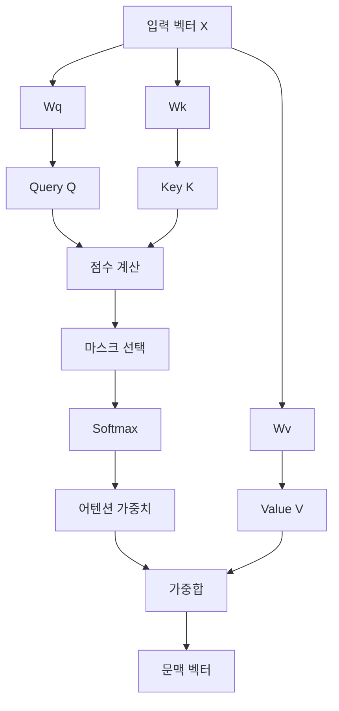

### 13.1 Q, K, V의 역할

Q, K, V는 이름이 어렵지만 역할은 명확합니다.

| 이름 | 의미 | 역할 |
|---|---|---|
| Query, Q | 현재 위치가 비교에 사용할 기준 | “현재 토큰이 어떤 정보를 필요로 하는가”를 나타냅니다. |
| Key, K | 각 토큰이 비교될 때 사용하는 기준 | Query와 점곱되어 어텐션 점수를 만듭니다. |
| Value, V | 실제로 문맥 벡터에 섞이는 정보 | 어텐션 가중치가 곱해져 최종 출력에 들어갑니다. |

가장 중요한 구분은 다음입니다.

```text
Q와 K의 역할: 참고 비율을 계산한다.
V의 역할    : 계산된 비율대로 실제 정보를 제공한다.
```

즉, Q와 K는 “얼마나 참고할지”를 정하는 데 쓰이고, V는 “무엇을 가져올지”에 쓰입니다.

### 13.2 왜 입력 X를 바로 쓰지 않고 Q, K, V로 바꾸는가

12장에서 본 단순 셀프 어텐션은 입력 벡터 `X`를 그대로 비교했습니다.

```text
scores = X @ X.T
context = softmax(scores) @ X
```

하지만 실제 LLM은 다음처럼 합니다.

```text
Q = X Wq
K = X Wk
V = X Wv

scores  = Q @ K.T / sqrt(d_k)
weights = softmax(scores)
context = weights @ V
```

이렇게 하는 이유는 모델이 비교 기준과 출력 정보를 따로 학습할 수 있기 때문입니다.

```text
입력 X 하나만 쓸 때
- 비교할 때 쓰는 정보와 출력으로 섞을 정보가 같음
- 표현력이 제한됨

Q, K, V를 나눌 때
- Q: 현재 토큰의 비교 기준
- K: 다른 토큰들의 비교 기준
- V: 실제로 가져올 정보
- 세 변환 Wq, Wk, Wv가 훈련 중 따로 학습됨
```

예를 들어 같은 입력 벡터라도 “문법 관계를 볼 때 필요한 표현”과 “의미 정보를 출력에 넣을 때 필요한 표현”이 다를 수 있습니다. Q/K/V는 이런 역할 분리를 가능하게 합니다.

### 13.3 단계별 계산 과정

입력 행렬을 `X`라고 합시다.

```text
X shape = [tokens, emb_dim]
```

예를 들어 토큰이 4개이고 임베딩 차원이 6이면 다음과 같습니다.

```text
X shape = [4, 6]
```

이제 세 개의 선형 변환을 적용합니다.

```text
Q = X Wq
K = X Wk
V = X Wv
```

만약 `d_k = 6`이라면 보통 다음 shape가 됩니다.

```text
Q shape = [4, 6]
K shape = [4, 6]
V shape = [4, 6]
```

그다음 Q와 K를 사용해 점수 행렬을 만듭니다.

```text
scores = Q @ K.T

Q shape   = [4, 6]
K.T shape = [6, 4]
scores    = [4, 4]
```

`scores[i, j]`는 i번째 토큰이 j번째 토큰을 얼마나 참고할지에 대한 정규화 전 점수입니다.

```text
             key 위치
           t0   t1   t2   t3
query t0  s00  s01  s02  s03
query t1  s10  s11  s12  s13
query t2  s20  s21  s22  s23
query t3  s30  s31  s32  s33
```

그다음 softmax를 각 행에 적용합니다.

```text
weights = softmax(scores)
```

마지막으로 Value를 섞습니다.

```text
context = weights @ V

weights shape = [4, 4]
V shape       = [4, 6]
context shape = [4, 6]
```

결과적으로 각 토큰 위치마다 문맥이 반영된 새 벡터가 생깁니다.

### 13.4 스케일드 점곱 어텐션

트랜스포머에서 사용하는 핵심 수식은 다음입니다.

```text
Attention(Q, K, V) = softmax((QK^T) / sqrt(d_k)) V
```

각 부분의 의미는 다음과 같습니다.

| 항목 | 의미 |
|---|---|
| `QK^T` | Query와 Key의 점수 행렬입니다. |
| `sqrt(d_k)` | 점수가 너무 커지는 것을 막는 스케일링 값입니다. |
| `softmax` | 점수를 합이 1인 어텐션 가중치로 바꿉니다. |
| `V` | 최종적으로 섞이는 실제 정보입니다. |

### 13.5 왜 `sqrt(d_k)`로 나누는가

벡터 차원이 커질수록 점곱 값도 커지기 쉽습니다. 점곱 값이 너무 커지면 softmax 결과가 한 위치에 거의 몰릴 수 있습니다.

```text
점수가 적당할 때
scores  = [1.2, 1.0, 0.8]
softmax = [0.40, 0.33, 0.27]

점수가 너무 클 때
scores  = [20, 3, 1]
softmax ≈ [1.00, 0.00, 0.00]
```

softmax가 한 위치에 지나치게 몰리면 학습 중 그레이디언트가 작아지고, 여러 토큰을 균형 있게 참고하기 어려워질 수 있습니다. 그래서 `sqrt(d_k)`로 나눠 점수 크기를 조절합니다.

```text
scores = QK^T / sqrt(d_k)
```

### 13.6 파라미터 가중치와 어텐션 가중치를 구분해야 합니다

이 부분은 자주 헷갈립니다.

| 구분 | 예시 | 의미 |
|---|---|---|
| 파라미터 가중치 | `Wq`, `Wk`, `Wv` | 훈련 중 업데이트되는 모델 내부 숫자입니다. |
| 어텐션 가중치 | `softmax(scores)` | 입력 문맥마다 달라지는 참고 비율입니다. |

즉, `Wq`, `Wk`, `Wv`는 모델이 학습하는 고정된 층의 파라미터이고, 어텐션 가중치는 매 입력 문장마다 새로 계산되는 값입니다.

```text
훈련 후에도 Wq, Wk, Wv는 모델 안에 저장됨
새 문장이 들어오면 Q, K, V와 attention weights는 새로 계산됨
```

### 13.7 PyTorch 구현에서 자주 보이는 코드

```python
q = self.W_query(x)
k = self.W_key(x)
v = self.W_value(x)

scores = q @ k.transpose(-2, -1)
scores = scores / (k.shape[-1] ** 0.5)
weights = torch.softmax(scores, dim=-1)
context = weights @ v
```

여기서 `transpose(-2, -1)`은 마지막 두 차원을 바꿔서 `Q @ K^T`를 계산하기 위한 것입니다.

```text
q shape          = [batch, tokens, emb_dim]
k shape          = [batch, tokens, emb_dim]
k.transpose      = [batch, emb_dim, tokens]
scores shape     = [batch, tokens, tokens]
weights shape    = [batch, tokens, tokens]
context shape    = [batch, tokens, emb_dim]
```

이 shape 흐름을 이해하면 Q/K/V 어텐션 코드가 훨씬 덜 낯설게 보입니다.

## 14. 소프트맥스


### ASCII 예시: 소프트맥스는 점수표를 확률표로 바꿉니다

```text
로짓 또는 점수
[2.0, 1.0, 0.1]

softmax 적용 후
[0.66, 0.24, 0.10]

성질
1. 모든 값이 0 이상입니다.
2. 전체 합이 1입니다.
3. 큰 점수는 큰 확률이 됩니다.
```

어텐션에서는 각 query가 어떤 key를 얼마나 참고할지 확률처럼 표현하는 데 사용됩니다.

```text
점수:       [1.2, 2.1, 0.3, -0.4]
softmax:   [0.23, 0.57, 0.09, 0.04]
합:         1.00
```


### 14.1 소프트맥스의 목적

소프트맥스는 여러 점수를 확률 분포처럼 바꿉니다.

입력:

```text
[2.0, 1.0, 0.1]
```

출력:

```text
[0.659, 0.242, 0.099]
```

특징은 다음과 같습니다.

- 모든 값은 0 이상입니다.
- 전체 합은 1입니다.
- 큰 점수는 더 큰 확률이 됩니다.

### 14.2 어텐션에서의 소프트맥스

어텐션에서는 각 토큰이 다른 토큰을 얼마나 참고할지 정해야 합니다.

```text
scores = [1.2, 0.4, 2.1]
weights = softmax(scores)
```

이렇게 얻은 weights를 사용해 Value 벡터들을 가중합합니다.

---

## 15. 코잘 어텐션


### ASCII 예시: 코잘 마스크

GPT는 왼쪽에서 오른쪽으로 생성합니다. 따라서 현재 위치에서 미래 토큰을 보면 안 됩니다.

```text
입력 토큰
t0  t1  t2  t3  t4

허용되는 참조 관계

        key
        t0 t1 t2 t3 t4
query t0 ✓  ✗  ✗  ✗  ✗
query t1 ✓  ✓  ✗  ✗  ✗
query t2 ✓  ✓  ✓  ✗  ✗
query t3 ✓  ✓  ✓  ✓  ✗
query t4 ✓  ✓  ✓  ✓  ✓
```

softmax 전에 미래 위치를 `-inf`로 바꾸면 그 위치의 확률은 0이 됩니다.

```text
마스킹 전 점수: [2.1, 1.4, 0.7, 3.0]
미래 위치 마스크: [허용, 허용, 금지, 금지]
마스킹 후 점수: [2.1, 1.4, -inf, -inf]
softmax 결과:  [0.67, 0.33, 0.00, 0.00]
```


### 15.1 코잘 어텐션이 필요한 이유

GPT 같은 모델은 왼쪽에서 오른쪽으로 텍스트를 생성합니다. 현재 토큰을 예측할 때 미래 토큰을 보면 안 됩니다.

예를 들어:

```text
입력: I like
정답: pizza
```

모델이 `pizza`를 예측하기 전에 이미 `pizza`를 참고하면 훈련이 의미가 없어집니다.

그래서 미래 토큰을 가립니다. 이것을 코잘 마스크 또는 마스크드 어텐션이라고 합니다.

### 15.2 마스크의 형태

토큰이 4개라면 각 토큰이 볼 수 있는 위치는 다음과 같습니다.

```text
토큰 0: 0만 봄
토큰 1: 0,1만 봄
토큰 2: 0,1,2만 봄
토큰 3: 0,1,2,3만 봄
```

행렬로 나타내면 다음과 같습니다.

```text
1 0 0 0
1 1 0 0
1 1 1 0
1 1 1 1
```

여기서 0인 부분은 미래 정보이므로 보지 못하게 합니다.

### 15.3 softmax 전에 `-inf`로 마스킹하는 이유

미래 위치의 점수를 `-inf`로 바꾸면 softmax 후 확률이 0이 됩니다.

```text
softmax(-inf) ≈ 0
```

따라서 모델은 미래 토큰에 어텐션을 줄 수 없습니다.

---

## 16. 드롭아웃


### ASCII 예시: 드롭아웃

드롭아웃은 훈련 중 일부 값을 랜덤하게 0으로 만들어 과대적합을 줄입니다.

```text
어텐션 가중치
[0.20, 0.30, 0.10, 0.40]

드롭아웃 마스크 예시
[ keep, drop, keep, drop ]

적용 후
[0.40, 0.00, 0.20, 0.00]
```

남은 값이 커지는 이유는 평균적인 크기를 유지하기 위해서입니다. 드롭아웃은 훈련 중에만 켜고, 추론에서는 끕니다.

```text
훈련 모드 model.train() : dropout 사용
평가 모드 model.eval()  : dropout 비활성화
```


드롭아웃은 훈련 중 일부 값을 랜덤하게 0으로 만드는 규제 기법입니다. 목적은 모델이 특정 경로나 특정 뉴런에 과도하게 의존하지 않게 하는 것입니다.

LLM에서는 다음 위치에서 드롭아웃이 사용될 수 있습니다.

- 임베딩 후
- 어텐션 가중치 후
- 피드 포워드 층 후
- 숏컷 연결 주변

드롭아웃은 훈련 중에만 사용하고, 평가나 추론 중에는 꺼야 합니다.

```python
model.train()  # 드롭아웃 활성화
model.eval()   # 드롭아웃 비활성화
```

---


## 17. 멀티 헤드 어텐션

### 구조도: 멀티 헤드 어텐션

멀티 헤드 어텐션은 하나의 어텐션을 여러 개로 나누어 병렬로 계산하는 방식입니다.

```text
입력 X
 │
 ├─ Head 1: Q1, K1, V1 -> Attention -> Z1
 ├─ Head 2: Q2, K2, V2 -> Attention -> Z2
 ├─ Head 3: Q3, K3, V3 -> Attention -> Z3
 └─ Head 4: Q4, K4, V4 -> Attention -> Z4

Z1, Z2, Z3, Z4를 이어 붙임
 │
 ▼
Output Projection
 │
 ▼
최종 출력
```

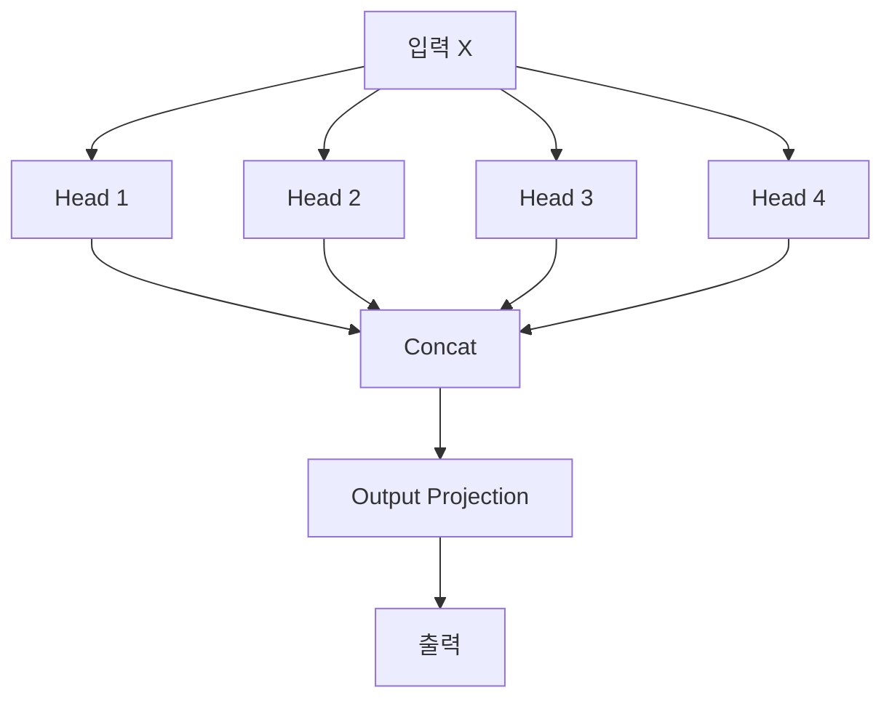

### 17.1 왜 여러 헤드를 쓰는가

하나의 어텐션 헤드는 하나의 Q/K/V 변환 세트를 사용합니다. 즉, 하나의 방식으로 토큰 관계를 계산합니다. 여러 헤드를 쓰면 여러 Q/K/V 변환 세트를 동시에 사용합니다.

```text
싱글 헤드
입력 X -> 하나의 Q/K/V -> 하나의 attention 결과

멀티 헤드
입력 X -> 여러 Q/K/V -> 여러 attention 결과 -> 합치기
```

여러 헤드를 쓰는 이유는 다음입니다.

| 이유 | 설명 |
|---|---|
| 여러 관계를 동시에 학습 | 한 헤드는 가까운 토큰 관계, 다른 헤드는 긴 거리 관계처럼 서로 다른 패턴을 학습할 수 있습니다. |
| 표현 공간을 나눠 계산 | 전체 임베딩 차원을 여러 head 차원으로 나눠 병렬 계산합니다. |
| 모델 표현력 증가 | 같은 입력을 여러 관점의 선형 변환으로 처리하므로 더 복잡한 문맥 표현을 만들 수 있습니다. |

주의할 점은 “Head 1은 문법, Head 2는 의미”처럼 사람이 항상 명확하게 해석할 수 있다는 뜻은 아닙니다. 핵심은 모델이 여러 종류의 관계 계산을 동시에 할 수 있도록 구조를 넓혀 준다는 점입니다.

### 17.2 head_dim 이해하기

멀티 헤드 어텐션에서 가장 중요한 shape 관계는 다음입니다.

```text
emb_dim = num_heads * head_dim
```

예를 들어 GPT-2 small 수준에서 자주 보는 설정은 다음과 같습니다.

```text
emb_dim = 768
num_heads = 12
head_dim = 768 / 12 = 64
```

즉, 전체 768차원 벡터를 12개의 헤드가 각각 64차원씩 나누어 처리한다고 볼 수 있습니다.

```text
전체 임베딩 768차원
┌──────┬──────┬──────┬──────┬──────┬──────┐
│ H1   │ H2   │ H3   │ ...  │ H11  │ H12  │
│ 64d  │ 64d  │ 64d  │ ...  │ 64d  │ 64d  │
└──────┴──────┴──────┴──────┴──────┴──────┘

12 * 64 = 768
```

### 17.3 처리 흐름

멀티 헤드 어텐션의 처리 흐름은 다음과 같습니다.

```text
1. 입력 X에서 Q, K, V를 만든다.
2. Q, K, V를 head 수만큼 나눈다.
3. 각 head에서 독립적으로 어텐션을 계산한다.
4. 각 head 결과를 concat으로 이어 붙인다.
5. output projection으로 다시 섞는다.
```

조금 더 자세히 보면 다음과 같습니다.

```text
입력 X
shape: [B, T, E]

Q, K, V 생성
shape: [B, T, E]

head로 분할
shape: [B, H, T, D]

각 head에서 attention 계산
scores shape : [B, H, T, T]
weights shape: [B, H, T, T]
output shape : [B, H, T, D]

head 결과 결합
shape: [B, T, E]
```

여기서 기호는 다음과 같습니다.

| 기호 | 의미 |
|---|---|
| `B` | batch size |
| `T` | token 수, sequence length |
| `E` | embedding dimension |
| `H` | head 수 |
| `D` | head 하나의 차원, `E / H` |

### 17.4 왜 concat 뒤에 output projection을 하는가

각 헤드는 자기 방식으로 문맥 벡터를 만듭니다. 하지만 concat만 하면 head 결과가 단순히 옆으로 붙어 있을 뿐입니다.

```text
[Head1 결과 | Head2 결과 | Head3 결과 | Head4 결과]
```

그래서 마지막에 선형층을 하나 더 적용합니다. 이를 output projection이라고 합니다.

```text
concat 결과
   │
   ▼
Linear projection
   │
   ▼
헤드 정보가 다시 섞인 최종 출력
```

이 projection은 여러 head에서 나온 정보를 다시 섞어 다음 층이 사용하기 좋은 형태로 만듭니다.

### 17.5 단순 구현과 효율적 구현

멀티 헤드 어텐션은 두 방식으로 이해할 수 있습니다.

첫 번째는 여러 개의 싱글 헤드 어텐션을 따로 만들고 결과를 붙이는 방식입니다.

```text
Head 1 모듈 따로 계산
Head 2 모듈 따로 계산
Head 3 모듈 따로 계산
Head 4 모듈 따로 계산
결과 concat
```

이 방식은 이해하기 쉽지만 실제 구현에서는 비효율적일 수 있습니다.

두 번째는 큰 Q/K/V 행렬을 한 번에 만든 뒤 shape를 바꾸는 방식입니다.

```text
Q shape = [B, T, E]

view 후
Q shape = [B, T, H, D]

transpose 후
Q shape = [B, H, T, D]
```

이 방식은 PyTorch에서 병렬 행렬 곱셈을 사용하기 좋아 실제 LLM 구현에서 자주 쓰입니다.

### 17.6 shape 기준으로 이해하기

일반적인 텐서 크기는 다음과 같습니다.

```text
입력 IDs:        [B, T]
토큰 임베딩:     [B, T, E]
Q, K, V:         [B, T, E]
헤드 분리 후:    [B, H, T, D]
어텐션 점수:     [B, H, T, T]
어텐션 출력:     [B, H, T, D]
헤드 결합 후:    [B, T, E]
로짓:            [B, T, vocab_size]
```

예를 들어 다음 설정을 봅니다.

```text
B = 2
T = 4
E = 768
H = 12
D = 64
vocab_size = 50257
```

그러면 shape는 다음과 같이 흐릅니다.

```text
토큰 ID          [2, 4]
임베딩           [2, 4, 768]
Q/K/V            [2, 4, 768]
head 분리        [2, 12, 4, 64]
attention scores [2, 12, 4, 4]
head 출력        [2, 12, 4, 64]
concat 후        [2, 4, 768]
logits           [2, 4, 50257]
```

멀티 헤드 어텐션은 개념보다 shape에서 많이 막힙니다. `E = H * D`만 확실히 잡으면 전체 흐름이 훨씬 안정적으로 보입니다.


## 18. GPT 구조

### 18.1 왜 원본 Transformer 이야기가 나오는가

GPT를 설명할 때 “원본 Transformer”와 “decoder-only”라는 말이 자주 나옵니다. 이 용어가 갑자기 나오면 어렵기 때문에, 먼저 원본 Transformer가 어떤 문제를 위해 만들어졌는지 봐야 합니다.

원본 Transformer는 주로 번역 같은 sequence-to-sequence 작업을 염두에 둔 구조입니다.

```text
입력 문장, source
"This is an example"

출력 문장, target
"Das ist ein Beispiel"
```

번역에서는 입력 문장과 출력 문장이 서로 다릅니다. 그래서 원본 Transformer는 크게 두 부분으로 나뉩니다.

```text
원본 Transformer

입력 문장
   │
   ▼
[Encoder]
   │
   │ 입력 문장의 정보를 벡터 표현으로 정리
   ▼
[Decoder]
   │
   │ 지금까지 생성한 출력 문장과 encoder 정보를 참고
   ▼
출력 문장
```

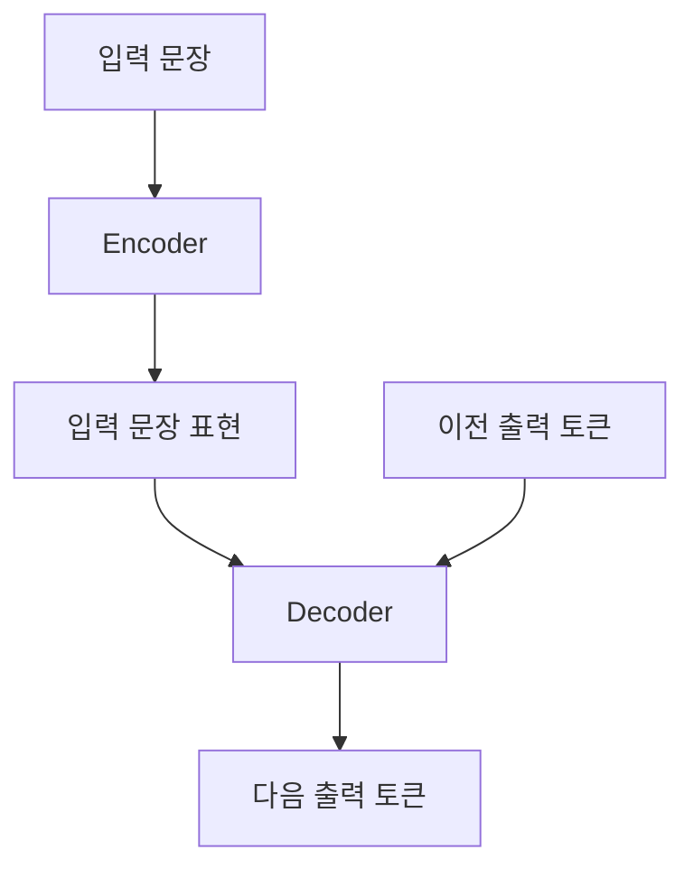

### 18.2 Encoder와 Decoder의 역할

원본 Transformer에서 encoder와 decoder의 역할은 다음과 같습니다.

| 구성 요소 | 역할 | 번역 예시 |
|---|---|---|
| Encoder | 입력 문장을 읽고 문맥 표현을 만듭니다. | 영어 문장 전체를 읽습니다. |
| Decoder | 지금까지 만든 출력과 encoder 정보를 보고 다음 토큰을 생성합니다. | 독일어 번역을 한 단어씩 생성합니다. |

조금 더 자세히 보면 다음과 같습니다.

```text
Encoder
- 입력 전체를 읽습니다.
- 입력 토큰끼리 서로 참고합니다.
- 미래 토큰을 가릴 필요가 없습니다.
- 출력: 입력 문장 전체에 대한 문맥 표현

Decoder
- 출력 문장을 한 토큰씩 생성합니다.
- 아직 생성하지 않은 미래 출력 토큰을 보면 안 됩니다.
- 그래서 masked self-attention 또는 causal attention을 사용합니다.
- 번역 모델에서는 encoder가 만든 표현도 참고합니다.
```

번역 모델의 decoder는 보통 두 종류의 attention을 가집니다.

```text
Decoder 내부

1. Masked Self-Attention
   지금까지 생성한 출력 토큰만 참고합니다.

2. Cross-Attention
   Encoder가 만든 입력 문장 표현을 참고합니다.

3. Feed Forward Network
   각 위치의 표현을 변환합니다.
```

### 18.3 GPT는 왜 디코더 전용인가

GPT는 번역 모델처럼 별도의 “입력 문장”과 “출력 문장”을 나누지 않습니다. GPT의 기본 목표는 주어진 토큰들 다음에 올 토큰을 예측하는 것입니다.

```text
입력 prompt
"This is"

GPT가 할 일
다음 토큰 예측: "an"

새 입력
"This is an"

다시 할 일
다음 토큰 예측: "example"
```

GPT에서는 지금까지의 텍스트가 곧 입력 문맥입니다. 별도의 encoder가 입력 문장을 따로 읽고 decoder에게 넘겨줄 필요가 없습니다.

```text
번역용 Transformer
source 문장 -> Encoder -> source 표현 -> Decoder -> target 문장

GPT
이전 토큰들 -> Decoder 스타일 블록 -> 다음 토큰
```

그래서 GPT는 **decoder-only transformer**라고 부릅니다.

이 말은 “GPT에 출력층만 있다”는 뜻이 아닙니다. 의미는 다음입니다.

```text
GPT는 원본 Transformer의 decoder 쪽 아이디어를 사용한다.
하지만 번역용 decoder에 있던 cross-attention은 보통 없다.
대신 causal self-attention으로 이전 토큰만 보고 다음 토큰을 예측한다.
```

### 18.4 원본 Transformer Decoder와 GPT Block의 차이

| 항목 | 원본 Transformer Decoder | GPT |
|---|---|---|
| 주요 목적 | 번역 문장 생성 | 다음 토큰 예측과 텍스트 생성 |
| Encoder 존재 | 있음 | 없음 |
| Masked Self-Attention | 있음 | 있음 |
| Cross-Attention | 있음, encoder 출력 참고 | 보통 없음 |
| 입력 | 이전 출력 토큰 + encoder 표현 | 이전 토큰들, prompt |
| 출력 | target 문장의 다음 토큰 | prompt 뒤의 다음 토큰 |

ASCII로 비교하면 다음과 같습니다.

```text
원본 Transformer 번역 구조

Source tokens
     │
     ▼
┌─────────┐
│ Encoder │
└─────────┘
     │ encoder output
     ▼
┌─────────┐
│ Decoder │ ◄── 이전 target tokens
└─────────┘
     │
     ▼
Next target token
```

```text
GPT 구조

Prompt tokens
     │
     ▼
┌──────────────────────┐
│ Decoder-style Blocks │
│ causal self-attention│
└──────────────────────┘
     │
     ▼
Next token
```

### 18.5 Mermaid 구조도: GPT 전체 구조

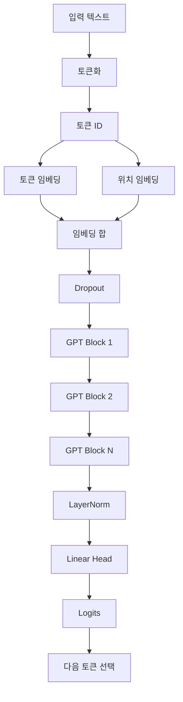

### 18.6 GPT 전체 구조

GPT의 큰 구조는 다음과 같습니다.

```text
토큰 ID
→ 토큰 임베딩
→ 위치 임베딩 추가
→ 드롭아웃
→ GPT Block × N
→ 최종 LayerNorm
→ 출력 Linear Head
→ Logits
→ 다음 토큰 선택
```

여기서 GPT Block은 보통 다음 요소를 포함합니다.

```text
GPT Block
- LayerNorm
- Masked Multi-Head Self-Attention
- Shortcut connection
- LayerNorm
- Feed Forward Network
- Shortcut connection
```

GPT에서 가장 중요한 제약은 **현재 위치가 미래 토큰을 보면 안 된다**는 것입니다. 그래서 GPT Block 안의 self-attention은 causal mask를 사용합니다.

```text
입력: [t0, t1, t2, t3]

t0 위치는 t0만 봄
t1 위치는 t0, t1만 봄
t2 위치는 t0, t1, t2만 봄
t3 위치는 t0, t1, t2, t3만 봄
```

### 18.7 GPT의 출력

GPT의 출력은 바로 단어가 아닙니다. 출력은 로짓입니다.

```text
logits shape = [batch_size, num_tokens, vocab_size]
```

예를 들어:

```text
batch_size = 2
num_tokens = 4
vocab_size = 50257
```

출력 shape는 다음입니다.

```text
[2, 4, 50257]
```

각 위치마다 어휘사전 전체 토큰에 대한 점수가 나옵니다. 다음 토큰 생성에서는 보통 마지막 위치의 로짓을 사용합니다.

```text
입력 토큰: [t0, t1, t2, t3]

모델 출력 logits:
logits[0] -> t1 예측에 사용됨
logits[1] -> t2 예측에 사용됨
logits[2] -> t3 예측에 사용됨
logits[3] -> 다음 토큰 t4 예측에 사용됨
```

훈련할 때는 모든 위치의 로짓을 사용해 손실을 계산하고, 추론할 때는 보통 마지막 위치의 로짓에서 다음 토큰을 고릅니다.

## 19. 트랜스포머 블록


### ASCII 구조도: Transformer Block 내부

GPT 계열에서 흔히 쓰는 Pre-LayerNorm 구조입니다.

```text
입력 x
 │
 │  ┌───────────────────────────────┐
 ├──┤ residual branch               │
 │  └───────────────────────────────┘
 │
 ▼
LayerNorm
 │
 ▼
Masked Multi-Head Attention
 │
 ▼
Dropout
 │
 ▼
+  <── residual x 더하기
 │
 ▼
x'
 │
 │  ┌───────────────────────────────┐
 ├──┤ residual branch               │
 │  └───────────────────────────────┘
 │
 ▼
LayerNorm
 │
 ▼
Feed Forward Network
 │
 ▼
Dropout
 │
 ▼
+  <── residual x' 더하기
 │
 ▼
출력
```

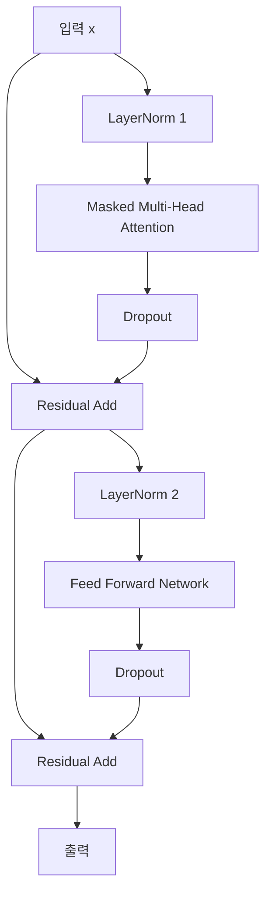


GPT의 핵심 반복 단위는 트랜스포머 블록입니다.

하나의 트랜스포머 블록은 보통 다음을 포함합니다.

```text
입력 x
→ LayerNorm
→ Masked Multi-Head Attention
→ Dropout
→ Shortcut connection
→ LayerNorm
→ Feed Forward Network
→ Dropout
→ Shortcut connection
→ 출력
```

### 19.1 층 정규화


### ASCII 예시: LayerNorm이 하는 일

```text
한 토큰의 hidden vector
x = [0.2, 0.4, -0.1, 0.9]

평균 mean(x)를 빼고 표준편차로 나눔

정규화 전: 평균이 제각각, 분산이 제각각
정규화 후: 평균 ≈ 0, 분산 ≈ 1
```

수식 형태는 다음입니다.

```text
LayerNorm(x) = gamma * (x - mean) / sqrt(var + eps) + beta

mean, var : 현재 벡터에서 계산
gamma     : 학습 가능한 scale
beta      : 학습 가능한 shift
eps       : 0으로 나누는 문제를 막는 작은 값
```


층 정규화는 각 샘플의 특성 차원에 대해 평균과 분산을 정규화합니다.

기본 수식은 다음입니다.

```text
x_norm = (x - mean) / sqrt(var + eps)
output = scale * x_norm + shift
```

여기서 `scale`과 `shift`는 학습 가능한 파라미터입니다.

층 정규화가 중요한 이유는 다음입니다.

- 깊은 신경망 훈련을 안정화합니다.
- 값의 분포가 너무 커지거나 작아지는 것을 줄입니다.
- 트랜스포머 블록을 많이 쌓을 수 있게 합니다.

### 19.2 GELU 활성화 함수

GPT 계열에서는 ReLU 대신 GELU가 자주 사용됩니다.

GELU 근사식은 다음과 같습니다.

```text
GELU(x) ≈ 0.5x(1 + tanh(sqrt(2/pi)(x + 0.044715x^3)))
```

GELU는 ReLU보다 부드러운 함수입니다. 음수 입력을 모두 0으로 잘라내지 않고, 작은 음수 값도 일부 통과시킵니다. 이는 깊은 신경망에서 학습 안정성에 도움이 될 수 있습니다.

### 19.3 피드 포워드 네트워크


### ASCII 구조도: Feed Forward Network

트랜스포머 블록 안의 FFN은 각 토큰 위치에 독립적으로 적용됩니다.

```text
입력 hidden vector, 크기 emb_dim
        │
        ▼
Linear: emb_dim -> 4 * emb_dim
        │
        ▼
GELU
        │
        ▼
Linear: 4 * emb_dim -> emb_dim
        │
        ▼
출력 hidden vector, 크기 emb_dim
```

예를 들어 GPT-2 small의 `emb_dim = 768`이면 다음과 같습니다.

```text
768 -> 3072 -> 768
```


트랜스포머 블록의 피드 포워드 네트워크는 보통 다음 구조입니다.

```text
Linear(E → 4E)
→ GELU
→ Linear(4E → E)
```

예를 들어 `E = 768`이면:

```text
768 → 3072 → 768
```

이 구조는 각 토큰 위치에 독립적으로 적용됩니다. 어텐션이 토큰 간 관계를 섞는다면, 피드 포워드는 각 위치의 표현을 더 풍부하게 변환합니다.

### 19.4 숏컷 연결


### ASCII 예시: 숏컷 연결

```text
일반 연결
x -> Layer -> y

숏컷 연결
x ───────────────┐
 │               ▼
 └-> Layer ->  Layer(x) + x
```

숏컷 연결의 핵심 효과는 깊은 모델에서 그레이디언트가 더 잘 흐르게 만드는 것입니다.

```text
깊은 신경망에서 역전파 흐름

손실
 │
 ▼
뒤쪽 층 -> 중간 층 -> 앞쪽 층

숏컷이 없으면 앞쪽으로 갈수록 그레이디언트가 약해질 수 있음
숏컷이 있으면 우회 경로가 생겨 학습이 안정적임
```


숏컷 연결은 입력을 어떤 층의 출력에 더하는 구조입니다.

```text
output = x + block(x)
```

중요한 이유는 다음입니다.

- 깊은 모델에서 그레이디언트 소실을 줄입니다.
- 정보가 여러 층을 지나도 보존되기 쉽습니다.
- 매우 깊은 트랜스포머를 훈련할 수 있게 합니다.

---

## 20. 사전 훈련


### 구조도: 사전 훈련 루프

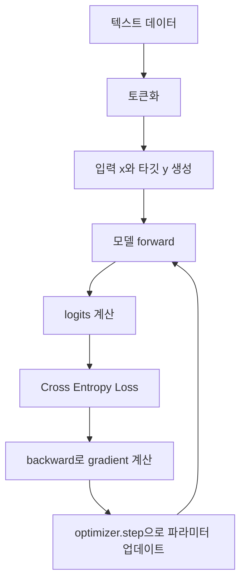

```text
훈련 데이터 한 조각
x = [t0, t1, t2, t3]
y = [t1, t2, t3, t4]

모델 출력 logits 위치별 목표
logits[0] -> t1을 맞혀야 함
logits[1] -> t2를 맞혀야 함
logits[2] -> t3을 맞혀야 함
logits[3] -> t4를 맞혀야 함
```


### 20.1 사전 훈련의 목표

사전 훈련의 목표는 다음 토큰 예측 손실을 줄이는 것입니다.

```text
입력:  [t1, t2, t3, t4]
타깃:  [t2, t3, t4, t5]
```

모델은 각 위치에서 다음 토큰을 맞히도록 훈련됩니다.

### 20.2 자기 지도 학습

사전 훈련은 사람이 직접 레이블을 붙이지 않아도 됩니다. 텍스트 자체에서 타깃을 만들기 때문입니다.

```text
문장: The cat sleeps
입력: The cat
타깃: sleeps
```

이처럼 데이터 내부 구조에서 정답을 만드는 방식을 자기 지도 학습이라고 합니다.

### 20.3 훈련 루프

기본 훈련 루프는 다음과 같습니다.

```text
1. 배치 입력을 모델에 넣는다.
2. 로짓을 얻는다.
3. 타깃과 비교해 손실을 계산한다.
4. loss.backward()로 그레이디언트를 계산한다.
5. optimizer.step()으로 파라미터를 업데이트한다.
6. 반복한다.
```

PyTorch 형태로 보면 다음과 같습니다.

```python
for input_batch, target_batch in train_loader:
    optimizer.zero_grad()
    logits = model(input_batch)
    loss = cross_entropy(logits, target_batch)
    loss.backward()
    optimizer.step()
```

---

## 21. 손실 함수와 크로스 엔트로피


### ASCII 예시: Cross Entropy 계산 흐름

```text
모델 출력 logits
[2.0, 0.5, -1.0]

softmax 확률
[0.79, 0.18, 0.03]

정답 토큰 ID = 0
정답 토큰 확률 p = 0.79

손실 = -log(p)
     = -log(0.79)
     ≈ 0.24
```

정답 확률이 높으면 손실이 작습니다.

```text
정답 확률 p    -log(p)
────────────────────
0.90           0.105
0.50           0.693
0.10           2.303
0.01           4.605
```


### 21.1 로짓, 확률, 타깃

모델은 각 위치에서 어휘사전 전체에 대한 로짓을 출력합니다.

```text
logits = [2.1, -0.5, 0.7, ...]
```

softmax를 적용하면 확률이 됩니다.

```text
probs = softmax(logits)
```

타깃 토큰 ID가 3이라면, 모델이 잘하고 있는지는 `probs[3]`이 얼마나 큰지로 판단할 수 있습니다.

### 21.2 크로스 엔트로피

언어 모델의 기본 손실은 크로스 엔트로피입니다.

간단히 말하면:

```text
loss = -log(모델이 정답 토큰에 부여한 확률)
```

정답 확률이 높으면 loss는 작아집니다.

```text
정답 확률 0.9 → loss 작음
정답 확률 0.01 → loss 큼
```

전체 배치에서는 모든 토큰 위치의 손실을 평균합니다.

### 21.3 훈련 손실과 검증 손실

훈련 중에는 훈련 세트 손실과 검증 세트 손실을 모두 봐야 합니다.

| 상황 | 해석 |
|---|---|
| 훈련 손실 감소, 검증 손실 감소 | 학습이 잘 진행됨 |
| 훈련 손실 감소, 검증 손실 증가 | 과대적합 가능성 |
| 둘 다 거의 감소하지 않음 | 학습률, 모델 크기, 데이터, 구현 문제 확인 필요 |

작은 데이터셋에서 큰 모델을 오래 훈련하면 모델이 훈련 문장을 외울 수 있습니다.

---

## 22. 옵티마이저와 훈련 안정화


### ASCII 예시: 옵티마이저의 역할

```text
현재 파라미터 W
      │
      ▼
모델 예측
      │
      ▼
손실 계산
      │
      ▼
기울기 gradient 계산
      │
      ▼
옵티마이저가 W를 조금 수정
      │
      ▼
다음 step에서 더 낮은 손실을 목표로 반복
```

학습률은 한 번에 얼마나 크게 움직일지 정합니다.

```text
learning rate가 너무 큼  : 최적점을 지나쳐 불안정
learning rate가 너무 작음: 학습이 너무 느림
적절한 learning rate     : 안정적으로 손실 감소
```


### 22.1 AdamW

LLM 훈련에서는 AdamW 옵티마이저가 자주 사용됩니다. AdamW는 Adam에 가중치 감쇠를 더해 일반화 성능을 높이는 데 도움을 줍니다.

```python
optimizer = torch.optim.AdamW(model.parameters(), lr=4e-4, weight_decay=0.1)
```

### 22.2 학습률

학습률은 한 번 업데이트할 때 파라미터를 얼마나 크게 바꿀지 정합니다.

- 너무 크면 학습이 불안정합니다.
- 너무 작으면 학습이 매우 느립니다.

### 22.3 학습률 웜업

웜업은 훈련 초기에 학습률을 작은 값에서 점진적으로 키우는 기법입니다. 초기 파라미터가 불안정한 상태에서 너무 큰 업데이트를 막기 위해 사용합니다.

### 22.4 코사인 감쇠

코사인 감쇠는 훈련이 진행될수록 학습률을 부드럽게 줄이는 방법입니다. 후반부에 더 작은 업데이트를 하게 되어 안정적인 수렴에 도움이 됩니다.

### 22.5 그레이디언트 클리핑

그레이디언트가 너무 커지면 훈련이 불안정해질 수 있습니다. 그레이디언트 클리핑은 그레이디언트 크기를 일정 한도 안으로 제한합니다.

---

## 23. 텍스트 생성 전략


### ASCII 비교: 디코딩 전략

```text
다음 토큰 후보 확률
A: 0.50
B: 0.30
C: 0.15
D: 0.05

Greedy decoding
항상 A 선택

Sampling
확률에 따라 A/B/C/D 중 선택

Temperature 낮음
A 확률이 더 커져 결정적 출력에 가까워짐

Temperature 높음
B, C, D가 선택될 가능성이 커져 다양성이 증가함

Top-k, k=2
A와 B만 남기고 C, D는 제외
```

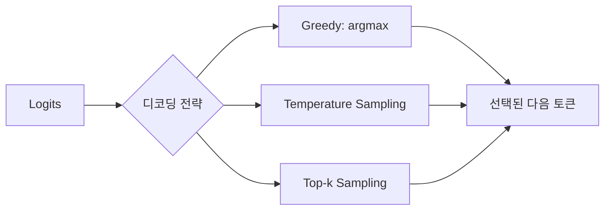


모델이 로짓을 출력하면 다음 토큰을 골라야 합니다. 이 과정을 디코딩 전략이라고 합니다.

### 23.1 그리디 디코딩

가장 확률이 높은 토큰을 항상 선택합니다.

```text
next_token = argmax(probs)
```

장점:

- 결정론적입니다.
- 결과가 재현됩니다.
- 구현이 쉽습니다.

단점:

- 반복적이고 단조로운 문장을 만들 수 있습니다.
- 다양한 답을 만들기 어렵습니다.

### 23.2 확률적 샘플링

확률 분포에 따라 다음 토큰을 샘플링합니다.

```text
"forward" 확률 0.5
"toward" 확률 0.3
"closer" 확률 0.2
```

이 경우 `forward`가 가장 자주 나오지만 다른 토큰도 나올 수 있습니다.

### 23.3 온도 스케일링

온도는 확률 분포의 날카로움을 조절합니다.

```text
scaled_logits = logits / temperature
```

| 온도 | 효과 |
|---|---|
| 낮은 온도 | 높은 확률 토큰에 더 집중, 보수적 출력 |
| 높은 온도 | 다양한 토큰 선택, 창의적이지만 오류 가능성 증가 |
| 1.0 | 기본 분포 |

### 23.4 탑-k 샘플링

탑-k 샘플링은 확률이 높은 상위 k개 토큰만 후보로 남깁니다.

예를 들어 `k=3`이면 상위 3개 토큰만 선택 가능하고 나머지는 확률 0으로 처리합니다.

장점:

- 말이 안 되는 낮은 확률 토큰을 줄입니다.
- 다양성을 어느 정도 유지합니다.

### 23.5 EOS 토큰

EOS 또는 `<endoftext>` 토큰이 생성되면 생성을 멈출 수 있습니다. 그렇지 않으면 모델은 지정된 최대 길이까지 계속 생성합니다.

---

## 24. 모델 저장과 로드


### ASCII 예시: 저장과 로드

```text
훈련된 모델
┌───────────────────────────────┐
│ GPTModel                       │
│ token embedding weights        │
│ transformer block weights      │
│ layer norm weights             │
│ output head weights            │
└───────────────────────────────┘
        │
        ▼
torch.save(model.state_dict(), "model.pth")
        │
        ▼
나중에 다시 로드
        │
        ▼
model.load_state_dict(torch.load("model.pth"))
```

훈련을 이어서 하려면 옵티마이저 상태도 함께 저장하는 것이 좋습니다.


훈련된 모델은 저장해야 다시 사용할 수 있습니다.

### 24.1 모델 가중치 저장

PyTorch에서는 `state_dict`를 저장합니다.

```python
torch.save(model.state_dict(), "model.pth")
```

### 24.2 모델 가중치 로드

```python
model = GPTModel(config)
model.load_state_dict(torch.load("model.pth"))
model.eval()
```

### 24.3 옵티마이저 상태까지 저장

훈련을 이어서 하려면 옵티마이저 상태도 저장해야 합니다.

```python
torch.save({
    "model_state_dict": model.state_dict(),
    "optimizer_state_dict": optimizer.state_dict(),
}, "checkpoint.pth")
```

---

## 25. 사전 훈련된 가중치 사용


### 구조도: 사전 훈련된 가중치 사용

```text
직접 처음부터 훈련
랜덤 초기화 -> 대규모 데이터 -> 긴 훈련 -> 사용 가능

사전 훈련된 가중치 사용
공개 가중치 로드 -> 필요한 작업에 맞게 미세 튜닝 -> 사용 가능
```

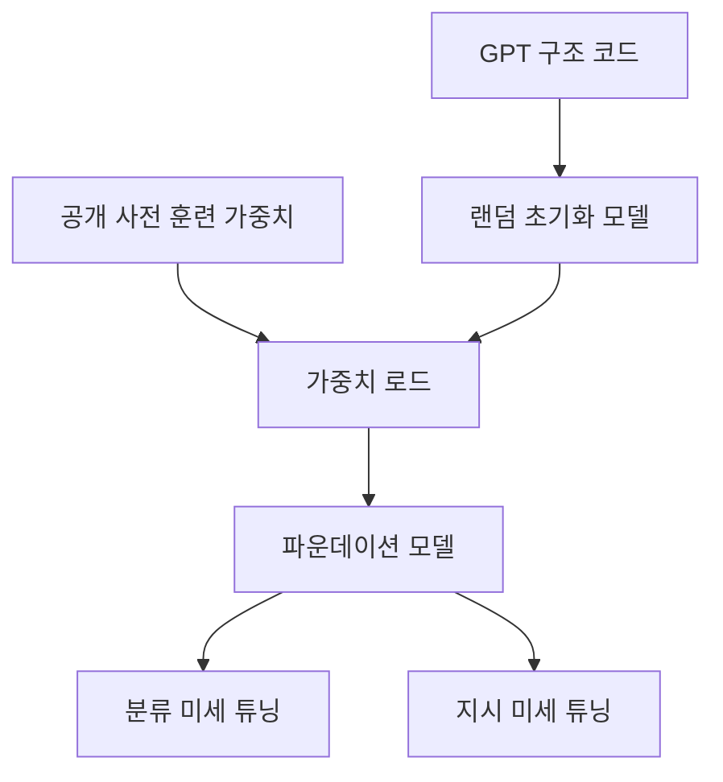


LLM을 처음부터 대규모로 사전 훈련하는 것은 매우 비쌉니다. 따라서 이미 공개된 사전 훈련 가중치를 가져와 사용하는 경우가 많습니다.

사전 훈련된 가중치를 사용할 때의 장점은 다음입니다.

- 대규모 사전 훈련 비용을 피할 수 있습니다.
- 적은 데이터로 미세 튜닝할 수 있습니다.
- 실험을 빠르게 시작할 수 있습니다.

GPT-2 같은 모델은 구조가 비교적 단순하고 공개 가중치가 있어 학습용으로 적합합니다.

---

## 26. 분류 미세 튜닝


### 구조도: 분류 미세 튜닝

분류 미세 튜닝에서는 다음 토큰을 길게 생성하는 대신, 입력 전체를 보고 클래스 중 하나를 고릅니다.

```text
입력 문장
"You won $1000. Click here!"
        │
        ▼
사전 훈련된 GPT
        │
        ▼
마지막 토큰 위치의 hidden vector
        │
        ▼
분류 head, Linear
        │
        ▼
logits: [스팸 아님 점수, 스팸 점수]
        │
        ▼
예측: spam
```

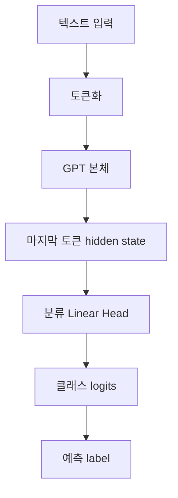


### 26.1 분류 미세 튜닝의 목적

분류 미세 튜닝은 LLM을 특정 분류 작업에 맞게 조정하는 과정입니다.

예시:

```text
입력: "Free money! Click now"
출력: spam
```

```text
입력: "오늘 저녁 약속 맞나요?"
출력: not spam
```

### 26.2 분류 모델로 바꾸는 방법

기존 GPT 모델의 출력은 어휘사전 크기만큼의 로짓입니다.

```text
[batch, tokens, vocab_size]
```

분류 작업에서는 클래스 개수만큼의 로짓이 필요합니다.

```text
[batch, num_classes]
```

따라서 출력 헤드를 바꿉니다.

```text
기존 출력층: emb_dim → vocab_size
분류 출력층: emb_dim → num_classes
```

스팸 분류에서는 `num_classes = 2`입니다.

### 26.3 어느 위치의 출력으로 분류하는가

GPT는 각 토큰 위치마다 출력 벡터를 만듭니다. 분류에서는 보통 마지막 토큰의 출력 벡터를 사용합니다.

```text
입력 전체를 읽은 뒤 마지막 위치의 표현 → 분류 헤드 → 클래스 로짓
```

### 26.4 분류 손실과 정확도

분류 손실도 보통 크로스 엔트로피를 사용합니다.

정확도는 다음과 같습니다.

```text
정확도 = 맞힌 샘플 수 / 전체 샘플 수
```

---

## 27. 지시 미세 튜닝


### 구조도: 지시 미세 튜닝

지시 미세 튜닝에서는 입력을 보통 `Instruction`, `Input`, `Response` 형태로 구성합니다.

```text
### Instruction:
다음 문장을 독일어로 번역하세요.

### Input:
The quick brown fox jumps over the lazy dog.

### Response:
Der schnelle braune Fuchs springt über den faulen Hund.
```

학습할 때는 보통 응답 부분의 토큰 손실을 중심으로 계산합니다.

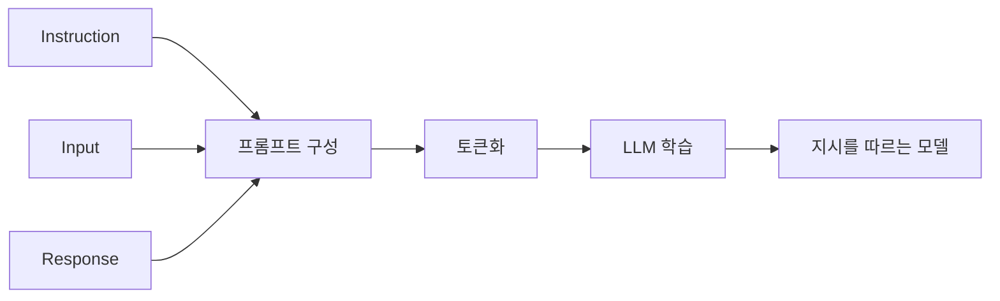


### 27.1 지시 미세 튜닝의 목적

사전 훈련된 LLM은 텍스트 완성은 할 수 있지만, 사용자의 지시를 반드시 잘 따르지는 않습니다. 지시 미세 튜닝은 모델이 지시를 입력으로 받고 기대 응답을 생성하도록 훈련합니다.

예시:

```text
Instruction: 다음 문장을 한국어로 번역하라.
Input: The cat is sleeping.
Output: 고양이가 자고 있다.
```

### 27.2 데이터 포맷

지시 데이터셋은 보통 다음 필드를 가집니다.

```json
{
  "instruction": "문장을 요약하라.",
  "input": "긴 문장 ...",
  "output": "요약 결과"
}
```

모델에 넣을 때는 프롬프트 형식으로 합칩니다.

```text
### Instruction:
문장을 요약하라.

### Input:
긴 문장 ...

### Response:
요약 결과
```

### 27.3 입력과 타깃

지시 미세 튜닝도 기본적으로 다음 토큰 예측입니다.

```text
입력:  [토큰1, 토큰2, 토큰3, ...]
타깃:  [토큰2, 토큰3, 토큰4, ...]
```

다만 데이터가 일반 문서가 아니라 지시-응답 형식입니다.

### 27.4 패딩과 마스킹

지시 데이터는 길이가 제각각입니다. 배치로 묶으려면 패딩이 필요합니다.

패딩 토큰은 손실 계산에서 제외해야 합니다. 그렇지 않으면 모델이 의미 없는 패딩 토큰 예측을 학습하게 됩니다.

PyTorch에서는 보통 타깃의 패딩 위치를 `-100`으로 두고, 크로스 엔트로피가 해당 위치를 무시하게 합니다.

### 27.5 평가

지시 미세 튜닝 모델의 평가는 분류보다 어렵습니다. 정답 문장과 모델 문장이 완전히 같지 않아도 좋은 답일 수 있기 때문입니다.

평가 방법은 다음이 있습니다.

- 사람이 직접 평가
- 정답과의 유사도 계산
- 더 큰 LLM을 평가자로 사용
- 작업별 자동 지표 사용

---

## 28. LoRA와 파라미터 효율적 미세 튜닝


### ASCII 구조도: LoRA

LoRA는 기존 큰 가중치 W를 고정하고, 작은 저랭크 행렬 A와 B만 학습합니다.

```text
기존 Linear 층
y = xW

LoRA 적용
y = xW + x(AB) * scale

W  : 고정, frozen
A,B: 학습, trainable
```

```text
큰 행렬 W를 직접 전부 수정하지 않음

W:  d_in × d_out        고정
A:  d_in × r            학습
B:  r × d_out           학습
r:  작은 rank 값

r이 작으면 학습할 파라미터 수가 크게 줄어듭니다.
```


### 28.1 왜 LoRA가 필요한가

전체 LLM의 모든 파라미터를 미세 튜닝하면 메모리와 계산량이 많이 필요합니다. LoRA, Low-Rank Adaptation은 기존 가중치를 고정하고 작은 추가 행렬만 학습하는 방법입니다.

### 28.2 LoRA의 핵심 아이디어

기존 선형층의 가중치가 `W`라고 합시다. 일반 미세 튜닝은 `W` 전체를 업데이트합니다.

LoRA는 `W`를 고정하고, 작은 저랭크 행렬 `A`, `B`만 학습합니다.

```text
W' = W + BA
```

보통 `A`와 `B`의 차원은 작습니다. 따라서 학습해야 할 파라미터 수가 크게 줄어듭니다.

### 28.3 LoRA의 장점

- GPU 메모리 사용량이 줄어듭니다.
- 훈련해야 할 파라미터 수가 줄어듭니다.
- 여러 작업용 어댑터를 따로 저장할 수 있습니다.
- 원본 모델을 유지한 상태로 작업별 조정이 가능합니다.

### 28.4 LoRA에서 반드시 알아야 할 용어

| 용어 | 의미 |
|---|---|
| rank `r` | 저랭크 행렬의 내부 차원 |
| adapter | 원본 모델에 추가되는 작은 학습 모듈 |
| freeze | 원본 파라미터를 학습하지 않도록 고정 |
| PEFT | Parameter-Efficient Fine-Tuning |

---

## 29. PyTorch 기초 개념


### 구조도: PyTorch 학습 파이프라인

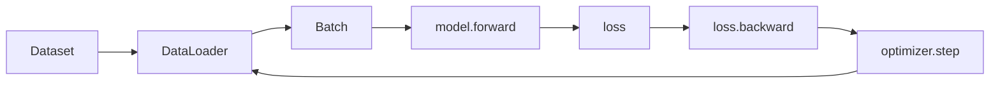

```text
Dataset
- 샘플 하나를 어떻게 읽을지 정의합니다.

DataLoader
- 샘플을 배치로 묶고 섞고 반복합니다.

nn.Module
- 모델 구조와 forward 계산을 정의합니다.

Autograd
- backward 때 gradient를 자동 계산합니다.
```


LLM 구현에서 PyTorch는 핵심 도구입니다. 최소한 다음은 알아야 합니다.

### 29.1 텐서

텐서는 다차원 배열입니다.

| 이름 | 예시 shape |
|---|---|
| 스칼라 | `[]` |
| 벡터 | `[d]` |
| 행렬 | `[m, n]` |
| 3차원 텐서 | `[batch, tokens, emb_dim]` |

### 29.2 `nn.Module`

PyTorch 모델은 보통 `nn.Module`을 상속해서 만듭니다.

```python
class MyModel(nn.Module):
    def __init__(self):
        super().__init__()
        self.layer = nn.Linear(10, 2)

    def forward(self, x):
        return self.layer(x)
```

### 29.3 자동 미분

PyTorch는 `loss.backward()`를 호출하면 자동으로 그레이디언트를 계산합니다.

```python
loss.backward()
optimizer.step()
```

### 29.4 Dataset과 DataLoader

`Dataset`은 데이터 하나를 어떻게 반환할지 정의합니다.

`DataLoader`는 여러 데이터를 배치로 묶고 섞는 역할을 합니다.

```python
loader = DataLoader(dataset, batch_size=8, shuffle=True)
```

---

## 30. 전체 구현 로드맵


### Mermaid 구조도: 전체 구현 로드맵

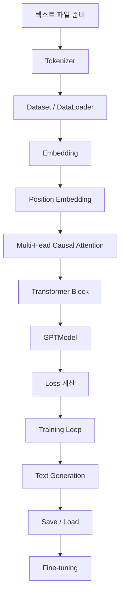


LLM을 밑바닥부터 구현한다면 순서는 다음이 적절합니다.

```text
1. 텍스트 파일 읽기
2. 토크나이저 준비
3. 토큰 ID 생성
4. 슬라이딩 윈도로 입력/타깃 생성
5. Dataset, DataLoader 구현
6. 토큰 임베딩과 위치 임베딩 구현
7. 단일 셀프 어텐션 구현
8. Q, K, V 기반 스케일드 점곱 어텐션 구현
9. 코잘 마스크 추가
10. 멀티 헤드 어텐션 구현
11. LayerNorm 구현
12. GELU 구현
13. FeedForward 구현
14. Shortcut connection 구현
15. TransformerBlock 구현
16. GPTModel 구현
17. CrossEntropy 손실 계산
18. 훈련 루프 구현
19. 텍스트 생성 함수 구현
20. 모델 저장/로드
21. 사전 훈련 가중치 로드
22. 분류 또는 지시 미세 튜닝
```

---

## 31. 핵심 수식 모음

### 31.1 점곱

```text
a · b = Σ ai bi
```

### 31.2 소프트맥스

```text
softmax(x_i) = exp(x_i) / Σ exp(x_j)
```

### 31.3 스케일드 점곱 어텐션

```text
Attention(Q,K,V) = softmax(QK^T / sqrt(d_k))V
```

### 31.4 층 정규화

```text
x_norm = (x - mean) / sqrt(var + eps)
output = scale * x_norm + shift
```

### 31.5 크로스 엔트로피

```text
loss = -log p(target_token)
```

### 31.6 GELU 근사

```text
GELU(x) ≈ 0.5x(1 + tanh(sqrt(2/pi)(x + 0.044715x^3)))
```

### 31.7 LoRA

```text
W' = W + BA
```

---

## 32. shape 치트시트

| 개념 | shape 예시 | 설명 |
|---|---:|---|
| 입력 토큰 ID | `[B, T]` | 배치와 토큰 길이 |
| 토큰 임베딩 | `[B, T, E]` | 각 토큰의 벡터 |
| 위치 임베딩 | `[T, E]` | 위치별 벡터 |
| Q, K, V | `[B, T, E]` | 선형 변환 결과 |
| 헤드 분리 Q | `[B, H, T, D]` | `D = E/H` |
| 어텐션 점수 | `[B, H, T, T]` | 각 토큰이 각 토큰을 보는 점수 |
| 어텐션 출력 | `[B, H, T, D]` | 헤드별 출력 |
| 헤드 결합 | `[B, T, E]` | 모든 헤드 concat 후 |
| 로짓 | `[B, T, V]` | 어휘사전 전체 점수 |
| LM 타깃 | `[B, T]` | 다음 토큰 ID |
| 분류 로짓 | `[B, C]` | 클래스 개수 C |

---

## 33. 반드시 구분해야 하는 개념


### ASCII 요약: 헷갈리는 개념 관계

```text
토큰       : 텍스트를 쪼갠 단위
토큰 ID    : 토큰을 숫자 인덱스로 바꾼 값
임베딩     : 토큰 ID에 대응하는 실수 벡터
로짓       : softmax 전의 점수
확률       : softmax 후의 값, 합이 1
손실       : 예측이 정답에서 얼마나 먼지 나타내는 값
파라미터   : 학습으로 바뀌는 모델 내부 숫자
하이퍼파라미터: 사람이 정하는 설정값
```

```text
텍스트 -> 토큰 -> 토큰 ID -> 임베딩 -> hidden state -> logits -> 확률 -> 선택 토큰
```


### 33.1 토큰, 토큰 ID, 임베딩

| 개념 | 예시 |
|---|---|
| 토큰 | `"hello"` |
| 토큰 ID | `15496` |
| 임베딩 | `[0.12, -0.03, ...]` |

토큰은 문자열 조각입니다. 토큰 ID는 어휘사전의 정수 인덱스입니다. 임베딩은 신경망이 처리하는 실수 벡터입니다.

### 33.2 파라미터와 하이퍼파라미터

| 개념 | 의미 | 예시 |
|---|---|---|
| 파라미터 | 훈련 중 학습되는 값 | 가중치 행렬 |
| 하이퍼파라미터 | 사람이 정하는 설정 | 학습률, 배치 크기, 헤드 수 |

### 33.3 로짓과 확률

| 개념 | 의미 |
|---|---|
| 로짓 | softmax 전 점수 |
| 확률 | softmax 후 값 |

### 33.4 사전 훈련과 미세 튜닝

| 개념 | 설명 |
|---|---|
| 사전 훈련 | 대규모 일반 텍스트로 다음 토큰 예측 학습 |
| 미세 튜닝 | 특정 작업 데이터로 추가 학습 |

### 33.5 인코더, 디코더, GPT

| 구조 | 용도 |
|---|---|
| 인코더 | 입력을 이해하고 표현 생성 |
| 디코더 | 출력 시퀀스 생성 |
| GPT | 디코더 전용 생성 모델 |

---

## 34. 자주 생기는 오해

### 오해 1. LLM은 문장을 한 번에 생성한다

아닙니다. 보통 한 토큰씩 반복적으로 생성합니다.

### 오해 2. LLM은 데이터베이스처럼 정답을 검색한다

아닙니다. LLM은 다음 토큰 확률을 계산합니다. 검색 기능이 붙은 시스템은 별도의 검색 모듈이나 RAG 구조를 사용할 수 있습니다.

### 오해 3. 토큰은 항상 단어다

아닙니다. 토큰은 단어, 부분 단어, 구두점, 공백 조각일 수 있습니다.

### 오해 4. 미세 튜닝은 항상 전체 모델을 다시 훈련하는 것이다

아닙니다. 일부 층만 훈련하거나 LoRA처럼 작은 어댑터만 훈련할 수 있습니다.

### 오해 5. 검증 손실이 낮으면 실제 서비스에서도 항상 좋다

아닙니다. 검증 데이터와 실제 사용 데이터가 다르면 성능 차이가 생깁니다. 또한 안전성, 편향, 응답 품질은 별도 평가가 필요합니다.

---

## 35. 선수 지식

LLM을 구현하고 이해하려면 다음 기초가 필요합니다.

### 35.1 Python

- 리스트, 딕셔너리
- 클래스
- 함수
- 파일 입출력
- 반복문

### 35.2 선형대수

- 벡터
- 행렬
- 행렬 곱
- 전치
- 차원 shape

### 35.3 확률과 통계

- 확률 분포
- 평균과 분산
- 로그
- softmax

### 35.4 머신러닝

- 훈련 세트, 검증 세트, 테스트 세트
- 손실 함수
- 과대적합
- 그레이디언트
- 옵티마이저

### 35.5 PyTorch

- 텐서 연산
- `nn.Module`
- `Dataset`, `DataLoader`
- `loss.backward()`
- `optimizer.step()`
- GPU 사용

---

## 36. 공부 순서 추천

처음 공부한다면 다음 순서가 좋습니다.

```text
1. 토큰화와 임베딩 이해
2. 다음 토큰 예측 개념 이해
3. softmax와 cross entropy 이해
4. 단순 셀프 어텐션 직접 계산
5. Q, K, V 어텐션 이해
6. 코잘 마스크 이해
7. 멀티 헤드 어텐션의 shape 이해
8. 트랜스포머 블록 구성 이해
9. GPT 전체 구조 이해
10. 훈련 루프 구현
11. 텍스트 생성 전략 실험
12. 분류 미세 튜닝 실습
13. 지시 미세 튜닝 구조 이해
14. LoRA 같은 효율적 미세 튜닝으로 확장
```

---

## 37. 점검 문제

아래 질문에 답할 수 있으면 LLM의 핵심 구조를 제대로 이해한 것입니다.

1. LLM이 “다음 토큰을 예측한다”는 말은 정확히 무엇인가?
2. 토큰과 단어는 왜 항상 같지 않은가?
3. BPE는 왜 `<unk>` 문제를 줄일 수 있는가?
4. 토큰 ID를 그대로 쓰지 않고 임베딩을 쓰는 이유는 무엇인가?
5. 위치 임베딩이 없으면 어떤 문제가 생기는가?
6. 셀프 어텐션에서 문맥 벡터는 어떻게 만들어지는가?
7. Q, K, V는 각각 어떤 역할을 하는가?
8. `QK^T / sqrt(d_k)`에서 `sqrt(d_k)`로 나누는 이유는 무엇인가?
9. 코잘 마스크가 없으면 GPT 훈련에서 어떤 문제가 생기는가?
10. 멀티 헤드 어텐션은 단일 헤드 어텐션과 무엇이 다른가?
11. 트랜스포머 블록은 어떤 구성 요소로 이루어지는가?
12. 층 정규화는 왜 필요한가?
13. 숏컷 연결은 왜 깊은 신경망에 중요한가?
14. GPT의 출력 shape `[B, T, V]`는 무엇을 의미하는가?
15. 크로스 엔트로피 손실은 무엇을 최소화하는가?
16. 훈련 손실과 검증 손실이 벌어지면 어떤 문제가 의심되는가?
17. 온도 스케일링은 생성 결과에 어떤 영향을 주는가?
18. 탑-k 샘플링은 왜 사용하는가?
19. 분류 미세 튜닝과 지시 미세 튜닝은 무엇이 다른가?
20. LoRA는 왜 파라미터 효율적인가?

---

## 38. 최종 요약

LLM의 핵심은 다음 한 문장으로 정리할 수 있습니다.

> LLM은 텍스트를 토큰 ID로 바꾸고, 임베딩과 트랜스포머 블록을 통해 문맥을 반영한 표현을 만든 뒤, 다음 토큰의 확률 분포를 예측하도록 훈련된 대규모 신경망입니다.

반드시 기억해야 할 흐름은 다음입니다.

```text
텍스트
→ 토큰화
→ 토큰 ID
→ 토큰 임베딩
→ 위치 임베딩 추가
→ 코잘 멀티 헤드 어텐션
→ 피드 포워드 네트워크
→ 트랜스포머 블록 반복
→ 로짓
→ softmax
→ 다음 토큰 선택
→ 텍스트 생성
```

LLM을 공부할 때 가장 중요한 기준은 “이 구성 요소가 다음 토큰 예측을 더 잘하기 위해 어떤 역할을 하는가?”입니다.

- 토큰화는 텍스트를 모델이 다룰 단위로 나눕니다.
- 임베딩은 토큰을 벡터로 바꿉니다.
- 위치 임베딩은 순서를 알려 줍니다.
- 어텐션은 토큰 간 관계를 계산합니다.
- 코잘 마스크는 미래 정보를 보지 못하게 합니다.
- 멀티 헤드는 여러 관계를 동시에 학습합니다.
- 층 정규화와 숏컷 연결은 깊은 모델 훈련을 안정화합니다.
- 피드 포워드는 각 위치의 표현을 변환합니다.
- 크로스 엔트로피는 정답 토큰 확률을 높이도록 모델을 학습시킵니다.
- 미세 튜닝은 사전 훈련된 모델을 특정 작업에 맞게 조정합니다.

이 흐름을 이해하면 GPT 계열 모델뿐 아니라 BERT, Llama, Phi, Gemini 계열 모델을 공부할 때도 구조를 훨씬 빠르게 파악할 수 있습니다.

---

## 39. GPT, BERT, 원본 트랜스포머의 차이

LLM을 공부할 때 GPT만 알면 부족합니다. 트랜스포머 계열 모델은 구조와 목적에 따라 나뉩니다.

| 모델 유형 | 구조 | 주 용도 | 훈련 방식의 대표 예 |
|---|---|---|---|
| 인코더-디코더 | 인코더 + 디코더 | 번역, 입력-출력 변환 | 입력 문장 인코딩 후 출력 생성 |
| 인코더 전용 | 인코더 중심 | 분류, 문장 이해 | 마스킹된 단어 예측 |
| 디코더 전용 | 디코더 중심 | 텍스트 생성 | 다음 토큰 예측 |

### 39.1 원본 트랜스포머

원본 트랜스포머는 번역을 위해 제안되었습니다.

```text
입력 문장 → 인코더 → 문맥 표현 → 디코더 → 출력 문장
```

인코더는 입력 전체를 읽고, 디코더는 출력 문장을 생성합니다.

### 39.2 BERT

BERT는 인코더 전용 구조입니다. 주어진 문장을 이해하고 분류하는 작업에 강합니다.

대표적인 훈련 방식은 마스킹된 단어 예측입니다.

```text
입력: This is a [MASK].
목표: [MASK]에 들어갈 단어 예측
```

BERT는 문장 전체를 양방향으로 볼 수 있으므로 분류, 감성 분석, 문장 관계 판단 등에 적합합니다.

### 39.3 GPT

GPT는 디코더 전용 구조입니다. 텍스트를 왼쪽에서 오른쪽으로 생성합니다.

```text
입력: This is a
목표: 다음 토큰 예측
```

GPT는 코잘 마스크를 사용하므로 미래 토큰을 보지 못합니다. 이 구조는 텍스트 생성에 적합합니다.

---

## 40. 제로샷, 퓨샷, 창발적 능력

### 40.1 제로샷 학습

제로샷은 예시 없이 작업을 수행하는 것입니다.

```text
입력: 다음 문장을 영어로 번역하라: "나는 학생입니다."
출력: I am a student.
```

모델이 해당 작업의 예시를 현재 프롬프트 안에서 받지 않았는데도 수행하면 제로샷입니다.

### 40.2 퓨샷 학습

퓨샷은 프롬프트 안에 몇 개의 예시를 제공하는 것입니다.

```text
Korean: 안녕
English: Hello

Korean: 고양이
English: cat

Korean: 학교
English:
```

모델은 앞의 예시 패턴을 보고 마지막 출력을 생성합니다.

### 40.3 창발적 능력

모델이 직접적으로 특정 작업만을 위해 훈련되지 않았는데도, 규모와 데이터 다양성 때문에 새로운 작업을 수행하는 것처럼 보이는 능력을 창발적 능력이라고 부릅니다.

예를 들어 다음 토큰 예측만으로 훈련된 모델이 번역, 요약, 질의응답, 코드 작성 능력을 보일 수 있습니다.

단, 창발적 능력은 “항상 정확하다”는 뜻이 아닙니다. 모델이 학습한 패턴을 바탕으로 작업을 수행할 수 있다는 의미입니다.

---

## 41. LLM 애플리케이션

LLM은 텍스트를 입력받고 텍스트를 출력하는 작업에 폭넓게 사용됩니다.

대표 예시는 다음과 같습니다.

| 작업 | 설명 |
|---|---|
| 텍스트 생성 | 글, 이메일, 기사 초안 작성 |
| 요약 | 긴 문서를 짧게 정리 |
| 번역 | 한 언어를 다른 언어로 변환 |
| 질의응답 | 문맥이나 지식을 바탕으로 질문에 답변 |
| 감성 분석 | 긍정/부정/중립 분류 |
| 코드 생성 | 코드 작성, 수정, 설명 |
| 문서 검색 보조 | 문서에서 관련 내용 찾기 |
| 챗봇 | 대화형 인터페이스 제공 |

중요한 점은 LLM이 단독으로 모든 문제를 해결하는 것이 아니라, 검색 시스템, 데이터베이스, 도구 호출, 사용자 인터페이스와 결합되어 실제 애플리케이션이 된다는 것입니다.

---

## 42. RAG의 기본 위치


### 구조도: RAG의 위치

RAG는 모델 자체의 파라미터만 믿지 않고, 외부 문서를 검색해서 프롬프트에 넣는 방식입니다.

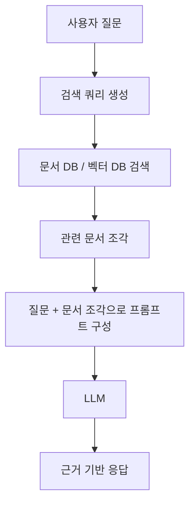

```text
일반 LLM
질문 -> LLM -> 답변

RAG
질문 -> 검색 -> 관련 문서 -> LLM -> 답변
```


RAG, Retrieval-Augmented Generation은 LLM 자체 지식만 사용하지 않고 외부 문서를 검색해서 답변에 활용하는 방식입니다.

기본 흐름은 다음과 같습니다.

```text
사용자 질문
→ 관련 문서 검색
→ 검색된 문서를 프롬프트에 포함
→ LLM이 문서를 참고해 답변 생성
```

RAG가 필요한 이유는 다음입니다.

- 모델이 모르는 최신 정보를 제공할 수 있습니다.
- 기업 내부 문서 기반 답변을 만들 수 있습니다.
- 환각을 줄이는 데 도움이 됩니다.
- 모델을 매번 재훈련하지 않아도 지식을 바꿀 수 있습니다.

RAG는 LLM 구조 자체라기보다 LLM을 활용하는 시스템 설계 방식입니다.

---

## 43. 추론과 훈련의 차이


### ASCII 비교: 훈련과 추론

```text
훈련 training
입력 x + 정답 y
      │
      ▼
모델 예측
      │
      ▼
손실 계산
      │
      ▼
역전파로 파라미터 업데이트

추론 inference
입력 x
      │
      ▼
모델 예측
      │
      ▼
토큰 선택 또는 클래스 선택
      │
      ▼
출력
```

훈련에서는 정답이 필요하고 파라미터가 바뀝니다. 추론에서는 정답 없이 출력만 만들고 파라미터는 바뀌지 않습니다.


### 43.1 훈련

훈련은 모델 파라미터를 바꾸는 과정입니다.

```text
입력 → 모델 → 손실 계산 → 그레이디언트 계산 → 파라미터 업데이트
```

훈련에는 다음이 필요합니다.

- 데이터셋
- 손실 함수
- 옵티마이저
- 많은 계산량

### 43.2 추론

추론은 훈련된 모델을 사용해 출력을 생성하는 과정입니다. 파라미터를 업데이트하지 않습니다.

```text
입력 → 모델 → 출력
```

추론에서는 보통 다음을 사용합니다.

```python
model.eval()
with torch.no_grad():
    output = model(input)
```

### 43.3 왜 구분이 중요한가

훈련과 추론을 혼동하면 다음 문제가 생깁니다.

- 추론 중 드롭아웃이 켜져 결과가 불안정해질 수 있습니다.
- 불필요하게 그레이디언트를 저장해 메모리를 낭비할 수 있습니다.
- 모델이 업데이트되는지 아닌지 잘못 이해할 수 있습니다.

---

## 44. LLM의 한계와 주의사항


### ASCII 요약: LLM의 주요 한계

```text
LLM 한계 지도

환각 hallucination
└─ 그럴듯하지만 틀린 문장을 만들 수 있음

문맥 길이 제한
└─ 한 번에 처리 가능한 토큰 수가 제한됨

편향
└─ 훈련 데이터의 편향을 반영할 수 있음

최신성 문제
└─ 훈련 이후 정보는 모를 수 있음

계산 비용
└─ 훈련과 추론에 GPU, 메모리, 전력이 많이 필요함

보안과 개인정보
└─ 민감한 정보를 입력하거나 출력할 위험이 있음
```


### 44.1 환각

LLM은 그럴듯한 문장을 만들 수 있지만, 사실과 다른 내용을 생성할 수 있습니다. 확률적으로 자연스러운 문장이 반드시 사실인 것은 아닙니다.

### 44.2 문맥 길이 제한

모델은 한 번에 처리할 수 있는 토큰 수가 제한되어 있습니다. 문맥 길이를 넘는 입력은 잘리거나 요약되어야 합니다.

### 44.3 훈련 데이터 편향

모델은 훈련 데이터의 패턴을 학습합니다. 데이터에 편향이 있으면 출력에도 편향이 나타날 수 있습니다.

### 44.4 계산 비용

큰 LLM은 훈련과 추론 모두 많은 메모리와 계산 자원이 필요합니다.

### 44.5 개인정보와 보안

민감한 데이터를 외부 LLM API에 넣으면 보안 문제가 생길 수 있습니다. 로컬 모델, 비식별화, 접근 제어, 로그 정책을 고려해야 합니다.

### 44.6 평가의 어려움

분류처럼 정답이 명확한 작업은 정확도로 평가할 수 있습니다. 하지만 요약, 번역, 대화처럼 정답이 여러 개 가능한 작업은 평가가 어렵습니다.

---

---

## 45. 한 장으로 보는 LLM 핵심 구조

```text
                         ┌───────────────────────┐
                         │      사용자 입력       │
                         └───────────┬───────────┘
                                     │
                                     ▼
                         ┌───────────────────────┐
                         │       Tokenizer        │
                         │ 텍스트 -> 토큰 ID       │
                         └───────────┬───────────┘
                                     │
                                     ▼
              ┌──────────────────────────────────────┐
              │        Embedding Layer                │
              │ token embedding + position embedding  │
              └──────────────────┬───────────────────┘
                                 │
                                 ▼
              ┌──────────────────────────────────────┐
              │        Transformer Block × N          │
              │                                      │
              │  LayerNorm                            │
              │    ↓                                  │
              │  Masked Multi-Head Attention          │
              │    ↓                                  │
              │  Residual Add                         │
              │    ↓                                  │
              │  LayerNorm                            │
              │    ↓                                  │
              │  Feed Forward Network                 │
              │    ↓                                  │
              │  Residual Add                         │
              └──────────────────┬───────────────────┘
                                 │
                                 ▼
                         ┌───────────────────────┐
                         │     Output Head        │
                         │ hidden -> vocab logits │
                         └───────────┬───────────┘
                                     │
                                     ▼
                         ┌───────────────────────┐
                         │  softmax / sampling    │
                         │ 다음 토큰 선택          │
                         └───────────┬───────────┘
                                     │
                                     ▼
                         ┌───────────────────────┐
                         │      출력 텍스트        │
                         └───────────────────────┘
```

---

## 46. 핵심 용어 색인

이 색인은 본문을 읽다가 용어가 헷갈릴 때 빠르게 돌아보기 위한 것입니다. 정렬은 가나다순이 아니라 LLM이 실제로 동작하는 흐름에 가깝게 배치했습니다.

### 46.1 큰 그림과 모델 종류

| 키워드 | 간단한 설명 |
|---|---|
| AI, 인공지능 | 사람이 지능적으로 처리한다고 여겨지는 문제를 컴퓨터가 수행하도록 만드는 넓은 분야입니다. LLM은 AI의 여러 응용 중 하나입니다. |
| 머신러닝 | 사람이 모든 규칙을 직접 작성하지 않고, 데이터로부터 규칙이나 패턴을 학습하게 하는 방법입니다. |
| 딥러닝 | 여러 층의 신경망을 사용해 데이터의 복잡한 패턴을 학습하는 머신러닝 방법입니다. LLM은 딥러닝 기반 모델입니다. |
| NLP, 자연어 처리 | 사람이 쓰는 언어를 컴퓨터가 처리하도록 만드는 분야입니다. 번역, 요약, 분류, 질의응답 등이 포함됩니다. |
| LLM, 대규모 언어 모델 | 대량의 텍스트로 훈련된 언어 모델입니다. 입력 문맥을 보고 다음 토큰의 확률 분포를 예측합니다. |
| 생성형 AI | 텍스트, 이미지, 코드처럼 새로운 결과물을 생성하는 AI입니다. LLM은 텍스트 생성형 AI의 대표적인 예입니다. |
| 언어 모델 | 토큰 시퀀스의 확률을 모델링하는 모델입니다. GPT 계열에서는 주어진 앞 문맥을 보고 다음 토큰을 예측합니다. |
| 파운데이션 모델 | 대규모 데이터로 먼저 사전 훈련된 범용 기반 모델입니다. 이후 분류, 지시 수행, 도메인 작업에 맞게 미세 튜닝할 수 있습니다. |
| 베이스 모델 | 지시 미세 튜닝이나 대화 튜닝을 하기 전의 기본 사전 훈련 모델입니다. 보통 텍스트 완성 능력이 중심입니다. |
| GPT | Generative Pretrained Transformer의 약자입니다. 디코더 전용 트랜스포머를 사용해 왼쪽에서 오른쪽으로 텍스트를 생성합니다. |
| BERT | 인코더 기반 트랜스포머 모델입니다. 생성보다 문장 이해, 분류, 마스킹된 단어 예측에 강합니다. |
| 트랜스포머 | 어텐션 메커니즘을 핵심으로 하는 신경망 구조입니다. 현대 LLM의 가장 중요한 기반 구조입니다. |
| 인코더 | 입력 전체를 읽고 입력의 표현을 만드는 트랜스포머 구성 요소입니다. BERT 계열 모델에서 중심 역할을 합니다. |
| 디코더 | 이전 토큰들을 바탕으로 다음 토큰을 생성하는 트랜스포머 구성 요소입니다. GPT 계열 모델에서 중심 역할을 합니다. |
| 디코더 전용 모델 | 인코더 없이 디코더 구조만 사용하는 모델입니다. GPT처럼 텍스트 생성에 적합합니다. |
| 자기회귀 모델 | 이전 출력이나 이전 토큰을 다시 입력으로 사용해 다음 값을 예측하는 모델입니다. GPT의 텍스트 생성 방식이 여기에 해당합니다. |
| 창발적 능력 | 모델이 명시적으로 특정 작업만 배우지 않았는데도 번역, 요약, 질의응답 같은 능력을 보이는 현상입니다. |

### 46.2 텍스트 전처리와 입력 표현

| 키워드 | 간단한 설명 |
|---|---|
| 원시 텍스트 | 아직 토큰화, 정제, 인코딩이 되지 않은 일반 문자열 데이터입니다. LLM은 원시 텍스트를 그대로 계산할 수 없습니다. |
| 말뭉치, 코퍼스 | 훈련에 사용하는 대량의 텍스트 묶음입니다. 책, 웹 문서, 코드, 논문 등이 포함될 수 있습니다. |
| 토큰 | 모델이 텍스트를 처리하는 기본 단위입니다. 단어, 부분단어, 구두점, 공백 조각 등이 토큰이 될 수 있습니다. |
| 토큰화 | 문자열을 토큰 단위로 나누는 과정입니다. 예를 들어 문장을 단어와 부분단어 ID의 시퀀스로 바꿉니다. |
| 토큰 ID | 각 토큰에 부여된 정수 번호입니다. 모델은 문자열 대신 토큰 ID를 입력으로 받습니다. |
| 어휘사전 | 토큰과 토큰 ID의 대응표입니다. `"hello" -> 15339`처럼 토큰을 정수로 매핑합니다. |
| BPE | Byte Pair Encoding의 약자입니다. 자주 등장하는 문자 조합을 합치며 어휘를 만들고, 모르는 단어도 부분단어로 분해해 처리합니다. |
| 부분단어 | 하나의 단어보다 작은 토큰 단위입니다. 예를 들어 생소한 단어를 여러 조각으로 나누어 표현할 수 있습니다. |
| 특수 토큰 | 일반 단어가 아니라 특별한 의미를 가진 토큰입니다. 예를 들어 `<endoftext>`, `[PAD]`, `[EOS]` 등이 있습니다. |
| 패딩 토큰 | 배치 안의 문장 길이를 맞추기 위해 짧은 입력 뒤에 붙이는 토큰입니다. 실제 의미 정보는 보통 없습니다. |
| EOS | End Of Sequence의 약자입니다. 문장이나 문서가 끝났음을 나타내는 토큰입니다. |
| BOS | Beginning Of Sequence의 약자입니다. 시퀀스 시작을 나타내는 토큰입니다. |
| 임베딩 | 토큰 ID 같은 이산적인 값을 실수 벡터로 바꾸는 표현 방식입니다. 신경망은 이 벡터를 계산에 사용합니다. |
| 토큰 임베딩 | 각 토큰 ID에 대응되는 벡터입니다. 같은 토큰 ID는 같은 토큰 임베딩에서 시작합니다. |
| 위치 임베딩 | 토큰의 순서 정보를 알려 주기 위해 더하는 벡터입니다. 트랜스포머는 기본적으로 순서를 직접 알지 못하므로 위치 정보가 필요합니다. |
| 절대 위치 임베딩 | 0번째, 1번째, 2번째 위치처럼 고정된 위치 번호마다 별도 벡터를 학습하는 방식입니다. GPT-2가 사용하는 방식입니다. |
| 상대 위치 임베딩 | 절대 위치보다 토큰 사이의 거리나 상대적 관계를 표현하는 방식입니다. 긴 문맥 일반화에 도움이 될 수 있습니다. |
| 입력 임베딩 | 토큰 임베딩과 위치 임베딩을 더한 최종 입력 벡터입니다. 트랜스포머 블록은 이 값을 입력으로 받습니다. |
| 문맥 길이 | 모델이 한 번에 처리할 수 있는 최대 토큰 수입니다. 이 길이를 넘는 입력은 잘리거나 다른 처리가 필요합니다. |
| 슬라이딩 윈도 | 긴 토큰 시퀀스를 일정 길이의 구간으로 잘라 학습 샘플을 만드는 방식입니다. 윈도가 오른쪽으로 이동하며 여러 샘플을 만듭니다. |
| 스트라이드 | 슬라이딩 윈도가 한 번에 이동하는 토큰 수입니다. 작으면 샘플이 많이 겹치고, 크면 겹침이 줄어듭니다. |
| 입력-타깃 쌍 | 다음 토큰 예측 훈련에서 입력은 현재 토큰들, 타깃은 한 칸 뒤로 밀린 다음 토큰들입니다. |
| 텐서 | 스칼라, 벡터, 행렬을 일반화한 다차원 배열입니다. PyTorch 모델의 입력과 출력은 대부분 텐서입니다. |
| 배치 | 여러 샘플을 한 번에 묶은 데이터 단위입니다. GPU 계산 효율을 높이고 학습을 안정화하는 데 사용됩니다. |
| 데이터셋 | 개별 샘플을 어떻게 읽고 반환할지 정의한 데이터 구조입니다. PyTorch에서는 `Dataset` 클래스로 구현할 수 있습니다. |
| 데이터 로더 | 데이터셋에서 배치를 만들고 섞어서 모델에 공급하는 도구입니다. PyTorch에서는 `DataLoader`를 사용합니다. |

### 46.3 어텐션과 트랜스포머 내부 구조

| 키워드 | 간단한 설명 |
|---|---|
| 어텐션 | 입력 토큰들 중 어떤 토큰을 얼마나 참고할지 계산하는 메커니즘입니다. LLM이 문맥을 반영하는 핵심 방법입니다. |
| 셀프 어텐션 | 하나의 입력 시퀀스 안에서 토큰끼리 서로를 참고하는 어텐션입니다. 문장 내부의 관계를 계산합니다. |
| 어텐션 점수 | 두 토큰 표현이 얼마나 관련 있는지 나타내는 정규화 전 점수입니다. 보통 쿼리와 키의 점곱으로 구합니다. |
| 어텐션 가중치 | 어텐션 점수에 softmax를 적용해 얻은 값입니다. 각 토큰을 얼마나 참고할지 나타내며 보통 합이 1입니다. |
| 문맥 벡터 | 여러 토큰의 값 벡터를 어텐션 가중치로 가중합한 결과입니다. 해당 위치의 문맥 정보가 반영된 표현입니다. |
| 쿼리, Q | 현재 토큰이 무엇을 찾고 있는지 나타내는 벡터입니다. 입력 벡터에 학습 가능한 선형 변환을 적용해 만듭니다. |
| 키, K | 각 토큰이 어떤 정보로 검색될 수 있는지 나타내는 벡터입니다. 쿼리와 비교되어 어텐션 점수를 만듭니다. |
| 값, V | 실제로 문맥 벡터에 섞여 들어가는 정보 벡터입니다. 어텐션 가중치가 값 벡터에 곱해집니다. |
| 점곱 | 두 벡터의 같은 위치 원소를 곱해 모두 더하는 연산입니다. 어텐션에서는 유사도 계산에 사용됩니다. |
| 스케일드 점곱 어텐션 | `softmax(QK^T / sqrt(d_k))V`로 계산하는 어텐션입니다. `sqrt(d_k)`로 나누어 학습을 안정화합니다. |
| 코잘 어텐션 | 현재 토큰이 현재와 과거 토큰만 보게 하는 어텐션입니다. GPT처럼 다음 토큰을 생성하는 모델에 필요합니다. |
| 코잘 마스크 | 미래 토큰의 어텐션 점수를 막기 위해 사용하는 마스크입니다. 보통 위삼각 영역을 `-inf`로 채웁니다. |
| 마스크드 멀티 헤드 어텐션 | 코잘 마스크가 적용된 멀티 헤드 어텐션입니다. GPT 트랜스포머 블록의 핵심 구성 요소입니다. |
| 멀티 헤드 어텐션 | 여러 개의 어텐션 헤드를 병렬로 계산하는 방식입니다. 서로 다른 관점의 토큰 관계를 동시에 학습합니다. |
| 헤드 | 멀티 헤드 어텐션에서 독립적으로 Q, K, V를 계산하는 작은 어텐션 단위입니다. |
| 드롭아웃 | 훈련 중 일부 값을 확률적으로 0으로 만들어 과대적합을 줄이는 기법입니다. 추론 때는 꺼야 합니다. |
| 층 정규화, LayerNorm | 각 샘플의 특성 차원 값을 평균과 분산 기준으로 정규화합니다. 깊은 신경망 훈련을 안정화합니다. |
| GELU | GPT 계열 피드 포워드 네트워크에서 자주 쓰는 활성화 함수입니다. ReLU보다 부드럽게 값을 통과시킵니다. |
| 피드 포워드 네트워크, FFN | 각 토큰 위치별로 독립적으로 적용되는 작은 완전연결 신경망입니다. 보통 차원을 키웠다가 다시 줄입니다. |
| 숏컷 연결 | 층의 입력을 출력에 더하는 연결입니다. 잔차 연결 또는 스킵 연결이라고도 하며, 깊은 모델의 학습을 돕습니다. |
| 잔차 연결 | 숏컷 연결과 같은 말입니다. 입력 정보를 보존하고 그레이디언트 흐름을 개선합니다. |
| 트랜스포머 블록 | 멀티 헤드 어텐션, 피드 포워드 네트워크, 층 정규화, 숏컷 연결을 묶은 반복 단위입니다. |
| 출력 헤드 | 트랜스포머의 hidden vector를 어휘사전 크기의 logits로 바꾸는 마지막 선형 층입니다. |
| 파라미터 | 훈련 중 업데이트되는 모델 내부 값입니다. 선형 층의 가중치와 편향, 임베딩 행렬 등이 포함됩니다. |
| 가중치 | 파라미터의 대표적인 형태입니다. 입력 벡터를 다른 벡터로 선형 변환할 때 사용됩니다. |

### 46.4 훈련, 손실, 평가

| 키워드 | 간단한 설명 |
|---|---|
| 사전 훈련 | 대규모 레이블 없는 텍스트로 먼저 모델을 훈련하는 과정입니다. GPT는 보통 다음 토큰 예측으로 사전 훈련됩니다. |
| 자기 지도 학습 | 데이터 자체에서 정답을 만들어 학습하는 방식입니다. 다음 토큰 예측에서는 다음 토큰이 자동으로 정답 역할을 합니다. |
| 다음 토큰 예측 | 앞의 토큰들을 보고 바로 다음 토큰을 맞히는 작업입니다. GPT 훈련의 기본 목표입니다. |
| 로짓 | softmax를 적용하기 전의 모델 출력 값입니다. 어휘사전의 각 토큰에 대한 원점수라고 볼 수 있습니다. |
| softmax | 여러 로짓을 확률 분포로 바꾸는 함수입니다. 출력값은 0 이상이고 전체 합은 1입니다. |
| 손실 함수 | 모델 예측이 정답과 얼마나 다른지 수치로 나타내는 함수입니다. 훈련은 이 값을 줄이는 방향으로 진행됩니다. |
| 크로스 엔트로피 | 분류와 다음 토큰 예측에서 자주 쓰는 손실입니다. 정답 토큰의 확률이 낮을수록 손실이 커집니다. |
| 혼잡도, Perplexity | 언어 모델이 다음 토큰 선택에서 얼마나 헷갈리는지 나타내는 지표입니다. 낮을수록 일반적으로 좋습니다. |
| 역전파 | 손실이 각 파라미터에 얼마나 영향을 주는지 계산하는 과정입니다. 그레이디언트를 구하는 핵심 알고리즘입니다. |
| 그레이디언트 | 손실을 줄이기 위해 파라미터를 어느 방향으로 얼마나 바꿔야 하는지 알려 주는 값입니다. |
| 옵티마이저 | 그레이디언트를 사용해 파라미터를 업데이트하는 알고리즘입니다. AdamW가 LLM 훈련에서 자주 사용됩니다. |
| AdamW | Adam 옵티마이저에 가중치 감쇠 처리를 개선한 방법입니다. LLM 훈련과 미세 튜닝에 널리 사용됩니다. |
| 학습률 | 파라미터를 한 번에 얼마나 크게 업데이트할지 정하는 값입니다. 너무 크면 불안정하고 너무 작으면 느립니다. |
| 에포크 | 훈련 데이터 전체를 한 번 모두 사용한 단위입니다. 큰 LLM은 거대한 데이터에서 적은 에포크로 훈련되는 경우가 많습니다. |
| 훈련 세트 | 모델 파라미터를 실제로 업데이트하는 데 사용하는 데이터입니다. |
| 검증 세트 | 훈련 중 모델 성능을 점검하고 과대적합을 확인하는 데이터입니다. 직접 파라미터 업데이트에는 쓰지 않습니다. |
| 테스트 세트 | 최종 성능 평가에 사용하는 데이터입니다. 모델 선택이 끝난 뒤 최대한 마지막에 사용해야 합니다. |
| 과대적합 | 모델이 훈련 데이터는 잘 맞히지만 새로운 데이터에는 약한 상태입니다. 훈련 손실은 낮고 검증 손실이 높으면 의심할 수 있습니다. |
| 훈련 | 데이터와 손실을 사용해 모델 파라미터를 업데이트하는 과정입니다. `model.train()` 모드가 필요합니다. |
| 추론 | 훈련된 모델로 결과를 생성하거나 예측하는 과정입니다. 파라미터는 바뀌지 않으며 보통 `model.eval()`을 사용합니다. |
| no_grad | PyTorch에서 그레이디언트 계산을 끄는 문맥입니다. 추론 시 메모리와 계산량을 줄입니다. |
| GPU | 대규모 행렬 계산을 빠르게 처리하는 장치입니다. LLM 훈련과 추론에서 매우 중요합니다. |

### 46.5 텍스트 생성과 디코딩

| 키워드 | 간단한 설명 |
|---|---|
| 디코딩 | 모델의 logits나 토큰 ID를 실제 출력 텍스트로 바꾸는 과정입니다. 토큰 선택 전략이 포함됩니다. |
| 그리디 디코딩 | 매번 가장 확률이 높은 토큰을 선택하는 방식입니다. 안정적이지만 출력이 단조롭거나 반복될 수 있습니다. |
| argmax | 가장 큰 값을 가진 인덱스를 고르는 연산입니다. 그리디 디코딩에서 다음 토큰 선택에 사용됩니다. |
| 확률적 샘플링 | 확률 분포에 따라 다음 토큰을 무작위로 뽑는 방식입니다. 더 다양한 출력을 만들 수 있습니다. |
| 온도 스케일링 | logits를 온도 값으로 나누어 확률 분포의 날카로움을 조절하는 방법입니다. 낮으면 보수적이고 높으면 다양해집니다. |
| top-k 샘플링 | 확률이 높은 상위 k개 토큰만 후보로 남기고 샘플링하는 방식입니다. 이상한 토큰이 뽑힐 위험을 줄입니다. |
| 반복 생성 | 생성된 토큰을 다시 입력 뒤에 붙이고 다음 토큰을 계속 예측하는 과정입니다. GPT식 텍스트 생성은 이 방식입니다. |
| 프롬프트 | 모델에 주는 입력 텍스트입니다. 생성 모델에서는 출력의 방향을 결정하는 중요한 조건입니다. |
| 컨텍스트 | 모델이 현재 예측을 위해 참고하는 입력 토큰들의 범위입니다. 문맥 길이 제한 안에 들어가야 합니다. |

### 46.6 미세 튜닝과 응용

| 키워드 | 간단한 설명 |
|---|---|
| 미세 튜닝 | 사전 훈련된 모델을 특정 작업이나 데이터셋에 맞게 추가로 훈련하는 과정입니다. |
| 분류 미세 튜닝 | 모델이 입력을 정해진 클래스 중 하나로 분류하도록 훈련하는 방식입니다. 예를 들어 스팸, 스팸 아님 분류가 있습니다. |
| 분류 헤드 | 모델의 최종 출력을 클래스 개수에 맞게 바꾸는 출력 층입니다. 이진 분류라면 보통 출력 차원이 2입니다. |
| 정확도 | 전체 샘플 중 맞게 분류한 샘플의 비율입니다. 분류 작업의 기본 평가 지표입니다. |
| 지시 미세 튜닝 | 지시문과 정답 응답 쌍으로 모델을 훈련해 사용자의 명령을 따르게 만드는 방식입니다. |
| 지시 데이터셋 | `질문 또는 지시 -> 응답` 형태로 구성된 데이터셋입니다. 챗봇이나 개인 비서 모델 학습에 사용됩니다. |
| LoRA | 원본 큰 가중치는 고정하고 작은 저랭크 행렬만 학습하는 파라미터 효율적 미세 튜닝 방법입니다. |
| 어댑터 | 기존 모델 사이에 추가되는 작은 학습 모듈입니다. 전체 모델을 모두 업데이트하지 않고 특정 작업에 적응시키는 데 사용됩니다. |
| RAG | Retrieval-Augmented Generation의 약자입니다. 외부 문서를 검색한 뒤 그 정보를 프롬프트에 넣어 답변을 생성하는 방식입니다. |
| 임베딩 검색 | 문서나 문장을 벡터로 바꾼 뒤, 질문 벡터와 가까운 내용을 찾는 검색 방식입니다. RAG에서 자주 사용됩니다. |
| 로컬 LLM | 사용자의 컴퓨터나 사내 서버에서 직접 실행하는 LLM입니다. 개인정보 보호와 비용 통제에 장점이 있습니다. |
| API 기반 LLM | 외부 서비스의 모델을 네트워크 요청으로 사용하는 방식입니다. 쉽게 사용할 수 있지만 비용, 지연, 보안 정책을 고려해야 합니다. |

### 46.7 한계와 안전성

| 키워드 | 간단한 설명 |
|---|---|
| 환각 | 모델이 사실과 다른 내용을 그럴듯하게 생성하는 현상입니다. 확률적으로 자연스러운 문장이 항상 사실은 아닙니다. |
| 편향 | 훈련 데이터의 사회적, 문화적, 통계적 편향이 모델 출력에 반영되는 문제입니다. |
| 최신성 문제 | 모델이 훈련 이후의 정보를 기본적으로 알지 못하는 문제입니다. 최신 정보가 필요하면 검색이나 외부 도구가 필요합니다. |
| 개인정보 위험 | 민감한 데이터를 모델 입력이나 로그에 남길 때 발생할 수 있는 위험입니다. 비식별화와 접근 제어가 필요합니다. |
| 보안 | 모델 입력, 출력, 저장 데이터, API 호출 과정에서 악용이나 정보 노출을 막기 위한 설계입니다. |
| 평가 어려움 | 요약, 대화, 창작처럼 정답이 하나가 아닌 작업은 품질 평가가 어렵습니다. 자동 지표와 사람 평가를 함께 고려해야 합니다. |
| 비용 | LLM 훈련과 추론에 드는 GPU, 메모리, 전력, API 사용료를 포함합니다. 모델 크기가 커질수록 비용도 커집니다. |
| 지연 시간 | 입력 후 출력이 나오기까지 걸리는 시간입니다. 실제 서비스에서는 모델 크기, 하드웨어, 네트워크, 생성 토큰 수가 영향을 줍니다. |
| 문맥 손실 | 입력이 문맥 길이를 넘어서 일부 정보가 잘리거나 누락되는 문제입니다. 요약, 검색, 청크 분할로 완화할 수 있습니다. |

### 46.8 수식과 코드에서 자주 보이는 기호

| 키워드 | 간단한 설명 |
|---|---|
| `QK^T` | 쿼리 행렬과 키 행렬의 전치를 곱한 값입니다. 모든 토큰 쌍의 어텐션 점수를 한 번에 계산합니다. |
| `sqrt(d_k)` | 키 벡터 차원의 제곱근입니다. 어텐션 점수가 지나치게 커지는 것을 막기 위해 나눕니다. |
| `softmax(QK^T / sqrt(d_k))V` | 스케일드 점곱 어텐션의 핵심 수식입니다. 어텐션 가중치를 구한 뒤 값 벡터를 섞습니다. |
| `batch_size` | 한 번에 모델에 넣는 샘플 개수입니다. 클수록 계산 효율은 좋을 수 있지만 메모리를 더 사용합니다. |
| `seq_len` | 입력 시퀀스의 토큰 개수입니다. 문맥 길이와 관련됩니다. |
| `emb_dim` | 각 토큰 벡터의 차원 수입니다. GPT-2 small에서는 768입니다. |
| `vocab_size` | 어휘사전에 있는 토큰 개수입니다. GPT-2 토크나이저는 50,257개를 사용합니다. |
| `num_heads` | 멀티 헤드 어텐션에서 사용하는 헤드 개수입니다. 전체 임베딩 차원을 여러 헤드로 나누어 계산합니다. |
| `n_layers` | 트랜스포머 블록을 몇 번 쌓는지 나타내는 값입니다. 모델 깊이를 결정합니다. |
| `drop_rate` | 드롭아웃 비율입니다. 값이 0.1이면 훈련 중 일부 값의 10%를 확률적으로 제거합니다. |
| `state_dict` | PyTorch 모델의 파라미터 이름과 텐서를 담은 딕셔너리입니다. 모델 저장과 로드에 사용됩니다. |
| `model.train()` | 모델을 훈련 모드로 바꿉니다. 드롭아웃 같은 훈련 전용 동작이 활성화됩니다. |
| `model.eval()` | 모델을 평가 또는 추론 모드로 바꿉니다. 드롭아웃이 비활성화되어 출력이 안정됩니다. |

